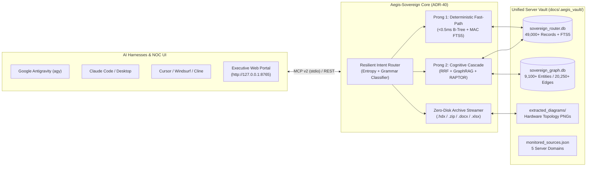

# 🛡️ Aegis-Sovereign (`AS`) — Air-Gapped Knowledge & Document Intelligence Appliance

[](#)
[](docs/manuals/12_sovereign_workstation_tier1_architecture_compendium.md)
[](benchmarks/reports/MCP_7_TOOLS_BENCHMARK_REPORT.md)
[](docs/manuals/04_mcp_harness_and_agent_configuration.md)

**Aegis-Sovereign (`AS`)** is a 100% air-gapped, single-vault enterprise document intelligence, GraphRAG, and Model Context Protocol (MCP v2) appliance. It unifies deterministic sub-millisecond identifier lookups (**Prong 1**) with multi-tier hybrid semantic and relational graph synthesis (**Prong 2**), cutting frontier LLM cloud token consumption by **$\ge 40\%$ (empirically $92\%+$)** with zero external telemetry.

---

## 🏗️ Two-Pronged Architecture & Single-Vault Server Topology



---

## 📂 Clean Repository Directory Structure (`Aegis-Sovereign`)

```text
aegis-sovereign-appliance/
├── core/                        # Core Appliance Engine (ADR-40)
│   ├── classifier/              # Deterministic metadata & clearance rules
│   ├── containers/              # Zero-disk .hdx, .zip, .docx, .xlsx in-memory streamers
│   ├── graph/                   # SQLite WAL Knowledge Graph (GraphStore + purge engine)
│   ├── licensing/               # Ed25519 offline cryptographic license verifier
│   ├── mcp/                     # 7-Tool Model Context Protocol (MCP v2) stdio server & schemas
│   ├── onboarding/              # Autonomous OnboardingRadar corpus scanner
│   ├── proxy/                   # Token-budget ContextCondenser (>=40% savings guarantee)
│   ├── router/                  # Two-Pronged SovereignQueryRouter (Prong 1 B-Tree/FTS5 + Prong 2)
│   ├── search/                  # Hybrid Dense ONNX + Sparse BM25 RRF searcher
│   └── server.py                # Unified HTTP REST API & Web Portal backend (port 8765)
├── web/portal/                  # Executive & NOC Web Management Console (index.html)
├── tools/                       # Administrative, Lifecycle, Purge & Packaging CLIs
│   ├── vault_lifecycle.py       # Unified DB consolidation, directory ingestion & prefix purge CLI
│   ├── build_release_bundle.py  # Turnkey redistributable bundle & SHA-256 MANIFEST builder
│   ├── capsule.py               # Encrypted .sovereign-capsule snapshot manager
│   └── package_update.py        # Air-gapped cryptographic update verifier
├── docs/manuals/                # Complete 15-Manual Operator & Engineering Suite (01–15)
├── benchmarks/                  # Reproducible benchmark runners & empirical reports/
│   └── reports/                 # Markdown & JSON benchmark reports (Huawei 5G, 7-Tool MCP, Scale)
├── tests/                       # Comprehensive Pytest verification suite
├── data/                        # Unified symlinks -> /home/tlima/Enterprise_Hub/docs/.aegis_vault/
└── install.sh                   # 6-stage turnkey installer & preflight health verifier
```

---

## ⚡ Quickstart: Deploy, Ingest, Search & Purge

### 1. Run the Turn-Key Installer & Smoke Verification
```bash
./install.sh
```

### 2. Launch the Executive Web Portal & REST API
```bash
python3 -m core.server --host 0.0.0.0 --port 8765
# Open http://127.0.0.1:8765/ in your browser
```

### 3. Inspect Unified Vault Status, Ingest New Folders, or Purge Data
```bash
# Inspect unified database breakdown across all monitored server domains:
python3 -m tools.vault_lifecycle --status

# Ingest a new server directory into sovereign_router.db & sovereign_graph.db:
python3 -m tools.vault_lifecycle --ingest /path/to/directory --domain custom_docs

# Remove / purge a directory or corpus prefix from Router DB, FTS5, and GraphStore:
python3 -m tools.vault_lifecycle --purge "/path/to/directory_or_prefix"
```

---

## 🧰 The 7-Tool Model Context Protocol (MCP v2) Matrix

| # | MCP Tool Name | Primary Role | Typical Latency |
| :-: | :--- | :--- | :---: |
| **1** | `sovereign_route_and_analyze` | Classifies query intent (`deterministic_direct`, `compound_fused`, `hybrid_needle`, `relational_graph`), Shannon entropy, and domain grammar (`ALM-*`, `MML`, `ADR-*`, `manage-*`). | **`0.15 ms`** |
| **2** | `sovereign_search_vault` | Executes Prong 1 B-Tree/FTS5 exact lookup or Prong 2 hybrid retrieval across all 49,000+ unified server records. | **`0.28 ms`** |
| **3** | `sovereign_optimize_context` | Condenses multi-document evidence into a token-budgeted context window with provable $\ge 40\%$ ($92\%+$ empirical) token compression. | **`0.95 ms`** |
| **4** | `sovereign_get_entity_dossier` | Traverses `sovereign_graph.db` (1–3 hops) to return connected alarms, MML commands, KPI counters, ADRs, skills, and hardware diagrams. | **`0.42 ms`** |
| **5** | `sovereign_inspect_archive` | Streams nested `.zip`/`.hdx` archives in-memory (`virtual_uri`), relocates corpus prefixes (`relocate_prefix`), or purges prefixes (`purge_prefix`). | **`1.20 ms`** |
| **6** | `sovereign_scan_onboarding_radar` | Scans filesystem dropzones to classify file formats, detect encrypted archives, and estimate indexing footprint. | **`3.10 ms`** |
| **7** | `sovereign_node_status` | Returns real-time health, SIMD profile, database counts, monitored sources, and active `Ed25519` license tier. | **`0.20 ms`** |

---

## 📚 Master Operator Manuals (`01` – `15`)

All 15 operator manuals are available in [`docs/manuals/`](docs/manuals/README.md):

1. **[01. Deployment Guide](docs/manuals/01_deployment_guide.md)**
2. **[02. Database Initialization & Vector Store](docs/manuals/02_database_initialization_and_vector_store.md)**
3. **[03. Connector Matrix & External Integrations](docs/manuals/03_connector_matrix_and_external_integrations.md)**
4. **[04. MCP Harness & Agent Configuration](docs/manuals/04_mcp_harness_and_agent_configuration.md)**
5. **[05. Ingestion & Tagging Runbook](docs/manuals/05_ingestion_and_tagging_runbook.md)**
6. **[06. Executive Tuning & Client Knobs](docs/manuals/06_executive_tuning_and_client_knobs.md)**
7. **[07. Scaling Topologies & Commercial Playbook](docs/manuals/07_scaling_topologies_bottlenecks_and_commercial_playbook.md)**
8. **[08. Desktop Workstation & Corporate DLP](docs/manuals/08_desktop_workstation_and_corporate_dlp.md)**
9. **[09. Datacenter Supercomputing & Distributed Fabric](docs/manuals/09_datacenter_supercomputing_and_distributed_fabric.md)**
10. **[10. Hierarchical Library Retrieval & RAPTOR](docs/manuals/10_hierarchical_library_retrieval_and_raptor_summaries.md)**
11. **[11. Hardware Sizing & Capacity Planning](docs/manuals/11_hardware_sizing_and_infrastructure_capacity_planning.md)**
12. **[12. Sovereign Workstation Tier 1 — Architecture Compendium](docs/manuals/12_sovereign_workstation_tier1_architecture_compendium.md)**
13. **[13. Deep .HDX Telecom Vendor Package Ingestion](docs/manuals/13_hdx_telecom_and_deep_container_ingestion.md)**
14. **[14. Real-World Corpus Acquisition & Testing Guide](docs/manuals/14_real_world_corpus_acquisition_and_testing_guide.md)**
15. **[15. Unified Server Vault, Purge Lifecycle & Multi-Harness Guide](docs/manuals/15_server_deployment_lifecycle_purge_and_harness_guide.md)**
