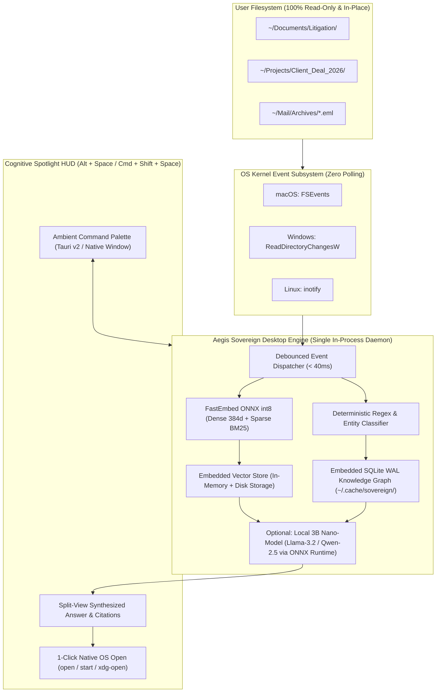

# ADR-03: Zero-Copy Workstation In-Place Indexing and Serverless Desktop Engine Architecture

## Status
Accepted

## Date
2026-09-18

## Context
Following the formalization of the **Aegis Sovereign Knowledge Appliance** as an air-gapped network server stack ([ADR-35](ADR-35-Sovereign-Knowledge-Appliance-Packaging-and-Commercial-Architecture.md)) and its multi-node fleet scaling topology ([ADR-36](ADR-36-Sovereign-Appliance-Scaling-Fleet-and-Business-Topology.md)), an urgent commercial and operational requirement has emerged from enterprise clients: **Aegis Sovereign Desktop (Personal Workstation Edition)**.

Institutional corporate workstations, M&A investment bankers, management consulting partners, and corporate counsel operate under stringent IT governance constraints that preclude running traditional homelab or server-style architectures:
1. **Corporate Data Loss Prevention (DLP) & Endpoint Agents**: Laptops and workstations are strictly monitored by enterprise endpoint security agents (CrowdStrike Falcon, Microsoft Defender for Endpoint, Zscaler Private Access, Symantec DLP, and Tanium). Running Docker daemons, external listening network ports (`0.0.0.0`), unvetted background servers, or opening firewall pinholes triggers immediate security containment, IT revocation, or forensic investigation.
2. **Strict Non-Duplication (Zero-Copy) Policies**: Enterprise legal agreements and client non-disclosure agreements (NDAs) prohibit duplicating files into arbitrary staging or `/consume` drop folders. Work files must reside strictly in their original version-controlled repositories or document folders (`~/Documents/M&A_Project_A`, `~/Projects/Client_Audit`, `~/Mail/Archives`). Staging copies create orphan files, storage bloat, and version desynchronization.
3. **Inadequacy of Traditional OS Desktop Search**: Built-in desktop search engines (macOS Spotlight, Windows Search Indexer, and PowerToys Run) rely exclusively on lexical file names, folder paths, and basic keyword substring matching. They are blind to conceptual equivalence, cross-document semantic relationships, and entity dependencies. They cannot answer questions, reconcile contract clauses, or traverse cross-document transaction graphs.
4. **Cloud AI Privacy Violations**: Mainstream cloud assistants (Microsoft Copilot, ChatGPT Enterprise, Claude Desktop) transmit proprietary internal text, emails, and financial spreadsheets to third-party cloud data centers for processing. This presents unacceptable compliance liability under LGPD (Art. 5, II), GDPR, HIPAA, and corporate confidentiality covenants.

To capture this enterprise market, we must define a dedicated, serverless desktop architecture that delivers full hybrid RAG, deterministic knowledge graph linking, and context optimization natively inside user workstations without servers, containers, or file duplication.

---

## Decisions

### 1. Zero-Copy In-Place Directory Indexing
- **In-Place Traversal**: The desktop engine connects directly to existing user-selected directories (`~/Documents`, `~/Projects`, `~/Mail/Archives`, or mounted SMB/NFS corporate shares). Files are read strictly in-place where they currently live.
- **Read-Only Ingestion**: The engine opens source documents with read-only filesystem flags (`O_RDONLY`). It never moves, copies, renames, touches metadata of, or writes to target directories.
- **Dedicated User Cache Storage**: All derived vector embeddings, BM25 token frequencies, and SQLite relational graph edges are written strictly to an isolated user cache directory:
  - **Linux / macOS**: `~/.cache/sovereign/`
  - **Windows**: `%LOCALAPPDATA%\Sovereign\`
- **Native OS Kernel Event Observers**: Polling and webhooks are eliminated in favor of native kernel filesystem notification subsystems via `watchdog`:
  - **macOS**: `FSEvents`
  - **Windows**: `ReadDirectoryChangesW`
  - **Linux**: `inotify`
  Events are debounced with a 40-millisecond sliding window, performing instant micro-reindexing when files are edited or created.

### 2. Embedded Serverless Engine Architecture
To guarantee zero friction with enterprise IT and eliminate Docker/container prerequisites:
- **Single-Process Lightweight Daemon**: The desktop engine executes as a lightweight, unprivileged background process owned by the current user (`sovereign-desktopd`).
- **Embedded Vector Database**: Replaces client-server vector databases with **Embedded Qdrant** (using `qdrant-client` local path storage: `QdrantClient(path="~/.cache/sovereign/vectors")`) or `sqlite-vec`. Indexing and hybrid RRF search execute in-process via fast C++ and Rust bindings.
- **Embedded SQLite WAL Knowledge Graph**: Graph entities (CPFs, CNPJs, contract clause citations, deal codes, and dates) and cross-document relational edges are managed in an embedded SQLite database (`desktop_graph.db`) with Write-Ahead Logging (WAL) mode and memory-mapped I/O (`PRAGMA mmap_size = 268435456`).
- **Optional Embedded Nano-Model**: For 100% air-gapped environments where cloud API calls are strictly blocked by corporate DLP, the daemon bundles an embedded 3B parameter quantized model (e.g. Llama-3.2-3B-Instruct or Qwen-2.5-3B-Instruct in Q4_K_M GGUF format) executed via `onnxruntime-genai` or embedded `llama-cpp-python` on AVX2/Metal/DirectML.
- **Resource Envelope**:
  - Memory: $< 350\text{ MB}$ RAM idle, $< 650\text{ MB}$ during active indexing.
  - Background CPU: $< 1\%$ on multi-core workstations.
  - Standby Power: $< 2\text{W}$ impact on laptop battery.

### 3. Cognitive Spotlight / Ambient Desktop HUD
Traditional desktop launchers (Spotlight, PowerToys Run, Alfred, Raycast) operate exclusively on lexical keyword filtering. Aegis Sovereign Desktop introduces the **Cognitive Spotlight**:
- **Global Ambient Hotkey (`Alt + Space` on Windows/Linux, `Cmd + Shift + Space` on macOS)**: Spawns a frameless, dark-obsidian command HUD overlaying any active IDE, spreadsheet, PDF reader, or browser.
- **Semantic & Conceptual Equivalence**: Evaluates queries conceptually (e.g. *"What is the termination penalty for delay?"* matches Clause 14.2 *"Compensatory damages for unexcused milestone slippage"* even when no identical words are present).
- **Cross-Document Relational Linking**: Traverses the SQLite graph to connect related documents across different formats (e.g. bridging an incoming `.eml` client notification with an signed PDF contract and internal markdown audit notes).
- **Split-View Evidence Drawer**:
  - **Left Pane**: Concise, direct grounded answer with numbered citation pills (`[Doc #42, Page 3, Clause 8.1]`).
  - **Right Pane**: Verified excerpt context with glowing gold highlighted bounding boxes.
  - **Instant Jump Action**: Pressing `Enter` triggers a native OS file launch (`open`, `start`, or `xdg-open`), opening the exact source document in Microsoft Word, Adobe Acrobat, or Preview at the relevant page.

### 4. Enterprise Corporate DLP & Air-Gap Compliance
- **Zero Outbound Telemetry**: Zero network packets are transmitted outside the local machine. All vectorization (FastEmbed ONNX int8), graph operations, and local inference execute 100% on localhost.
- **No Listening Public Sockets**: The daemon avoids binding to `0.0.0.0` or standard public ports. Inter-Process Communication (IPC) between the background daemon and the HUD occurs strictly via named pipes (Windows: `\\.\pipe\sovereign-desktop`) or local Unix domain sockets (macOS/Linux: `~/.cache/sovereign/ipc.sock`).
- **Security Agent Compatibility**: Pre-certified configuration profiles ensure zero conflict with CrowdStrike Falcon, Zscaler, Microsoft Defender, and Trellix DLP filters.
- **Strict Anti-Hallucination Rejection**: When retrieved evidence scores fall below the user-configured confidence floor ($\text{RRF} < 0.25$), the engine returns an explicit grounded refusal rather than generating unverified assumptions.

---

## Consequences

### Positive
- **Frictionless Enterprise Deployment**: Operates without Docker, administrative sudo privileges, or open network ports. Users or IT teams install it as a standard desktop application.
- **Zero Storage Multiplication**: Users keep their existing folder structures and cloud-synced drives (OneDrive, Dropbox, Google Drive, Box) intact without duplicating gigabytes of files.
- **Sub-100ms Ambient Workflow**: Legal and financial executives access instant document synthesis across all their local projects via a single global hotkey.
- **Zero Cloud API Leakage**: 100% compliance with strict institutional confidentiality agreements and corporate DLP policies.

### Negative & Mitigations
- **Workstation OCR Resource Demands**: OCR processing of massive scanned PDF batches is constrained by laptop CPU cores.
  - *Mitigation*: Background indexing operates at low OS process priority (`nice -n 10` on Unix, `IDLE_PRIORITY_CLASS` on Windows) and pauses indexing automatically when the laptop is operating on battery power if configured.
- **Nano-Model Reasoning Boundaries**: 3B on-device models cannot match the multi-step reasoning capabilities of 70B+ frontier models.
  - *Mitigation*: The engine retains the dual-mode architecture: in air-gapped corporate mode it uses local 3B nano-inference; when permitted by corporate policy, it connects to the client's authorized cloud LLM via Model Context Protocol (MCP) as a context condenser with 90%+ token savings.

---

## Related Documents
- [ADR-35: Sovereign Knowledge Appliance Packaging, Headless Ingestion & Commercial Architecture](ADR-35-Sovereign-Knowledge-Appliance-Packaging-and-Commercial-Architecture.md)
- [ADR-36: Sovereign Appliance Scaling Fleet & Business Topology](ADR-36-Sovereign-Appliance-Scaling-Fleet-and-Business-Topology.md)
- [Manual 08: Sovereign Desktop Workstation Setup & Corporate DLP Compliance](../appliance/08_desktop_workstation_and_corporate_dlp.md)
- [Chapter 23: Sovereign Knowledge Appliance Architecture](../23_sovereign_knowledge_appliance_and_commercial_stack.md)
