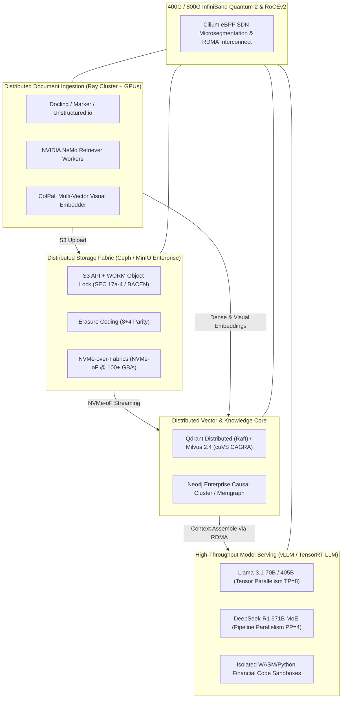
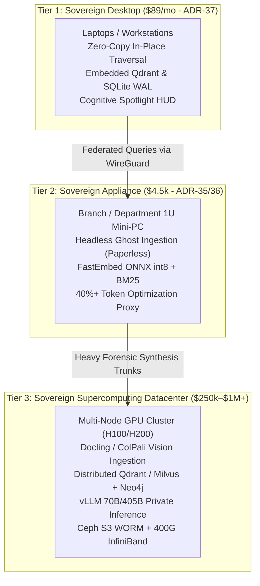

# ADR-04: Enterprise Sovereign Datacenter Architecture, Vision-First Retrieval (ColPali), and High-Performance Distributed Fabric (Ceph & RoCEv2)

## Status
Accepted

## Date
2026-09-18

## Context
The Aegis Sovereign platform spans two proven form factors:
1. **The Sovereign Knowledge Appliance** ([ADR-35](ADR-35-Sovereign-Knowledge-Appliance-Packaging-and-Commercial-Architecture.md), [ADR-36](ADR-36-Sovereign-Appliance-Scaling-Fleet-and-Business-Topology.md)): A low-power ($< 65\text{W}$) edge server for boutique offices, family offices, and clinic departments.
2. **The Sovereign Desktop Edition** ([ADR-37](ADR-37-Zero-Copy-Workstation-Indexing-and-Serverless-Desktop-Engine.md)): A serverless single-process daemon with zero-copy traversal and a Cognitive Spotlight HUD for corporate workstations under strict DLP.

However, massive institutional clients—including **Central Banks, State Courts of Justice (Tribunais de Justiça), Federal Revenue Agencies (Receita Federal), National Libraries and University Archives, and Multi-Hospital Networks**—operate at an entirely different scale:
- **Archive Volume**: Tens of millions of historical documents, microfilms, court proceedings, and land registries (10 PB+).
- **Ingestion Velocity**: Batches exceeding $2,500\text{ pages/second}$ during legal discovery cutoffs or institutional digitization sweeps.
- **Complex Multimodal Documents**: Classical OCR (Tesseract) fails catastrophically on handwritten marginal notes, court seals, watermarks, crossed-out clauses, and multi-column fiscal balance sheets.
- **Strict Legal Retention (WORM)**: Brazilian Federal Law 8.159 (Public Archives), BACEN Resolution 4.893, and SEC Rule 17a-4 mandate Write-Once-Read-Many (WORM) immutability, prohibiting file tampering or deletion for up to 30 years.
- **Massive User Concurrency**: Thousands of simultaneous judges, tax auditors, or medical researchers requiring sub-second, multi-step forensic synthesis.

These requirements cannot be satisfied by single-node mini-PCs, local ext4 NVMe drives, or 384-dimensional FastEmbed embeddings. We must formalize the **Tier-3 / Tier-4 Enterprise Datacenter Platform ("Sovereign Supercomputing")**.

---

## Decisions

### 1. Technology Replacement Matrix: Edge vs. Datacenter

| Architectural Layer | Homelab / Edge Appliance (Current) | Enterprise Datacenter Platform (Replacement) | Architectural Rationale & Added Value |
| :--- | :--- | :--- | :--- |
| **Ingestion & Document Parsing** | Paperless-ngx (Tesseract OCR + Django worker) | **Docling / Marker / Unstructured.io / NVIDIA NeMo Retriever** on distributed Ray GPU clusters | Eliminates OCR bottleneck; processes complex multi-page tables, nested charts, balance sheets, and reading order at **2,500+ pages/second** across distributed GPU nodes. |
| **Multimodal Intelligence** | Immich (Postgres + pgvector / CPU CLIP) | **Vespa / Milvus Distributed + ColPali / DINOv2** | True late-interaction visual retrieval: embeds the raw visual PDF page directly rather than relying on flattened, error-prone OCR text strings. |
| **Embedding Engine** | FastEmbed int8 (`bge-small`, 384d, 33M params) | **NVIDIA NV-Embed-v2 / SFR-Embedding-Mistral (7B params)** or **ColBERTv2** | 1024d–4096d embeddings across 32k-token spans; captures nuanced legal clauses, multi-tier corporate holdings, and tax structures that 384d vectors compress away. |
| **Vector Engine** | Qdrant (Single-node / Embedded) | **Qdrant Distributed (Raft) / Milvus 2.4 / Vespa.ai** with GPU-accelerated HNSW (NVIDIA cuVS/CAGRA) | Multi-node distributed sharding, horizontal read/write scaling, and billion-vector indexing with sub-5ms GPU-accelerated nearest-neighbor traversal. |
| **Knowledge Graph** | SQLite WAL (`graph_store.db`) | **Neo4j Enterprise (Causal Clustering) / Memgraph / TigerGraph** | Distributed graph architecture capable of billions of nodes and edges, real-time Cypher traversals across global ownership webs, and Graph Neural Network (GNN) link prediction. |
| **Inference Runtime** | Local 3B Nano-model or agy MCP Proxy | **vLLM / NVIDIA TensorRT-LLM / Triton Inference Server** | Continuous batching, PagedAttention, and multi-GPU Tensor Parallelism (TP) over NVLink, delivering sub-20ms Time-To-First-Token (TTFT) for hundreds of concurrent users. |

### 2. Cognitive Capabilities Unlocked by Frontier Models (70B / 405B / MoE)

1. **Vision-First Retrieval Without OCR (The ColPali Paradigm)**:
   - Scanned historical manuscripts, microfilms, stamped notarizations, and complex balance sheets defeat classical OCR.
   - Vision-language models (e.g., PaliGemma, Qwen2-VL-72B, ColPali) index the *rendered visual canvas* directly, preserving crossed-out clauses, notarization seals, and spatial matrix structures natively.
2. **Autonomous Cross-Document Forensic Synthesis (Zero-Shot Graph Induction)**:
   - While a 3B model extracts names and CPFs via deterministic regex, a **70B/405B or DeepSeek-R1 (671B MoE)** can ingest 1,000 disparate contracts, balance sheets, and bank statements to deduce complex hidden relationships (e.g., identifying undisclosed offshore holding structures designed for tax evasion under *Lei 14.754*).
3. **Deterministic Sandbox Code Execution & Quantitative Audit**:
   - Coupling massive datacenter models with isolated Python/WASM sandboxes allows real-time Monte Carlo risk modeling, bankruptcy liquidation waterfalls, and instant spreadsheet recalculation during search retrieval.
4. **Massive Enterprise Concurrency**:
   - A cluster with **8x–32x NVIDIA H100/H200 or L40S** servers easily sustains **500+ simultaneous attorneys, analysts, or clinicians** with zero queue delay.

### 3. Distributed Storage: S3 Object Storage with WORM Compliance
- **Ceph / MinIO Enterprise Object Fabric**: Eliminates local filesystem disk limits.
- **S3 Object Lock (Compliance Mode)**: Implements unalterable Write-Once-Read-Many (WORM) storage. Once a document is committed, neither system administrators nor compromised root credentials can alter or delete the file until the legal retention period expires (5 to 30 years).
- **Erasure Coding ($8+4$ Parity)**: Survives the total loss of 4 physical drives or an entire server rack without data loss or downtime.
- **NVMe-over-Fabrics (NVMe-oF)**: Feeds multi-terabyte vector indices directly into GPU memory at $100+\text{ GB/s}$ over the storage network.

### 4. High-Performance Interconnect & SDN Security
- **Tensor Parallelism Network Bottleneck**: Models of 70B parameters ($140\text{ GB}$ FP16) and 405B parameters ($810\text{ GB}$) exceed the VRAM of a single GPU. They must be split across multiple GPUs using **Tensor Parallelism (TP)** and **Pipeline Parallelism (PP)**. Inter-chassis communication requires **400G/800G InfiniBand Quantum-2** or **RoCEv2** (RDMA over Converged Ethernet) to avoid catastrophic token generation stalls.
- **Cilium eBPF Software-Defined Networking (SDN)**:
  - Enforces kernel-level cryptographic microsegmentation.
  - Guarantees strict multi-tenant isolation (e.g. separating Public Defenders from Prosecuting Attorneys or separating Department A mergers from Department B compliance).

---

## The Unified 3-Tier Product Continuum

1. **Workstation Desktop Seat (ADR-37)**: Attorneys, bankers, and civil servants use the desktop edition for sub-40ms zero-copy retrieval over local working files.
2. **Branch Appliance (ADR-35 / ADR-36)**: Branch offices, regional clinics, or municipal bureaus operate 1U appliances handling local ingestion and pre-filtering.
3. **Datacenter Sovereign Cloud (ADR-04)**: Enterprise and government headquarters run central Ceph/H100 supercomputing clusters for multi-million document discovery, historical national archives, and 405B cross-entity forensic synthesis.

---

## Consequences

### Positive
- **Market Reach to Governments & Megacorporations**: Opens procurement pipelines for Central Banks, Federal Ministries, Judiciary Tribunals, and National Libraries.
- **True Vision-First Intelligence**: Completely bypasses OCR failure modes through direct visual canvas embeddings (ColPali).
- **Legally Irrefutable Immutability**: Full compliance with international WORM standards (SEC Rule 17a-4, BACEN, LGPD).
- **Infinite Scalability**: Horizontally scalable from 10,000 documents to 500,000,000+ documents without changing API contracts.

### Negative & Mitigations
- **Substantial Capital Expenditure**: Multi-GPU racks and InfiniBand switches cost between $250,000 and $1,200,000+.
  - *Mitigation*: Packaged into structured enterprise CapEx financing or provided as a private, dedicated Sovereign Bare-Metal Cloud lease.
- **Operational Complexity**: Managing Ceph, Ray, and vLLM clusters requires specialized SRE capabilities.
  - *Mitigation*: Bundled with our high-margin Annual Managed Operations Retainer (Tier 4 monetization ladder).

---

## Related Documents
- [ADR-35: Sovereign Knowledge Appliance Packaging](ADR-35-Sovereign-Knowledge-Appliance-Packaging-and-Commercial-Architecture.md)
- [ADR-36: Sovereign Appliance Scaling Fleet & Business Topology](ADR-36-Sovereign-Appliance-Scaling-Fleet-and-Business-Topology.md)
- [ADR-37: Zero-Copy Workstation Indexing Architecture](ADR-37-Zero-Copy-Workstation-Indexing-and-Serverless-Desktop-Engine.md)
- [Manual 09: Datacenter Supercomputing Deployment & Distributed Fabric](../appliance/09_datacenter_supercomputing_and_distributed_fabric.md)
- [Chapter 23: Sovereign Knowledge Appliance & Commercial Stack](../23_sovereign_knowledge_appliance_and_commercial_stack.md)
