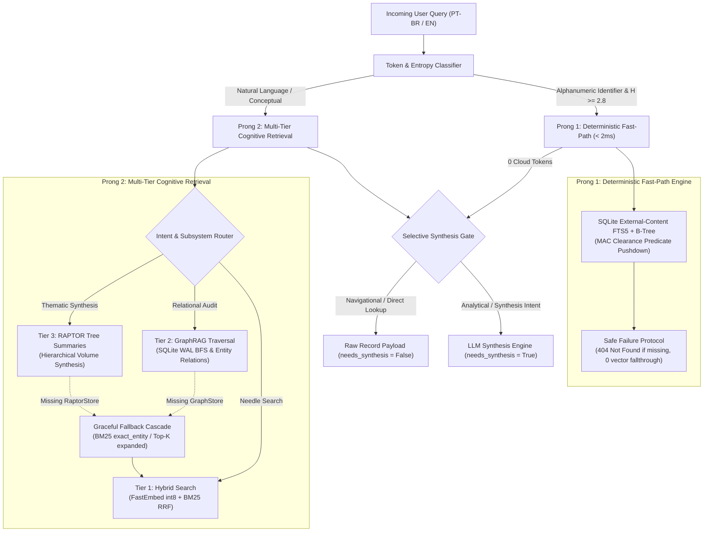

# ADR-06: Two-Pronged Hybrid Retrieval, Deterministic Fast-Path & Resilient Intent Routing

## Status
Accepted

## Date
2026-09-20

## Context
Deploying the Aegis Sovereign Knowledge Appliance into mission-critical enterprise environments (Corporate Legal, Forensic Accounting, Hospital Administration, and National Archives) revealed fundamental challenges at the intersection of retrieval precision, query latency, and data security:

1. **The Technical Identifier Semantic Smearing Fallacy**:
   - Dense vector embeddings excel at broad conceptual associations but perform poorly on exact alphanumeric identifiers (e.g., memory hex error codes `0x80070005`, internal support ticket IDs `TCK-1092`, Brazilian legal entity identifiers such as CPF `123.456.789-00` and CNPJ `12.345.678/0001-90`, or strict quoted phrases `"Clause 14.2"`).
   - Embedding models compress `TCK-1092` and `TCK-1093` into near-identical geometric vectors. Performing an ONNX forward pass (100–300 ms on CPU) and HNSW cosine distance search frequently retrieves the wrong ticket or dilutes relevance scores with semantically adjacent records.
2. **The Missing Identifier Hallucination Risk**:
   - In pure dense retrieval architectures, if a requested technical identifier does not exist in the corpus, the vector search engine returns nearest semantic neighbors instead of an explicit not-found status. This risks prompting downstream LLM generation based on irrelevant documents.
3. **False-Positive Fast-Path Hijacking**:
   - Naive regex engines that attempt to bypass vector search on uppercase tokens inevitably hijack common domain vocabulary and standard business acronyms (`TAX`, `CEO`, `API`, `WAR`, `LAW`, `DARF`, `IRPF`, `LGPD`). When a user searches for conceptual guidance regarding these terms, an uncalibrated fast-path routes to an exact code lookup rather than deep hybrid retrieval.
4. **Hardware-Tier Heterogeneity & Missing Subsystems**:
   - The appliance product continuum spans entry-level community deployments (Free tier, single-core CPU, flat RAG only) up to multi-GPU enterprise racks with full GraphRAG and RAPTOR hierarchical tree summarization. When GraphRAG (`graph_store is None`) or RAPTOR (`raptor_store is None`) are unavailable or disabled by plan governance, queries requesting relational audits or thematic synthesis must degrade gracefully without raising runtime errors.
5. **Full-Text Search (FTS5) Security Clearance Leaks**:
   - SQLite FTS5 search without strict security predicates can expose sensitive document fragments. If full-text indexing is not bound to Mandatory Access Control (MAC) predicate pushdown, unprivileged users could probe for classified keywords or receive matching snippets from restricted records.
6. **Bilingual Query Intent & LLM Token Economy**:
   - Queries span Portuguese and English. Direct navigational lookups (e.g., retrieving an exact invoice or decree) do not require expensive LLM generation. Generating conversational answers for factual lookups consumes unnecessary cloud tokens or local compute; such records should be delivered directly as verified raw payloads.

---

## Decisions

### 1. Two-Pronged Retrieval Taxonomy (Prong 1 vs Prong 2)
The appliance establishes a formal two-pronged query routing architecture:



### 2. Deterministic Fast-Path Engine (<2ms)
When a query contains an exact alphanumeric identifier, the system routes through Prong 1:
- **Identifier Grammars**:
  - Memory & Hex Addresses: `^0x[0-9a-fA-F]{4,16}$`
  - Ticket & Case Codes: `^[A-Z]{2,6}-\d{2,8}$` (e.g., `TCK-1092`, `SEC-40912`)
  - Brazilian Tax Identification (CPF): `\d{3}\.\d{3}\.\d{3}-\d{2}` or unmasked 11 digits with standard modulo-11 checksum validation.
  - Brazilian Corporate Tax Identification (CNPJ): `\d{2}\.\d{3}\.\d{3}/\d{4}-\d{2}` or unmasked 14 digits with standard modulo-11 checksum validation.
  - Strict Quoted Phrases: Exact substrings enclosed in double quotes (`"[^"]+"`).
- **Zero Forward Passes**: Prong 1 completely bypasses the ONNX dense embedding inference and HNSW graph traversal.
- **Sub-2ms Execution**: Lookups execute directly via SQLite indexed primary keys and FTS5 inverted indices.
- **Safe Failure on Missing Technical IDs**: If a technical identifier (hex, ticket, CPF, CNPJ) is queried but absent from the corpus, the engine returns `status: "not_found"` immediately (`safe_fail_on_missing_id=True`). It strictly avoids falling back to dense vector approximation, eliminating hallucinated hits.

### 3. Resilient Intent Classification, Shannon Entropy & Reserved Lexicon Guards
To prevent common business vocabulary and natural uppercase acronyms from triggering false-positive fast-path routing:
- **Shannon Entropy Verification**:
  - The information entropy $H(X)$ of the candidate token is calculated:
    $$H(X) = - \sum_{i=1}^{n} P(x_i) \log_2 P(x_i)$$
  - Candidate alphanumeric identifiers must satisfy $H \ge 2.8$ bits of entropy to qualify as non-trivial technical tokens. Low-entropy repetitive tokens are rejected from the fast-path.
- **Reserved Lexicon Guard**:
  - An explicit dictionary of high-frequency legal, tax, technical, and executive acronyms is maintained:
    `RESERVED_LEXICON = {"TAX", "CEO", "CFO", "CTO", "API", "WAR", "LAW", "DARF", "IRPF", "DIRPF", "LGPD", "BACEN", "GDPR", "SLA", "ROI", "LLM", "RAG", "SQL", "USA", "BRA"}`
  - If a token matches the reserved lexicon, it is treated as a semantic search keyword rather than an exact technical identifier, routing the query to Prong 2 hybrid retrieval.

### 4. Graceful Degradation Cascade (When GraphRAG or RAPTOR are Absent)
The appliance enforces deterministic fallbacks when advanced cognitive subsystems are unavailable or restricted by plan tier:
- **GraphRAG Fallback**:
  - When a query expresses relational audit intent (e.g., investigating relationships between entities) but `graph_store is None` or the plan tier is `free`:
  - The router activates `fallback_active=True` and falls back cleanly to Tier 1 Hybrid Search with `retrieval_mode="exact_entity"`.
  - The extracted entity name is injected as a mandatory lexical filter in the flat chunk index, providing high-precision lexical recall without throwing an exception.
- **RAPTOR Fallback**:
  - When a query expresses macro-thematic synthesis intent (e.g., requesting a whole-book or cross-chapter thesis) but `raptor_store is None` or the plan tier is `free`:
  - The router activates `fallback_active=True` and falls back to Tier 1 Hybrid Search with `analytical_depth="deep_synthesis"`.
  - The candidate limit is expanded from 5 to 15 flat chunks with BM25 lexical re-ranking, providing maximum corpus coverage within flat RAG boundaries.
- In all fallback scenarios, Prong 1 deterministic lookup and the Selective Synthesis Gate continue to operate with 100% efficacy.

### 5. Mandatory Access Control (MAC) Clearance Pushdown in FTS5
To guarantee zero snippet leakage and eliminate side-channel existence attacks:
- **External-Content FTS5 Virtual Table**:
  ```sql
  CREATE TABLE document_records (
      id INTEGER PRIMARY KEY AUTOINCREMENT,
      doc_identifier TEXT UNIQUE NOT NULL,
      title TEXT NOT NULL,
      content TEXT NOT NULL,
      clearance_level INTEGER DEFAULT 0,
      metadata JSON
  );

  CREATE VIRTUAL TABLE document_fts USING fts5(
      title,
      content,
      content='document_records',
      content_rowid='id',
      tokenize='unicode61 remove_diacritics 2'
  );
  ```
- **Predicate Pushdown Inner-Join**:
  All fast-path queries join the FTS5 virtual table with `document_records` and apply clearance filtering directly in the SQL predicate:
  ```sql
  SELECT d.id, d.doc_identifier, d.title, d.content, d.clearance_level, d.metadata,
         snippet(document_fts, 1, '<b>', '</b>', '...', 32) as match_snippet
  FROM document_fts f
  JOIN document_records d ON f.rowid = d.id
  WHERE document_fts MATCH :query
    AND d.clearance_level <= :user_clearance
  ORDER BY rank
  LIMIT :limit;
  ```
- If a document matches the query string but exceeds `:user_clearance`, the inner join evaluates to 0 rows. No snippets, titles, or timing cues are surfaced to unprivileged users.

### 6. Bilingual Intent Taxonomy & Selective Synthesis Gating
The appliance supports Portuguese and English query understanding:
- **Intent Taxonomy**:
  - `DETERMINISTIC_DIRECT`: Exact identifier lookup (Prong 1).
  - `RELATIONAL_GRAPH`: Entity-relationship, ownership, cross-holding audit.
  - `MACRO_SYNTHESIS`: Thematic summary, multi-chapter synthesis, executive brief.
  - `HYBRID_NEEDLE`: Specific factual or conceptual question within document bodies.
  - `COMPOUND_FUSED`: Combined query featuring both an exact identifier and an analytical/synthesis request.
- **Selective Synthesis Gating**:
  - Direct navigational and factual queries (e.g., retrieving document records, checking status, viewing metadata) set `needs_synthesis=False`. The verified database payload is returned directly to the user or agent, consuming 0 LLM tokens and completing in sub-millisecond time.
  - Explanatory, analytical, or comparative queries (e.g., triggers such as `por que`, `why`, `compare`, `resuma`, `explique`, `how does`) set `needs_synthesis=True`, routing the retrieved evidence to local or cloud LLM synthesis.

---

## Consequences

### Positive
- **Sub-2ms Latency for Identifiers**: Alphanumeric lookups complete in <2ms, reducing end-to-end response time by over 95% compared to dense embedding evaluation.
- **Zero Hallucination on Missing Codes**: Missing tickets or hex codes return safe not-found signals rather than irrelevant semantic neighbors.
- **Protected Domain Vocabulary**: Shannon entropy and reserved lexicon guards ensure common business terms (`TAX`, `DARF`, `LGPD`) receive deep hybrid semantic search.
- **Zero Cross-Clearance FTS5 Leakage**: Mandatory Access Control predicate pushdown guarantees complete isolation across clearance levels (L0–L3).
- **Graceful Hardware Degradation**: Flat RAG fallback cascades ensure smooth operation across the entire hardware continuum without crashing.
- **Substantial Token Savings**: Navigational lookups bypass LLM synthesis entirely, preserving cloud API quota and local GPU capacity.

### Negative & Mitigations
- **SQLite Storage Overhead**: The FTS5 index and synchronization triggers consume approximately 15–20% additional disk space relative to the raw document table, mitigated by SQLite WAL compression and single-node ext4 storage.
- **Maintenance of Lexicon**: New domain acronyms must be appended to `RESERVED_LEXICON` over time; mitigated by exposing an extensible configuration interface.

---

## Related Architecture & References
* [ADR-33: Hybrid RAG Engine Architecture & Dual-Corpus Retrieval](ADR-33-Hybrid-RAG-Engine-Architecture.md)
* [ADR-35: Sovereign Knowledge Appliance Packaging](ADR-35-Sovereign-Knowledge-Appliance-Packaging-and-Commercial-Architecture.md)
* [ADR-39: Security Clearance Governance, MAC Pre-Filtering & Resource Quotas](ADR-39-Security-Clearance-Governance-and-Resource-Quotas.md)
* [System Overview & Live Cluster Manifest](../system_overview.md)
* [Manual 06: Executive Tuning, Retrieval Modes & Client Knobs](../appliance/06_executive_tuning_and_client_knobs.md)
