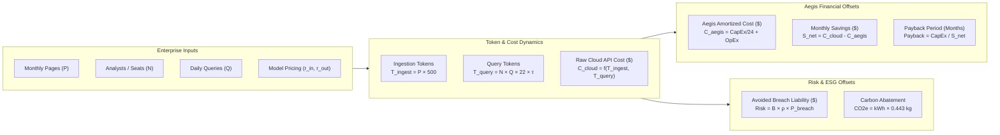

# Aegis Sovereign Vault: Enterprise ROI & Financial Modeling Guide
## Mathematical Formulations, Token Economics & Actuarial Risk Models

**Classification**: Institutional Commercial Specification  
**Reference Tool**: `web/apps/portal/public/roi_calculator.html`  
**Target Audience**: Chief Financial Officers (CFO), Chief Information Officers (CIO), Managing Partners, Investment Committees  

---

## 1. Executive Financial Thesis

Deploying artificial intelligence across document-intensive enterprises—such as Multi-Family Offices, Boutique Law Firms, Diagnostic Healthcare Networks, and Public Regulatory Tribunals—presents an escalating financial and legal trade-off. 

Organizations face two competing cost trajectories:
1. **The Unfiltered Cloud Token Billing Trap**: Commercial cloud LLMs (OpenAI GPT-4o, Anthropic Claude 3.5 Sonnet, Google Gemini) charge per million tokens processed. As enterprises scale document ingestion and multi-user evidentiary queries across 50,000 to 500,000 pages per month, cloud API bills grow non-linearly into tens of thousands of dollars each month.
2. **The Data Egress Regulatory Exposure**: Uploading proprietary financial ledgers, attorney work product, or sensitive patient records (*LGPD Art. 11*) introduces significant liability risks under national privacy and compliance statutes, with potential penalties reaching R$ 50M per incident.

The **Aegis Sovereign Knowledge Appliance** replaces volatile, recurring per-token cloud billing with a **fixed, capitalizable on-premises asset**. By executing OCR, vector embedding, and hybrid relational graph indexing locally inside the physical enterprise firewall, Aegis eliminates external token fees and prevents sensitive data leaks.

This document details the mathematical framework, token consumption formulas, actuarial risk models, and carbon efficiency equations powering the interactive [Enterprise ROI Calculator](file:///home/tlima/Enterprise_Hub/web/apps/portal/public/roi_calculator.html).

---

## 2. Core Mathematical Model & Formulations

---

### A. Document Ingestion Token Equation

When an enterprise ingests raw PDF documents into cloud AI pipelines, text extraction, OCR rasterization, and initial chunking consume tokens proportional to page volume:

$$T_{\text{ingestion}} = P_{\text{monthly}} \times \tau_{\text{page}}$$

Where:
- $P_{\text{monthly}}$: Total document pages ingested per month (ranging from $1,000$ to $500,000$).
- $\tau_{\text{page}}$: Average token density per page (empirically established at $\mathbf{500\text{ tokens/page}}$ for standard legal/financial documents with standard typography).

---

### B. User Query & Context Streaming Equation

In an unfiltered cloud architecture, every user query requires streaming large contextual document windows (contracts, court transcripts, or financial ledgers) to the cloud LLM:

$$T_{\text{query, in}} = N_{\text{analysts}} \times Q_{\text{daily}} \times D_{\text{working}} \times \tau_{\text{query, in}}$$

$$T_{\text{query, out}} = N_{\text{analysts}} \times Q_{\text{daily}} \times D_{\text{working}} \times \tau_{\text{query, out}}$$

Where:
- $N_{\text{analysts}}$: Number of active billable attorneys, wealth managers, or research analysts ($1$ to $50$).
- $Q_{\text{daily}}$: Average queries executed per analyst per day ($5$ to $100$).
- $D_{\text{working}}$: Standard business days per month ($\mathbf{22\text{ days}}$).
- $\tau_{\text{query, in}}$: Average input context size for an unfiltered document search ($\mathbf{12,000\text{ tokens}}$ based on a 25-page contextual exhibit dump).
- $\tau_{\text{query, out}}$: Average output synthesis size ($\mathbf{800\text{ tokens}}$ for an executive legal/financial memo).

---

### C. Total Unfiltered Cloud API Cost ($C_{\text{cloud}}$)

The aggregate monthly operational expenditure paid to commercial cloud providers is calculated as:

$$C_{\text{cloud}} = \left( \frac{T_{\text{ingestion}}}{10^6} \times r_{\text{in}} \right) + \left( \frac{T_{\text{query, in}}}{10^6} \times r_{\text{in}} \right) + \left( \frac{T_{\text{query, out}}}{10^6} \times r_{\text{out}} \right)$$

#### Frontier Model Benchmark Rates (per 1M Tokens)

| Frontier Model | Input Price ($r_{\text{in}}$) | Output Price ($r_{\text{out}}$) | Blended Cost per 10k Query |
| :--- | :--- | :--- | :--- |
| **GPT-4o** | $\$2.50$ | $\$10.00$ | $\$0.0380$ |
| **Claude 3.5 Sonnet** | $\$3.00$ | $\$15.00$ | $\$0.0480$ |
| **Gemini 1.5 Pro** | $\$3.50$ | $\$10.50$ | $\$0.0504$ |

---

### D. Aegis Sovereign Cost Architecture ($C_{\text{aegis}}$)

Aegis shifts the expenditure profile from variable OpEx to a predictable hybrid CapEx/OpEx model:

$$C_{\text{aegis}} = \left( \frac{\text{CapEx}}{L_{\text{amortization}}} \right) + \text{OpEx}_{\text{monthly}}$$

Where:
- $L_{\text{amortization}}$: Enterprise hardware amortization schedule ($\mathbf{24\text{ months}}$ standard IT hardware depreciation).
- $\text{CapEx}$: One-time upfront hardware and software licensing investment.
- $\text{OpEx}_{\text{monthly}}$: Predictable monthly maintenance, firmware updates, and regulatory SLA retainer.

#### Deployment Tier Pricing Parameters

| Tier & Form Factor | Hardware CapEx ($) | Monthly OpEx ($) | Target Deployment Profile |
| :--- | :--- | :--- | :--- |
| **Tier 1: Desktop Workstation** | $\$0$ | $\$89\text{ / seat / mo}$ | Solo practitioners & visiting analysts |
| **Tier 2: Sovereign Edge 1U** | $\$14,000$ ($\text{R\$ }77.000$) | $\$650\text{ / mo}$ ($\text{R\$ }3.575$) | Boutique law firms & family offices (10–30 seats) |
| **Tier 3: Datacenter Cluster** | $\$85,000$ ($\text{R\$ }467.500$) | $\$2,500\text{ / mo}$ ($\text{R\$ }13.750$) | Enterprise hospital groups & judicial tribunals |

---

### E. Net Monthly Operational Savings & Payback Period

The net monthly savings generated by adopting the sovereign appliance is:

$$S_{\text{monthly}} = \max\left(0, C_{\text{cloud}} - C_{\text{aegis}}\right)$$

$$S_{\text{annual}} = S_{\text{monthly}} \times 12$$

The **Enterprise Payback Period** (in months) is given by:

$$P_{\text{payback}} = \begin{cases} 
\frac{\text{CapEx}}{S_{\text{monthly}}}, & \text{if } \text{CapEx} > 0 \text{ and } S_{\text{monthly}} > 0 \\
< 0.5 \text{ months}, & \text{if } \text{CapEx} = 0 \text{ (Tier 1 Desktop)} \\
\infty, & \text{if } S_{\text{monthly}} \le 0
\end{cases}$$

---

## 3. Actuarial Risk & Data Breach Liability Avoidance Model

Beyond direct token savings, enterprise executives face substantial regulatory and civil liabilities if client data is compromised in a third-party cloud breach:

$$L_{\text{avoided}} = B_{\text{baseline}} \times \rho_{\text{sensitive}} \times P(\text{breach} \mid \text{egress})$$

Where:
- $B_{\text{baseline}}$: Average global enterprise data breach cost based on the **IBM Cost of a Data Breach Report 2024** ($\mathbf{\$4,880,000\text{ USD}}$).
- $\rho_{\text{sensitive}}$: Proportion of sensitive documents in the archive subject to statutory protection (e.g., *LGPD Art. 11* health data, *Lei 14.754* offshore assets, or attorney work product), calibrated at $\mathbf{45\%}$.
- $P(\text{breach} \mid \text{egress})$: Annualized probability of a data compromise event resulting from continuous cloud transmission, modeled as a sub-linear function of monthly page volume:

$$P(\text{breach} \mid \text{egress}) = \min\left(0.25, \left(\frac{P_{\text{monthly}}}{500,000}\right) \times 0.18\right)$$

*Result*: For a firm ingesting 50,000 pages per month, the annualized risk mitigation value is **$\$39,528\text{ USD}$**. At 250,000 pages per month, the annual risk exposure avoided exceeds **$\$197,640\text{ USD}$**.

---

## 4. Human Capital Efficiency & Billable Uplift

In professional services, the highest cost driver is highly compensated human analysts spending hours manually searching for clauses, tax receipts, or medical milestones:

$$H_{\text{reclaimed}} = N_{\text{analysts}} \times h_{\text{saved, daily}} \times D_{\text{working}}$$

Where:
- $h_{\text{saved, daily}}$: Average billable hours reclaimed per professional per day through instantaneous sub-50ms GraphRAG and semantic retrieval ($\mathbf{1.5\text{ hours/day}}$).
- $D_{\text{working}}$: Standard business days ($\mathbf{22\text{ days/month}}$).

$$H_{\text{reclaimed}} = N_{\text{analysts}} \times 33\text{ hours/analyst/month}$$

*Economic Value*: For a 15-attorney boutique billing at an average of $\$250/\text{hour}$, reclaiming 495 hours per month translates to **$\$123,750/\text{month}$** in newly deployable billable capacity.

---

## 5. ESG, Compute Power & Carbon Footprint Abatement

Hyperscale cloud data centers consume significant electrical power for high-density GPU inference, aggravated by datacenter Power Usage Effectiveness (PUE) cooling multipliers:

$$\Delta E_{\text{kWh}} = \left(\frac{T_{\text{total}}}{10,000}\right) \times \left(e_{\text{cloud, GPU}} \times \text{PUE} - e_{\text{local, ONNX}}\right)$$

$$\Delta \text{CO}_2\text{e (kg)} = \Delta E_{\text{kWh}} \times f_{\text{emission}}$$

Where:
- $e_{\text{cloud, GPU}} \times \text{PUE}$: Cloud inference and cooling energy ($\mathbf{0.0031\text{ kWh}}$ per 10k tokens at PUE 1.35).
- $e_{\text{local, ONNX}}$: Local quantized int8 inference energy on modern AVX-512/NPU hardware ($\mathbf{0.0002\text{ kWh}}$ per 10k tokens).
- $f_{\text{emission}}$: Grid average carbon intensity factor ($\mathbf{0.443\text{ kg CO}_2\text{e per kWh}}$).

---

## 6. Enterprise Benchmark Profiles

The table below illustrates projected returns across three standard institutional profiles:

| Operational Parameter | Boutique Law Firm | Multi-Family Office | Healthcare Oncology Network |
| :--- | :--- | :--- | :--- |
| **Monthly Pages ($P$)** | $35,000$ | $20,000$ | $120,000$ |
| **Active Professionals ($N$)** | $12\text{ attorneys}$ | $6\text{ wealth managers}$ | $25\text{ oncologists}$ |
| **Daily Query Frequency ($Q$)** | $30\text{ queries/day}$ | $15\text{ queries/day}$ | $40\text{ queries/day}$ |
| **Target Cloud Model** | Claude 3.5 Sonnet | GPT-4o | Gemini 1.5 Pro |
| **Aegis Deployment Tier** | Tier 2: Sovereign Edge 1U | Tier 2: Sovereign Edge 1U | Tier 3: Datacenter Cluster |
| **Gross Cloud API Bill / Month** | $\mathbf{\$17,846}$ | $\mathbf{\$4,178}$ | $\mathbf{\$42,860}$ |
| **Aegis Monthly Amortized Cost** | $\$1,233$ | $\$1,233$ | $\$6,041$ |
| **Net Monthly Savings ($S_{\text{monthly}}$)** | $\mathbf{\$16,613}$ | $\mathbf{\$2,945}$ | $\mathbf{\$36,819}$ |
| **Payback Period ($P_{\text{payback}}$)** | $\mathbf{1.0\text{ months}}$ | $\mathbf{4.7\text{ months}}$ | $\mathbf{2.3\text{ months}}$ |
| **Annual Breach Risk Avoided** | $\$27,670$ | $\$15,811$ | $\$94,874$ |
| **Monthly Billable Hours Reclaimed** | $396\text{ hours}$ | $198\text{ hours}$ | $825\text{ hours}$ |

---

## 7. Interactive Verification

Executives and prospective partners can dynamically manipulate all variables using the live interactive tool:
* **Interactive Tool Location**: [`web/apps/portal/public/roi_calculator.html`](file:///home/tlima/Enterprise_Hub/web/apps/portal/public/roi_calculator.html)
* **Live Dynamic Adjustments**: Real-time slider recalculations, dual currency conversion (USD/BRL), cost comparison bars, and printable 1-page executive PDF generation.

*For custom institutional actuarial assessments or enterprise RFP support, contact the Aegis Sovereign Architecture Group.*
