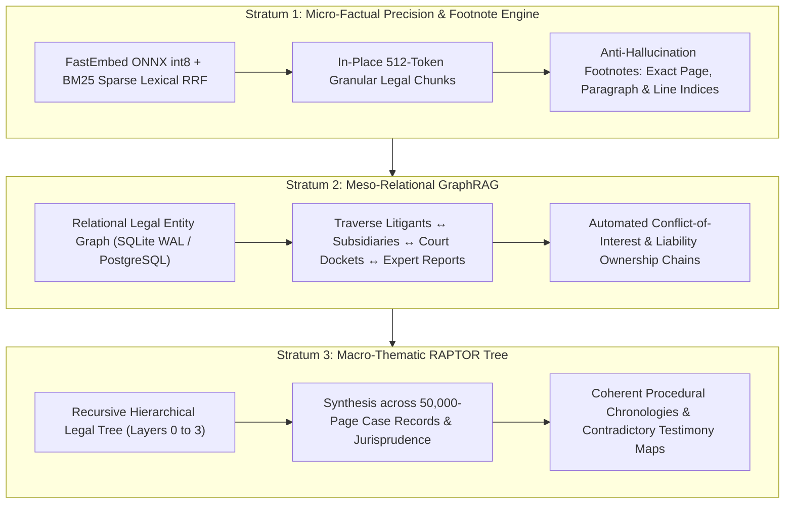
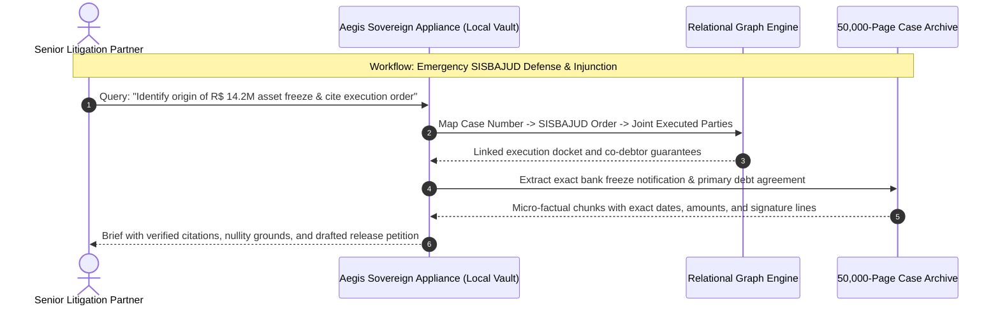
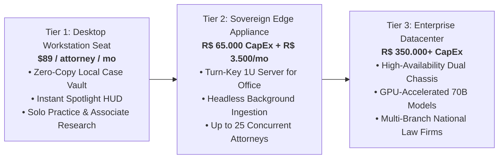

# Aegis Sovereign Vault: Executive Commercial Brief
## Boutique Law Firms & High-Stakes Litigation Counsel

**Classification**: Institutional Commercial Document  
**Product**: Aegis Sovereign Knowledge Appliance  
**Target Decision Makers**: Senior Partners, Litigation Practice Heads, Chief Knowledge Officers, General Counsel  
**Target Ecosystem**: Specialized Litigation Boutiques, Corporate M&A Practices, Tax Controversy Firms (5 to 150 attorneys)  

---

## 1. Executive Summary & Market Thesis

Elite legal counsel win cases through evidentiary mastery, procedural speed, and flawless factual precision. Modern corporate litigation and M&A transactions routinely generate document archives exceeding 50,000 to 200,000 pages—comprising complex corporate agreements, board minutes, court dockets, accounting ledgers, and electronic correspondence.

While commercial cloud language models promise automated analysis, their deployment in top-tier legal practice introduces existential hazards: **hallucinated case law, non-existent precedents, and the catastrophic waiver of attorney-client privilege.** Under Brazilian legal doctrine (*Estatuto da Advocacia - Lei 8.906/1994, Art. 7, II*) and global evidentiary standards, transmitting unredacted client dossiers to third-party clouds compromises institutional privilege and invites disciplinary sanctions.

The **Aegis Sovereign Knowledge Appliance** provides a mathematically grounded, air-gapped solution. Engineered specifically for litigation e-discovery and transactional due diligence, Aegis delivers instantaneous multi-volume synthesis backed by a **100% Anti-Hallucination Footnote Guarantee**—citing exact page numbers, paragraph coordinates, and line indices. **Zero client data leaves the law firm's physical firewall. Zero third-party cloud exposure.**

---

## 2. The Vertical Dilemma: The Legal Evidentiary & Privilege Crisis

Boutique and tier-one law firms face four critical operational bottlenecks:

```
            ┌────────────────────────────────────────────────────────┐
            │          The High-Stakes Legal Practice Paradox        │
            └───────────────────────────┬────────────────────────────┘
                                        │
          ┌─────────────────────────────┴─────────────────────────────┐
          ▼                                                           ▼
┌─────────────────────────────────┐                 ┌─────────────────────────────────┐
│     The Ingestion Imperative    │                 │      The Sovereign Barrier      │
├─────────────────────────────────┤                 ├─────────────────────────────────┤
│ • 50,000+ page M&A deal rooms   │                 │ • Cloud AI hallucinates court   │
│ • Complex litigation discovery  │                 │   citations & contract clauses  │
│ • 15-day court appeal deadlines │                 │ • Waiver of attorney-client     │
│ • Aggressive SISBAJUD freezes   │                 │   privilege (OAB Art. 7, II)    │
└─────────────────────────────────┘                 └─────────────────────────────────┘
```

1. **The Hallucination & Verification Crisis**:  
   Generative cloud LLMs frequently invent citations, misquote contract clauses, and fabricate jurisprudence (*súmulas* and *acórdãos*). In judicial practice, submitting a brief with a single hallucinated precedent can result in severe judicial reprimands, loss of credibility, and claims of professional malpractice.

2. **The Attorney-Client Privilege Barrier**:  
   Attorneys owe an absolute statutory duty of confidentiality to their clients. Streaming unredacted strategy memoranda, settlement calculations, and internal fraud investigations to public cloud platforms (OpenAI, Anthropic, Google Cloud) can be construed under corporate governance and international discovery rules as a voluntary waiver of confidentiality, exposing clients to hostile subpoenas.

3. **High-Volume Discovery & M&A Fatigue**:  
   Reviewing 50,000 pages during a 14-day M&A diligence window or an emergency preliminary injunction (*tutela de urgência*) consumes thousands of associate hours. Flat keyword searches (Ctrl+F) fail to detect nuanced indemnification caps, change-of-control triggers, or contradictory witness testimonies scattered across years of depositions.

4. **The Procedural Deadline & SISBAJUD Threat**:  
   In jurisdictions like Brazil, electronic judicial dockets (*PJe*, *e-SAJ*) operate with unforgiving statutory deadlines. When an electronic asset freeze order is issued via **SISBAJUD** (especially through the automated recurrence engine, *a teimosinha*), a firm has mere hours to review thousands of pages, identify the originating execution order, and draft an emergency motion for release (*desbloqueio judicial*).

---

## 3. The Sovereign Solution: The 3-Strata Legal Cognitive Engine

Aegis Sovereign eliminates discovery friction by deploying a local, multi-tiered neural and relational indexing architecture:



### Stratum 1: Micro-Factual Precision & Anti-Hallucination Footnotes
- **Mechanism**: Hybrid dense semantic search combined with exact BM25 lexical matching (2.0x lexical boost in `exact_entity` mode).
- **Legal Output**: Every synthesis, answer, or extracted clause is coupled with a cryptographic evidence pill referencing the exact source document, page number, and bounding box coordinates. Attorneys can click any citation to inspect the original PDF in high resolution.

### Stratum 2: Meso-Relational GraphRAG
- **Mechanism**: Extracts and links legal entities, corporate directors, co-defendants, judicial orders, and disputed assets into a queryable relational graph.
- **Legal Output**: Maps corporate alter-egos in disregard of legal personality (*desconsideração da personalidade jurídica*), traces inter-company transfers to evade creditors, and instantly flags conflicts of interest across past firm matters.

### Stratum 3: Macro-Thematic Synthesis (RAPTOR Tree)
- **Mechanism**: Asynchronous hierarchical clustering and recursive summarization across hundreds of procedural filings and discovery bundles.
- **Legal Output**: Constructs comprehensive, end-to-end procedural chronologies (*linhas do tempo processuais*) spanning 10+ years of litigation, identifying doctrinal contradictions between early depositions and subsequent expert witness reports.

---

## 4. High-Value Institutional Workflows



### Workflow A: 50,000-Page M&A Diligence & Red-Flag Audit
- **Input**: Virtual Data Room (VDR) exports comprising shareholder agreements, commercial leases, labor audit reports, and material supply contracts.
- **Execution**: The appliance automatically extracts change-of-control provisions, liability caps, non-compete covenants, and pending environmental claims.
- **Output**: An executive due diligence red-flag matrix with direct hyperlinks to source contract clauses, reducing associate review time by 85%.

### Workflow B: Litigation e-Discovery & Automated Privilege Logs
- **Input**: 100,000 scanned emails, internal memos, and audit drafts submitted by opposing counsel.
- **Execution**: Hybrid semantic classifiers detect attorney work product, confidential settlement negotiations, and third-party communications.
- **Output**: A standardized privilege log (*tabela de confidencialidade*) conforming to judicial rules, detailing document dates, senders, recipients, and legal privilege grounds.

### Workflow C: SISBAJUD Emergency Asset Freeze Defense
- **Input**: Emergency client notification of automated bank account blockades.
- **Execution**: Stratum 1 locates the exact judicial dispatch, cross-checks the locked amount against statutory unseizable accounts (e.g., payroll accounts, capital reserves under *CPC, Art. 833*), and drafts an emergency release petition.
- **Output**: Complete motion for release of seized assets filed within hours of the initial bank notification.

### Workflow D: Contradictory Deposition Analysis
- **Input**: Transcripts from 15 witness hearings, expert accounting reports, and police inquiry testimonies.
- **Execution**: Stratum 3 RAPTOR clustering aligns witness testimonies chronologically and factually against physical exhibits.
- **Output**: A cross-examination grid highlighting direct contradictions between depositions, empowering partners during live court hearings.

---

## 5. Security Architecture & Ethical Privilege Compliance

| Security Dimension | Standard Commercial Cloud AI | Aegis Sovereign Appliance |
| :--- | :--- | :--- |
| **Attorney-Client Privilege** | High risk of deemed waiver under cloud terms | **100% Protected**. Data never leaves law firm premises |
| **Ethical Compliance** | Questionable under *OAB CED Art. 34* & ABA Model Rules | **Fully Compliant** with statutory secrecy and ethical codes |
| **Subpoena Defense** | Foreign governments can subpoena cloud datacenters | **Immune to Third-Party Cloud Subpoenas**. Vault is on-premise |
| **Data Residency** | Dynamic routing across international server farms | **Strictly Local**. On-premises NVMe storage with AES-256 |
| **Citation Verifiability** | Black-box generated text prone to hallucinations | **Deterministic Verification**: Exact page/line citation audit trail |

- **Zero-Cloud Air-Gap Guarantee**: The appliance operates without an external WAN connection, ensuring opposing litigants, foreign entities, or cloud administrators cannot compromise strategic legal work product.
- **Multi-Case Isolation & Ethical Walls**: Secure case partitioning enforces cryptographic Chinese walls, preventing attorneys representing conflicting parties from querying unauthorized case files.

---

## 6. Commercial Packages & Institutional Deployment



### 1. Tier 1: Personal Workstation Edition (Litigator Seat)
- **Target**: Senior partners, boutique solo practitioners, and traveling dispute specialists.
- **Deployment**: Standalone binary on MacBook Pro or corporate ThinkPad; zero-copy in-place traversal of local case files.
- **Commercial Model**: **US$ 89 / user / month** or **R$ 450 / user / month** (Annual commitment).

### 2. Tier 2: Sovereign Edge Appliance (Turn-Key Law Firm Vault)
- **Target**: Boutique and mid-sized law firms (10 to 40 attorneys) handling high-stakes litigation and M&A.
- **Deployment**: Silent 1U server or rackmount appliance located in the firm's private server closet. Integrates via local Gigabit LAN.
- **Commercial Model**:
  - **Hardware & Engine License (CapEx)**: **R$ 65.000,00 – R$ 95.000,00** one-time.
  - **Custom Taxonomy & Legacy Case Ingestion**: **R$ 20.000,00** (Historical brief and contract library indexing).
  - **Maintenance, Firmware & Legal Rule Retainer (OpEx)**: **R$ 3.500,00 / month** (Includes ongoing firmware security, statutory updates, and 24/7 hardware replacement SLA).

### 3. Tier 3: Enterprise Multi-Office Cluster
- **Target**: Full-service national firms (50+ attorneys) across São Paulo, Rio de Janeiro, and Brasília.
- **Deployment**: High-availability dual-node cluster with Ceph S3 storage and dedicated GPU inference servers for on-premise frontier models.
- **Commercial Model**: Custom institutional quote starting at **R$ 350.000,00 CapEx** + 20% annual SLA retainer.

---

## 7. Financial & Strategic ROI Justification

- **Direct Associate Hours Saved**: Reduces first-pass document review time from 160 hours to 12 hours per 10,000 pages, freeing billable time for high-value strategic drafting.
- **Zero Cloud API Exposure**: Eliminates runaway per-token monthly bills that exceed $15,000/month during large document reviews.
- **Litigation Win Rate**: Guarantees zero missed deadlines and eliminates procedural default risks through proactive docket synthesis.

*For private litigation case simulations and hardware demonstrations, contact the Aegis Sovereign Architecture Group.*
