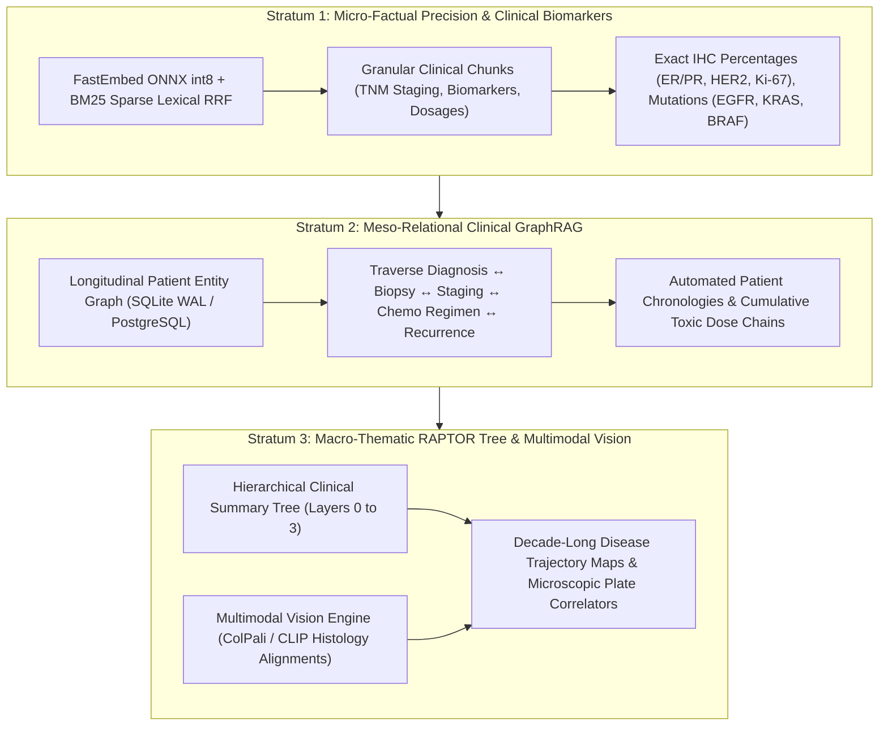
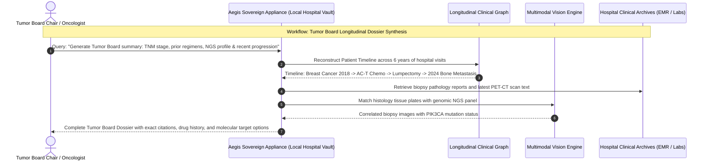
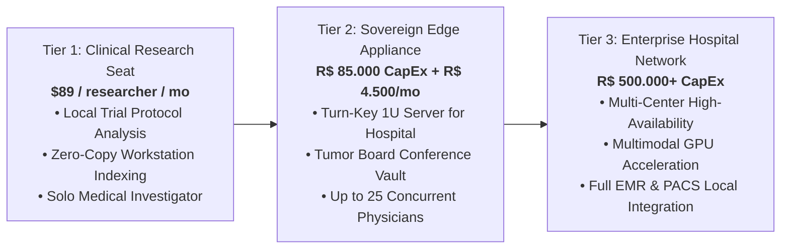

# Aegis Sovereign Vault: Executive Commercial Brief
## Elite Healthcare & Comprehensive Oncology Networks

**Classification**: Institutional Commercial Document  
**Product**: Aegis Sovereign Knowledge Appliance  
**Target Decision Makers**: Chief Medical Officers (CMO), Chief Information Officers (CIO), Oncology Chairs, Data Protection Officers (DPO)  
**Target Ecosystem**: Cancer Centers, Tertiary Diagnostic Hospitals, Specialty Pathology Networks, Academic Medical Centers  

---

## 1. Executive Summary & Market Thesis

Modern oncology and precision medicine demand the continuous synthesis of massive, multimodal clinical data: longitudinal electronic health records, surgical notes, molecular pathology reports, next-generation genomic sequencing (NGS), and radiology imaging. In multidisciplinary **Tumor Boards**, oncologists, surgeons, and pathologists have mere minutes to evaluate complex patient histories and formulate definitive therapeutic regimens.

While generative AI offers transformative potential for clinical synthesis, hospitals operate under strict statutory confidentiality laws. In Brazil, medical records are classified as sensitive personal data (*dados pessoais sensíveis*) under **LGPD Art. 5 (II) and Art. 11**. Transmitting identifiable clinical charts, biopsy images, or genetic markers to public commercial clouds (OpenAI, AWS, Azure, Google Cloud) violates national health regulations (*CFM Resoluções*), breaks patient confidentiality, and exposes healthcare institutions to severe regulatory fines of up to R$ 50M per infraction.

The **Aegis Sovereign Knowledge Appliance** solves this institutional crisis. Delivered as a dedicated, air-gapped on-premises appliance, Aegis fuses multimodal pathology plates, clinical charts, and genomic reports into an instant, unified longitudinal dossier. **Zero patient data leaves the hospital's private intranet. Zero cloud transmission. Zero regulatory risk.**

---

## 2. The Vertical Dilemma: The Clinical Synthesis & LGPD Privacy Crisis

Healthcare networks and oncology institutions face four acute operational challenges:

```
           ┌────────────────────────────────────────────────────────┐
           │        The Oncology Care & Health Privacy Paradox       │
           └───────────────────────────┬────────────────────────────┘
                                       │
         ┌─────────────────────────────┴─────────────────────────────┐
         ▼                                                           ▼
┌─────────────────────────────────┐                 ┌─────────────────────────────────┐
│     The Ingestion Imperative    │                 │      The Sovereign Barrier      │
├─────────────────────────────────┤                 ├─────────────────────────────────┤
│ • 5-10 years of patient records │                 │ • LGPD Art. 11: Severe curbs on │
│ • Fragmented EMRs, labs & NGS   │                 │   sharing sensitive health data │
│ • Tumor board time constraints  │                 │ • CFM ethical bans on cloud data│
│ • Multimodal pathology plates   │                 │ • R$ 50M fines for data breaches│
└─────────────────────────────────┘                 └─────────────────────────────────┘
```

1. **The LGPD *Dados Sensíveis* (Art. 11) Regulatory Wall**:  
   Under the Brazilian General Data Protection Law (*LGPD - Lei 13.709/2018*), health, genetic, and biometric data receive elevated statutory protection. Sharing patient data with third-party cloud AI vendors without explicit, documented consent or under dubious secondary use agreements exposes hospitals to catastrophic regulatory sanctions by the ANPD, civil class-action lawsuits, and loss of medical accreditation.

2. **Longitudinal Clinical Fragmentation**:  
   An oncology patient’s history is scattered across incompatible enterprise software (Tasy, MV Soul, Cerner, Epic), third-party laboratory PDF portals, outside imaging centers (PACS/DICOM), and genetic sequencing laboratories. Clinicians spend up to 40% of their time manually hunting for prior chemotherapy regimens, cumulative radiation doses, and baseline biopsy reports.

3. **Multimodal Pathology & Histology Blindness**:  
   Traditional OCR engines fail completely on microscopic histology slides, immunohistochemistry (IHC) staining plates, and graphical radiation distribution charts. Flat text RAG cannot correlate a microscopic tissue plate showing HER2 amplification with the corresponding clinical narrative in the surgical discharge summary.

4. **Tumor Board Latency & Cognitive Fatigue**:  
   Tumor boards review dozens of cases in single multi-hour sessions. Missing a prior adverse drug reaction, a subtle progression on a PET-CT scan from three years prior, or a rare somatic mutation can lead to suboptimal first-line systemic therapies.

---

## 3. The Sovereign Solution: The 3-Strata Multimodal Clinical Engine

Aegis Sovereign deploys an air-gapped, on-premise clinical intelligence architecture tailored for complex medical environments:



### Stratum 1: Micro-Factual Clinical Precision
- **Mechanism**: Hybrid dense-sparse retrieval optimized for medical nomenclatures (SNOMED-CT, ICD-10/CID-10, LOINC).
- **Clinical Output**: Instantly extracts exact TNM anatomical staging (`T2N1M0`), immunohistochemistry receptor status (e.g., *ER 95%, PR 80%, HER2 2+ FISH negative, Ki-67 45%*), and molecular mutations (e.g., *EGFR Exon 19 deletion, KRAS G12C*), providing deterministic citations to source lab reports.

### Stratum 2: Meso-Relational Clinical GraphRAG
- **Mechanism**: Dynamic knowledge graph tracking the patient's longitudinal oncology journey across healthcare encounters.
- **Clinical Output**: Constructs an uninterrupted clinical timeline linking the initial biopsy, neoadjuvant anthracycline/taxane cycles, surgical margins from lumpectomy/mastectomy, adjuvant radiation fields, and subsequent surveillance imaging.

### Stratum 3: Macro-Thematic Synthesis & Multimodal Vision
- **Mechanism**: RAPTOR tree summarization integrated with ColPali/CLIP visual embedding encoders operating directly on pathology plates and radiology reports.
- **Clinical Output**: Summarizes 8 years of complex oncological care into an executive 1-page tumor board summary while visually indexing histology plates without lossy OCR degradation.

---

## 4. High-Value Institutional Workflows



### Workflow A: 90-Second Tumor Board Longitudinal Synthesis
- **Input**: 800 pages of scattered clinical records, external lab PDFs, and surgical operative notes spanning 5 years.
- **Execution**: The appliance synthesizes the patient's entire trajectory: initial presentation, cumulative chemotherapy dosages (e.g., lifetime doxorubicin exposure), disease-free interval, and current metastatic sites.
- **Output**: A standardized 1-page Tumor Board Brief highlighting critical clinical decision points, accompanied by verifiable citations to original laboratory reports.

### Workflow B: Multimodal Pathology Plate & Marker Correlation
- **Input**: High-resolution microscopic pathology plates and molecular profiling panels.
- **Execution**: Visual embedding models cross-reference tissue cellularity and staining density with the pathologist's textual diagnostic impression.
- **Output**: Instant side-by-side display of the baseline core needle biopsy vs. the recurrence biopsy, highlighting phenotypic switching (e.g., conversion from ER-positive to triple-negative).

### Workflow C: Clinical Trial Eligibility Matching
- **Input**: Clinical trial protocol criteria (inclusion/exclusion parameters) and hospital oncology archives.
- **Execution**: The appliance scans institutional records locally to identify candidates matching intricate criteria (e.g., *HER2-low, prior CDK4/6 inhibitor treatment, ECOG performance status 0–1, absence of active brain metastases*).
- **Output**: Qualified cohort lists generated on-premise without ever uploading protected health information (PHI) to third-party clinical trial platforms.

---

## 5. Security Architecture & LGPD Regulatory Proof

| Compliance Parameter | Commercial Cloud AI (OpenAI / Azure) | Aegis Sovereign Appliance |
| :--- | :--- | :--- |
| **LGPD Art. 11 (Dados Sensíveis)** | High risk of unauthorized third-party processing | **100% Compliant**. Data never leaves hospital control |
| **CFM Medical Secrecy Rules** | Cloud transmission breaches physician confidentiality | **Absolute Adherence**. Zero external network egress |
| **Data Sovereignty** | Cross-border transfer of health and genetic data | **Zero International Egress**. Fully on-premises storage |
| **Hardware Encryption** | Cloud-managed keys accessible to provider personnel | **FIPS 140-2 Level 3 / LUKS2 AES-256** local hardware keys |
| **Network Architecture** | Requires persistent WAN / Internet access | **Physically Air-Gapped**. Dedicated hospital medical VLAN |

- **Zero-Egress Operational Guarantee**: The appliance can be deployed on a physically isolated network segment without internet access, ensuring complete compliance with international standards (HIPAA, GDPR Health Special Categories) and national regulations.
- **Physician Clearance & Audit Logging**: Cryptographic access logging records every query and document retrieval, providing the Data Protection Officer (DPO) with an immutable compliance trail for ANPD audits.

---

## 6. Commercial Packages & Institutional Deployment



### 1. Tier 1: Clinical Research Edition (Investigator Seat)
- **Target**: Principal clinical investigators, oncology department chairs, and academic medical fellows.
- **Deployment**: Standalone workstation binary for research laptops; local analysis of de-identified clinical trials and publications.
- **Commercial Model**: **US$ 89 / user / month** or **R$ 450 / user / month** (Annual commitment).

### 2. Tier 2: Sovereign Edge Appliance (Turn-Key Cancer Center Vault)
- **Target**: Independent oncology clinics and hospital departments (10 to 30 clinicians and tumor board members).
- **Deployment**: 1U rackmount server pre-configured with high-throughput NVMe storage, FastEmbed medical indexers, and local hospital intranet integration.
- **Commercial Model**:
  - **Hardware & Clinical Engine License (CapEx)**: **R$ 85.000,00 – R$ 120.000,00** one-time.
  - **EMR Pipeline & Taxonomy Integration**: **R$ 35.000,00** (Local PDF connector setup and clinical dictionary alignment).
  - **Clinical Maintenance & Health Regulatory Retainer (OpEx)**: **R$ 4.500,00 / month** (Includes ongoing firmware security, regulatory updates, and 24/7 hardware replacement SLA).

### 3. Tier 3: Enterprise Hospital Network Supercomputing Cluster
- **Target**: Multi-hospital healthcare conglomerates, statewide cancer networks, and diagnostic laboratory groups.
- **Deployment**: Multi-node high-availability cluster with dedicated GPU inference nodes for local vision processing (ColPali/CLIP) and multi-billion parameter clinical language models.
- **Commercial Model**: Custom institutional quote starting at **R$ 500.000,00 CapEx** + 20% annual managed SLA retainer.

---

## 7. Clinical & Financial ROI Justification

- **Physician Time Reclaimed**: Reduces tumor board case preparation time from 45 minutes to under 2 minutes per patient, allowing oncologists to focus on direct patient care.
- **Elimination of Cloud Compliance Penalties**: Insulates the hospital from ANPD regulatory fines of up to R$ 50,000,000 per data security incident.
- **Enhanced Clinical Trial Accrual**: Doubles patient enrollment in high-margin oncology clinical trials through rapid, on-premise phenotype matching.

*For institutional clinical demonstrations and security audits, contact the Aegis Sovereign Healthcare Architecture Group.*
