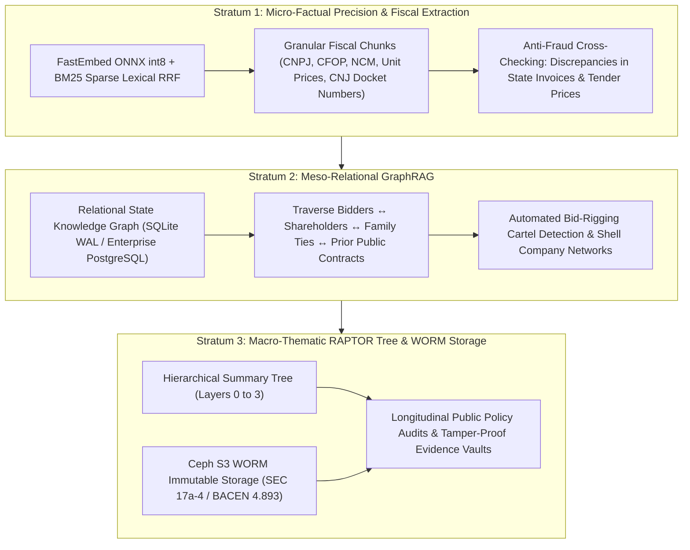
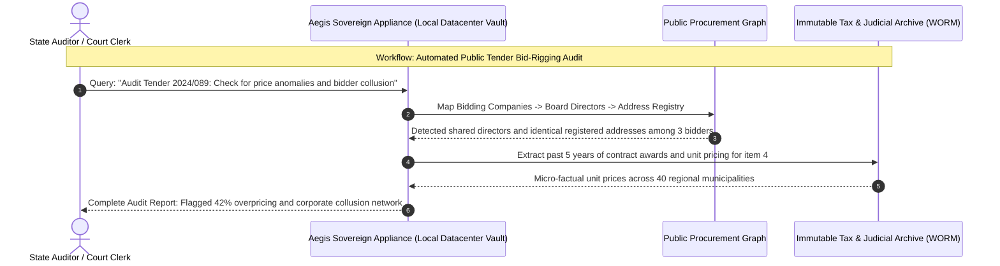
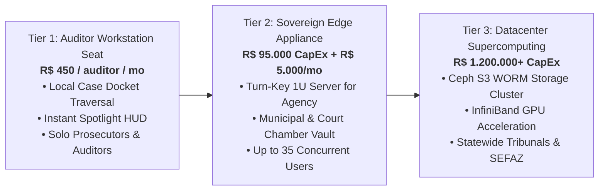

# Aegis Sovereign Vault: Executive Commercial Brief
## Municipal, State & Federal Governments and Judicial Tribunals

**Classification**: Institutional Commercial Document  
**Product**: Aegis Sovereign Knowledge Appliance (Government & Judicial Edition)  
**Target Decision Makers**: Tribunal IT Directors (DTI), State Secretaries of Finance (SEFAZ), Attorney Generals (PGE/PGM), Chief Court Auditors (TCE/TCU)  
**Target Ecosystem**: State Courts of Justice (TJs), Federal Regional Courts (TRFs), State Tax Secretariats, Public Audit Courts, Municipal Administrations  

---

## 1. Executive Summary & Market Thesis

Government agencies, judicial tribunals, and public tax secretariats handle millions of sensitive documents every month: judicial dockets, electronic invoices (*NF-e*), corporate registry records, public procurement files, and state audit trails. In Brazil alone, the judiciary manages over 80 million active lawsuits, while tax secretariats audit trillions of reais in economic transactions.

Deploying cognitive AI in the public sector is complicated by strict regulatory and statutory frameworks. Under **Brazilian Federal Law 8.159/1991 (*Public Archives*)**, **BACEN Resolution 4.893 (*Cybersecurity and Cloud Outsourcing*)**, and the **New Public Procurement Law (*Lei 14.133/2021*)**, public entities are legally constrained from transmitting sovereign fiscal records, sealed criminal dockets, or citizen PII to foreign, commercial multi-tenant cloud platforms.

The **Aegis Sovereign Knowledge Appliance (Government Edition)** delivers an air-gapped, high-throughput cognitive engine engineered specifically for state and judicial workflows. From detecting procurement collusion and shell company networks to automating repetitive judicial drafts and enforcing **SEC 17a-4 / WORM immutability**, Aegis empowers public institutions with sovereign intelligence—with **zero data leaving the state datacenter, zero external telemetry, and absolute regulatory compliance.**

---

## 2. The Vertical Dilemma: The Public Sector Governance & Sovereignty Crisis

Public sector leaders operate under intense legal scrutiny and operational backlogs:

```
            ┌────────────────────────────────────────────────────────┐
            │       The Public Administration & Sovereignty Paradox  │
            └───────────────────────────┬────────────────────────────┘
                                        │
          ┌─────────────────────────────┴─────────────────────────────┐
          ▼                                                           ▼
┌─────────────────────────────────┐                 ┌─────────────────────────────────┐
│     The Ingestion Imperative    │                 │      The Sovereign Barrier      │
├─────────────────────────────────┤                 ├─────────────────────────────────┤
│ • 80M+ pending judicial lawsuits│                 │ • BACEN Res 4.893 cloud limits  │
│ • Complex procurement (Lei 14.133)│               │ • National archival sovereignty │
│ • Multi-million NF-e tax audits │                 │ • SEC 17a-4 WORM requirements   │
│ • Cartel & bid-rigging detection│                 │ • Prohibition on foreign egress │
└─────────────────────────────────┘                 └─────────────────────────────────┘
```

1. **National Data Sovereignty & Judicial Secrecy**:  
   Court proceedings involving state security, criminal investigations, and tax foreclosure dockets (*execuções fiscais*) contain sensitive citizen data and confidential business secrets. Uploading this data to foreign cloud hyperscalers violates national data custody mandates, constitutional secrecy guarantees, and LGPD principles.

2. **The Cloud Outsourcing & Cybersecurity Barrier (*BACEN Res. 4.893*)**:  
   Stringent regulatory frameworks, such as Central Bank Resolution 4.893, impose strict accountability on cybersecurity, business continuity, and third-party cloud outsourcing. Public and regulated financial institutions face substantial legal penalties if critical systems rely on unverified, off-premise cloud infrastructure.

3. **Public Procurement Complexity (*Lei 14.133/2021*)**:  
   The New Public Procurement Law demands exhaustive price research, rigorous technical specifications (*Termos de Referência*), and continuous anti-fraud vigilance. Identifying subtle overpricing (*sobrepreço*) or hidden cartel collusion across bidding consortia manually across tens of thousands of past tenders is virtually impossible.

4. **WORM Archival & Tamper-Proof Audit Requirements (*SEC 17a-4 Standards*)**:  
   Public administration requires write-once, read-many (WORM) storage immutability. Judicial records, evidence exhibits, and tax audit notices must be cryptographically protected against tampering, alteration, or deletion by external hackers or malicious insiders.

---

## 3. The Sovereign Solution: The 3-Strata Public Sector Cognitive Engine

Aegis Sovereign deploys an on-premise, 3-strata neural and relational architecture engineered to process millions of public sector records:



### Stratum 1: Micro-Factual Precision & Fiscal Extraction
- **Technology**: Hybrid dense vector embeddings fused with sparse BM25 lexical search (optimized for Brazilian judicial dockets and tax codes).
- **Public Output**: Instantly matches CNPJ numbers, tax classifications (NCM/CST), itemized unit prices, and 20-digit standard CNJ process numbers (`NNNNNNN-DD.YYYY.J.TR.OOOO`), detecting billing anomalies with microsecond speed.

### Stratum 2: Meso-Relational GraphRAG
- **Technology**: Multi-hop relational knowledge graph tracing corporate ownership, public registries, and procurement bidding consortia.
- **Public Output**: Maps corporate alter-egos, shell company networks (*empresas de fachada / noteiras*), common board members among competing bidders, and political family connections across multiple municipal and state agencies.

### Stratum 3: Macro-Thematic Synthesis & Immutable Archival
- **Technology**: Asynchronous RAPTOR summarization tree coupled with Ceph S3 WORM object locks.
- **Public Output**: Synthesizes 10,000-page infrastructure audit dossiers into executive legislative summaries while preserving cryptographic evidence immutability compliant with SEC 17a-4 and BACEN guidelines.

---

## 4. High-Value Institutional Workflows



### Workflow A: Automated Public Tender Collusion & Bid-Rigging Detection
- **Input**: Public procurement bids, corporate registration sheets (*JUCESP / JUCERJA*), and bidding history across agencies.
- **Execution**: GraphRAG traverses cross-shareholdings, identifying bidding entities that share IP addresses, registered offices, legal representatives, or immediate family members.
- **Output**: A formal investigative audit brief for the Tribunal de Contas, identifying collusive behavior under *Lei 14.133/2021* with evidentiary documentation.

### Workflow B: Mass Judicial Docket & Tax Foreclosure (*Execução Fiscal*) Automation
- **Input**: 100,000 repetitive tax foreclosure dockets or mass consumer claims.
- **Execution**: The appliance categorizes claims, verifies statute of limitations (*prescrição intercorrente*), validates certificate of tax debt (*CDA*) validity, and drafts standard judicial dispatches.
- **Output**: Pre-drafted judicial decisions ready for magistrate review, reducing court backlogs by up to 70%.

### Workflow C: State Tax Evasion & Shell Company (*Empresa Noteira*) Identification
- **Input**: Millions of XML electronic invoices (*NF-e*), transport manifests (*MDF-e*), and corporate tax returns.
- **Execution**: Stratum 1 micro-filtering flags transactions with unrealistic freight distances, rapid turnover spikes, or missing physical inventory indicators.
- **Output**: Real-time tax audit alerts for the Secretaria de Fazenda (SEFAZ), intercepting irregular tax credit claims.

---

## 5. Security Architecture & Regulatory Compliance Proof

| Security Parameter | Public Cloud AI Providers | Aegis Sovereign Government Appliance |
| :--- | :--- | :--- |
| **National Data Custody** | Stored on foreign commercial server farms | **100% Sovereign**. Deployed inside government datacenter |
| **BACEN Resolution 4.893** | Non-compliant with cloud risk restrictions | **Fully Compliant**. On-premise air-gapped infrastructure |
| **SEC 17a-4 / WORM Archival** | Mutable cloud storage prone to manipulation | **Cryptographic WORM**. Write-Once-Read-Many storage lock |
| **Lei 8.159 (Public Archives)** | Breaches custody of state historical files | **Complete Statutory Compliance**. Inalienable custody |
| **Network Egress** | Continuous streaming of telemetry to vendors | **Zero Network Egress**. Operates completely offline |

- **Air-Gapped Government Security**: Operates completely detached from the public internet. Compatible with state government private intranet fibers and secure government clouds (*PRODESP, PRODERJ, SERPRO*).
- **Mandatory Access Control (MAC)**: Enforces strict multi-level clearance fencing, segregating public information from restricted administrative files and top-secret judicial proceedings.

---

## 6. Commercial Packages & Institutional Deployment



### 1. Tier 1: Public Auditor Edition (Prosecutor / Auditor Seat)
- **Target**: State prosecutors (*promotores de justiça*), public defenders, and tribunal court clerks.
- **Deployment**: Standalone workstation binary for secure government laptops; zero-copy in-place traversal of case bundles.
- **Commercial Model**: **R$ 450,00 / user / month** or **US$ 89 / user / month** (Annual public framework contract).

### 2. Tier 2: Sovereign Edge Appliance (Agency & Court Chamber Vault)
- **Target**: Municipal secretariats, regional court chambers, and local tax audit offices (15 to 35 concurrent users).
- **Deployment**: 1U rackmount server installed inside the municipal or tribunal data room, integrated with the local government intranet.
- **Commercial Model**:
  - **Hardware & Engine License (CapEx)**: **R$ 95.000,00 – R$ 140.000,00** one-time.
  - **Judicial / Tax Pipeline & Taxonomy Onboarding**: **R$ 40.000,00** (Integration with PJe/e-SAJ and fiscal schemas).
  - **Maintenance, Firmware & Statutory Update Retainer (OpEx)**: **R$ 5.000,00 / month** (Includes ongoing firmware security, regulatory updates, and 24/7 hardware replacement SLA).

### 3. Tier 3: Sovereign Datacenter Supercomputing Cluster
- **Target**: State Courts of Justice (e.g., TJSP, TJRJ), State Tax Secretariats (SEFAZ), and Federal Regulatory Authorities.
- **Deployment**: Multi-rack distributed supercomputing cluster featuring Ceph S3 WORM storage, 400G InfiniBand networking, and GPU acceleration for local 70B/405B open-weights models.
- **Commercial Model**: Turn-key project starting at **R$ 1.200.000,00 – R$ 4.500.000,00 CapEx** + 20% annual managed operations SLA retainer.

---

## 7. Institutional Impact & Financial Justification

- **Accelerated Judicial Throughput**: Triples the resolution rate of tax foreclosures and repetitive lawsuits, cutting procedural wait times from years to weeks.
- **Recuperation of Evaded Tax Revenue**: Empowers tax auditors to identify fraudulent tax credit schemes and recover millions in evaded state revenues.
- **Flawless Procurement Integrity**: Eliminates overpriced government contracts and cartel bid-rigging through automated graph cross-matching.

*For government procurement specifications and private tribunal demonstrations, contact the Aegis Sovereign Public Architecture Group.*
