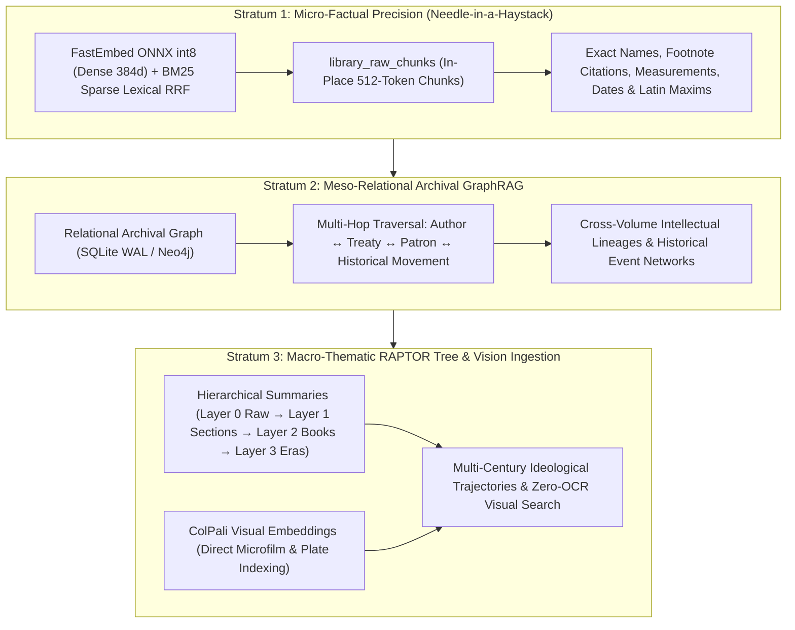
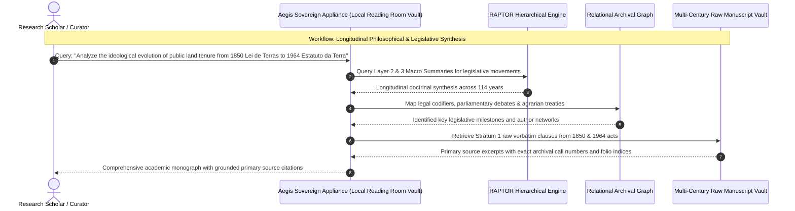
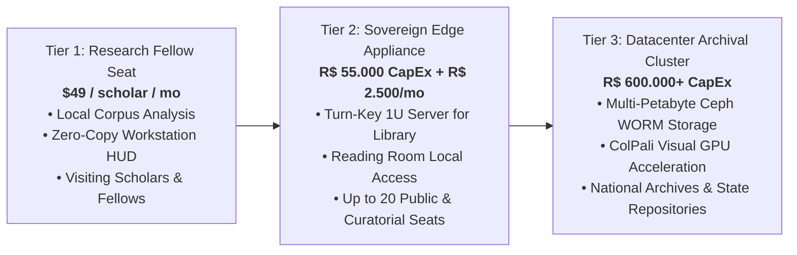

# Aegis Sovereign Vault: Executive Commercial Brief
## Public Libraries, University Archives & National Heritage Centers

**Classification**: Institutional Commercial Document  
**Product**: Aegis Sovereign Knowledge Appliance (Archival Edition)  
**Target Decision Makers**: National Library Directors, Chief Curators, University Vice-Presidents of Research, State Archivists  
**Target Ecosystem**: National Libraries, State Historical Archives, University Special Collections, Cultural Heritage Foundations  

---

## 1. Executive Summary & Market Thesis

National libraries, university research archives, and cultural heritage foundations hold humanity’s intellectual, legal, and historical memory. Spanning centuries, these collections include illuminated manuscripts, colonial administrative records, presidential correspondence, cartographic surveys, and multi-volume academic treatises.

Digital preservation initiatives have scanned millions of pages, yet making these archives meaningfully discoverable for scholars remains deeply challenging. Standard OCR engines fail on cursive calligraphy, degraded parchment, and multi-column historical texts. Furthermore, commercial cloud RAG systems suffer from two fatal limitations: they either lose the broad narrative arc of multi-volume treatises ("missing the forest for the trees") or discard obscure names, measurements, and footnote citations through lossy summarization ("losing the needle in the haystack"). Crucially, uploading cultural patrimony and classified state archives to foreign commercial clouds violates national data sovereignty under **Federal Law 8.159/1991 (*Política Nacional de Arquivos*)**.

The **Aegis Sovereign Knowledge Appliance (Archival Edition)** delivers an institutional cognitive engine built specifically for large-scale historical and academic corpora. Powered by the **RAPTOR 3-Strata Archival Cognitive Architecture** and **ColPali Visual Embeddings**, Aegis enables both surgical micro-factual retrieval and macro-thematic synthesis across multi-century archives—with **zero external cloud egress and complete compliance with national custody laws.**

---

## 2. The Vertical Dilemma: The Archival Discovery & Sovereignty Barrier

Curators, academic researchers, and state archivists face four fundamental crises:

```
            ┌────────────────────────────────────────────────────────┐
            │        The Archival Preservation & Discovery Paradox   │
            └───────────────────────────┬────────────────────────────┘
                                        │
          ┌─────────────────────────────┴─────────────────────────────┐
          ▼                                                           ▼
┌─────────────────────────────────┐                 ┌─────────────────────────────────┐
│     The Ingestion Imperative    │                 │      The Sovereign Barrier      │
├─────────────────────────────────┤                 ├─────────────────────────────────┤
│ • Fragile manuscripts & maps    │                 │ • Lei 8.159: Prohibition against│
│ • Flat RAG loses historical arc │                 │   alienating public custody     │
│ • MARC21 / Dublin Core schemas  │                 │ • Cloud AI loses exact footnotes│
│ • Dual public vs sealed records │                 │ • High cloud tokens on archives │
└─────────────────────────────────┘                 └─────────────────────────────────┘
```

1. **The Inviolability of Public Records (*Lei Federal 8.159/1991*)**:  
   National historical archives, diplomatic cables, and state documents constitute inalienable public heritage. Transmitting unencrypted historical archives or classified records to foreign public cloud data centers (AWS, Azure, Google Cloud) breaches federal custody mandates and compromises national historical sovereignty.

2. **The Fragile Manuscript & OCR Failure**:  
   Centuries of watermarked parchment, cursive calligraphy, ink bleed-through (*iron gall ink corrosion*), and rare dialectical syntax cause standard OCR engines (Tesseract, cloud vision APIs) to fail, producing garbled, unindexable text.

3. **The Flat RAG vs. Naive Summarization Dilemma**:  
   - *The Flat Chunking Trap*: Segmenting an 800-page philosophical or legal treatise into arbitrary 512-token chunks completely severs overarching intellectual movements and longitudinal developments across chapters.
   - *The Lossy Summarization Trap*: Standard cloud LLM summarization strips away obscure historical figures, minor treaty signers, exact dates, and crucial footnote references, destroying scholarly utility.

4. **Public vs. Sealed Collection Fencing**:  
   Archives hold two distinct classes of records: open-access public domain heritage and legally restricted special collections (e.g., sealed judicial records, sensitive diplomatic correspondence, unreleased presidential papers). Commercial cloud tools cannot enforce hardware-level cryptographic isolation between open reading rooms and secure curatorial vaults.

---

## 3. The Sovereign Solution: The RAPTOR 3-Strata Archival Architecture

Aegis Sovereign implements the specialized **RAPTOR 3-Strata Archival Cognitive Architecture** ([Manual 10](../../wiki/appliance/10_hierarchical_library_retrieval_and_raptor_summaries.md)), harmonizing micro-evidentiary precision with macro-thematic synthesis:



### Stratum 1: Micro-Factual Precision (The Haystack Needle)
- **Engine**: Granular 512-token chunks indexed with FastEmbed ONNX int8 dense vectors fused with BM25 lexical sparse search.
- **Archival Value**: Preserves raw historical text verbatim. Retrieves obscure historical actors, exact archival call numbers, marginalia, and specific footnote references with sub-15ms latency. Raw chunks are never discarded or compressed.

### Stratum 2: Meso-Relational Archival GraphRAG
- **Engine**: Multi-hop relational knowledge graph tracing historical networks across distinct volumes, collections, and centuries.
- **Archival Value**: Links authors, publishers, political treaties, academic patrons, and cartographic expeditions. Allows a scholar to query: *"Map all correspondence between Brazilian abolitionists and European diplomats between 1870 and 1888 across both library and foreign office archives."*

### Stratum 3: Macro-Thematic Synthesis & ColPali Vision
- **Engine**: Recursive offline RAPTOR summarization tree structured across 4 hierarchical abstraction layers, coupled with ColPali vision encoders.
- **Archival Value**: Synthesizes broad ideological trajectories across multi-volume treatises while enabling direct visual search over fragile manuscripts, watermarked deeds, and rare architectural plates without lossy OCR.

---

## 4. High-Value Archival & Academic Workflows



### Workflow A: Multi-Layer Longitudinal Academic Synthesis
- **Input**: 10 volumes (6,000 pages) of parliamentary debates, constitutional commentaries, and regional land registers.
- **Execution**: The scholar queries high-level doctrinal shifts. The system hits Layer 3 corpus summaries for macro narrative structure, then routes down to Stratum 1 raw chunks to gather primary source quotations.
- **Output**: An authoritative academic synthesis grounding broad ideological shifts in verbatim, primary source citations.

### Workflow B: Zero-OCR Manuscript & Illuminated Plate Search (ColPali)
- **Input**: High-resolution digital scans of 18th-century Jesuit mission maps, botanical expedition plates, and cursive legal deeds.
- **Execution**: ColPali multi-vector visual representations index the physical layout, handwriting patterns, and graphical illustrations directly.
- **Output**: Instant retrieval of visual plates matching conceptual descriptions (e.g., *"baroque cartouche depicting the Amazon river basin"*) without requiring erroneous text transcription.

### Workflow C: Automated MARC21 & Dublin Core Metadata Ingestion
- **Input**: Uncataloged digital collections, rare pamphlets, and audio/video transcripts.
- **Execution**: Neural classifiers parse title, author, imprint, physical description, subject terms, and archival provenance, formatting them directly into standard bibliographic records.
- **Output**: Automated generation of valid MARC21 (fields 100, 245, 260, 650) and Dublin Core XML/JSON-LD metadata ready for integration into Koha, Alma, or DSpace.

### Workflow D: Cryptographic Public vs. Sealed Collection Fencing
- **Input**: Dual-status repository containing both public domain manuscripts and sealed diplomatic cables subject to statutory embargoes.
- **Execution**: Cryptographic mandatory access control (MAC) isolates collections at the filesystem and vector partition levels.
- **Output**: Open reading room terminals query public heritage freely, while sealed diplomatic cables require cryptographic hardware token authentication.

---

## 5. Archival Sovereignty & Security Architecture

| Security Parameter | Public Commercial Cloud AI | Aegis Sovereign Archival Appliance |
| :--- | :--- | :--- |
| **National Custody Compliance** | Non-compliant with *Lei 8.159/1991* | **100% Compliant**. National heritage remains on sovereign soil |
| **Archival Immutability** | Mutable cloud storage susceptible to edits | **Ceph S3 WORM / SEC 17a-4 Immutability**. Write-Once-Read-Many |
| **Data Residency** | Foreign public cloud servers | **Local Physical Vault**. 100% on-premises NVMe storage |
| **OCR Independence** | Dependent on brittle text OCR | **ColPali Visual Indexing**. Direct image retrieval of manuscripts |
| **Token Consumption** | Runaway cloud API costs on massive archives | **Zero Cloud Tokens**. Fully local inference and embedding |

- **Preservation of Inviolability**: The physical appliance operates within the library or university network, shielding cultural heritage from foreign subpoena, commercial training scraping, or third-party corporate privatization.
- **WORM Immutability**: Integrated write-once-read-many (WORM) storage guarantees that digital preservation scans cannot be altered, overwritten, or encrypted by ransomware.

---

## 6. Commercial Packages & Institutional Deployment



### 1. Tier 1: Academic Research Fellow Edition (Scholar Seat)
- **Target**: University professors, postdoctoral researchers, and independent historical scholars.
- **Deployment**: Standalone workstation binary for research laptops; local analysis of archival document packages.
- **Commercial Model**: **US$ 49 / user / month** or **R$ 250 / user / month** (Annual academic license).

### 2. Tier 2: Sovereign Edge Appliance (Turn-Key Library Vault)
- **Target**: Municipal libraries, university departmental archives, and historical society reading rooms.
- **Deployment**: Whisper-quiet 1U rackmount appliance installed in the local library network room, serving local research terminals.
- **Commercial Model**:
  - **Hardware & Archival Engine License (CapEx)**: **R$ 55.000,00 – R$ 85.000,00** one-time.
  - **Historical Archive Ingestion & MARC21 Alignment**: **R$ 25.000,00** (Metadata integration and RAPTOR tree pre-computation).
  - **Ongoing Support & Academic Firmware Retainer (OpEx)**: **R$ 2.500,00 / month** (Includes security updates, schema updates, and hardware replacement warranty).

### 3. Tier 3: National Supercomputing Archival Cluster
- **Target**: National Libraries, State Public Archives, and Federal Research Consortia.
- **Deployment**: Multi-rack distributed cluster with Ceph S3 WORM storage, 400G InfiniBand networking, and GPU acceleration for real-time ColPali visual embeddings and multi-billion parameter historical language models.
- **Commercial Model**: Custom institutional quote starting at **R$ 600.000,00 CapEx** + 15% annual managed SLA retainer.

---

## 7. Institutional Impact & Strategic ROI

- **Unlocking Trapped Collections**: Makes previously unsearchable manuscript collections, watermarked maps, and cursive registers discoverable in real-time.
- **Preservation of National Sovereignty**: Fulfills all legal and constitutional mandates regarding the protection and non-alienation of public historical documents.
- **Predictable Academic Budgeting**: Eliminates the recurring operational expenses of cloud token subscriptions, replacing them with permanent, institutionally owned capital assets.

*For institutional archive evaluations and live manuscript search demonstrations, contact the Aegis Sovereign Archival Architecture Group.*
