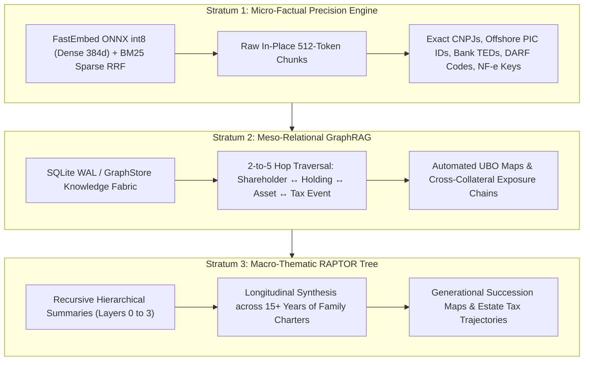
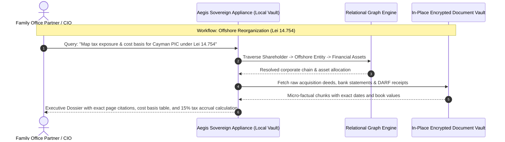
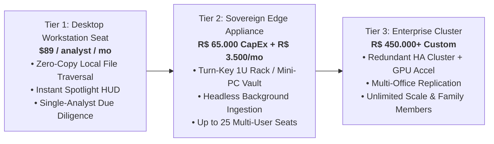

# Aegis Sovereign Vault: Executive Commercial Brief
## Multi-Family Offices & Ultra-High-Net-Worth (UHNW) Wealth Management

**Classification**: Institutional Commercial Document  
**Product**: Aegis Sovereign Knowledge Appliance  
**Target Decision Makers**: Managing Partners, Family Office CIOs, Chief Legal Officers, Principal Trustees  
**Target Ecosystem**: Multi-Family Offices (MFOs), Single Family Offices (SFOs), Private Wealth Boutiques (AUM: R$ 50M to R$ 10B+)  

---

## 1. Executive Summary & Market Thesis

Ultra-High-Net-Worth (UHNW) family offices and private wealth managers steward multi-generational capital across fractured global jurisdictions, private equity holdings, real estate trusts, and philanthropic foundations. In this tier of wealth management, **confidentiality is not an IT policy—it is an existential imperative.**

The integration of cognitive artificial intelligence offers unprecedented leverage: synthesizing decades of corporate minutes, reconciling cross-holding transactions, and stress-testing estate plans against statutory shifts. However, standard cloud AI providers (OpenAI, Microsoft Copilot, Google Cloud) require streaming sensitive shareholder registries, offshore accounts, and balance sheets to external public infrastructure.

The **Aegis Sovereign Knowledge Appliance** resolves this dilemma. Engineered as a turn-key, air-gapped cognitive vault, Aegis operates strictly within the family office’s physical perimeter. Powered by a 3-strata neural and relational search engine, it transforms chaotic multi-decade family archives into structured, auditable intelligence—with **zero bytes transmitted off-premises, zero third-party cloud exposure, and zero recurring token licensing fees.**

---

## 2. The Vertical Dilemma: The UHNW Compliance & Confidentiality Crisis

Family offices operate under mounting regulatory and operational friction:

```
           ┌────────────────────────────────────────────────────────┐
           │           The UHNW Wealth Stewardship Paradox          │
           └───────────────────────────┬────────────────────────────┘
                                       │
         ┌─────────────────────────────┴─────────────────────────────┐
         ▼                                                           ▼
┌─────────────────────────────────┐                 ┌─────────────────────────────────┐
│     The Ingestion Imperative    │                 │      The Sovereign Barrier      │
├─────────────────────────────────┤                 ├─────────────────────────────────┤
│ • Offshore overhaul (Lei 14.754)│                 │ • Cloud LLM telemetry leaks UHNW│
│ • Complex cross-holdings & FIPs │                 │   family trees and asset values │
│ • Multi-decade family charters  │                 │ • Subpoena/breach risks on AWS  │
│ • Manual NF-e / DARF / TED drift│                 │ • Loss of strategic discretion  │
└─────────────────────────────────┘                 └─────────────────────────────────┘
```

1. **The Brazilian Offshore Tax Overhaul (*Lei 14.754/2023*)**:  
   The enactment of *Lei 14.754* fundamentally altered the taxation of offshore controlled entities (*PICs - Private Investment Companies*) and trusts. Automatic tax deferrals have been eliminated, mandating annual 15% income tax reconciliations, complex asset revaluation step-ups, and rigorous transparent reporting. Reconciling historical acquisition costs across Caribbean, European, and US jurisdictions currently consumes hundreds of billable accounting hours.

2. **Multi-Holding Entity Opacity**:  
   Families own assets through an intricate web of domestic operating companies (*S.A.* and *Ltda.*), investment funds (*FIPs*, *FIMs*), real estate holdings, offshore holding companies (BVI, Cayman, Bahamas), and trusts. Tracing capital calls, inter-company loans, dividend distributions, and Ultimate Beneficial Ownership (UBO) across 15+ corporate vehicles requires cross-referencing thousands of PDFs, banking contracts, and board minutes.

3. **Succession Governance & Family Charters (*Protocolos Familiares*)**:  
   Family constitutions, shareholder agreements, and voting trusts span decades and multiple generations. When liquidations, buyouts, or estate distributions arise, conflicting covenants and legacy stipulations are buried across disparate amendments, exposing the family to catastrophic internal litigation.

4. **The Zero-Cloud Trust Invariant**:  
   Family principals refuse to allow their net worth statements, offshore bank accounts, passport scans, and estate plans to be uploaded to public hyperscale clouds where third-party administrators, subpoena orders, or model-training scraping pipelines could compromise their privacy.

---

## 3. The Sovereign Solution: The 3-Strata Cognitive Engine

Aegis Sovereign eliminates operational paralysis by deploying an on-premise, 3-strata document intelligence engine that indexes the firm’s entire institutional memory:



### Stratum 1: Micro-Factual Precision (Needle-in-a-Haystack)
- **Technology**: Quantized ONNX multilingual dense vectors fused with BM25 lexical search via Reciprocal Rank Fusion (RRF).
- **Function**: Extracts specific fiscal parameters, payment verification keys, transaction amounts, and contractual clauses with mathematical exactitude. Recovers the exact paragraph, invoice number, or bank voucher in under 20 milliseconds.

### Stratum 2: Meso-Relational Traversal (GraphRAG)
- **Technology**: In-process graph storage tracking entities, ownership stakes, directors, transactions, and covenants.
- **Function**: Automatically links individual family members to operating companies, offshore trusts, and real estate assets. When queried about a specific asset, GraphRAG surfaces the entire lineage of corporate authorizations, capital contributions, and dividend distributions across 5 tiers of separation.

### Stratum 3: Macro-Thematic Synthesis (Hierarchical RAPTOR Tree)
- **Technology**: Asynchronous recursive summarization tree structuring raw text chunks into sectional, doctrinal, and multi-decade thematic abstractions.
- **Function**: Synthesizes the broad trajectory of the family charter across generations. Answers complex strategic questions such as: *"How have the liquidity withdrawal rules for third-generation heirs evolved across our 2012, 2018, and 2024 shareholder revisions?"*

---

## 4. High-Value Institutional Workflows



### Workflow A: Automated Offshore Structure Reconciliation (*Lei 14.754*)
- **Input**: Ingests offshore bank statements (PBT, Pictet, UBS, Morgan Stanley), foreign entity registers, and domestic tax returns (IRPF).
- **Execution**: The appliance automatically extracts historical cost bases, calculates accumulated undistributed profits, distinguishes between active financial income and operating income, and projects the 15% annual tax liability.
- **Output**: An executive audit dossier cross-referenced with exact statement pages, ready for external tax audit sign-off.

### Workflow B: Three-Way Fiscal Reconciliation (NF-e ↔ TED ↔ DARF)
- **Input**: Scanned or digital municipal invoices (*NFS-e*), state invoices (*NF-e*), bank wire confirmations (*TED/PIX*), and federal tax collection vouchers (*DARF*).
- **Execution**: Stratum 1 micro-filtering parses barcode numbers, CNPJ parties, withholding tax rates (IRRF, CSLL, PIS/COFINS), and settlement timestamps.
- **Output**: Discrepancy matrices highlighting unpaid vouchers, duplicate billings, or missing withholding receipts, averting fiscal penalties from the Receita Federal.

### Workflow C: Family Charter & Governance Conflict Resolution
- **Input**: 25 years of family constitutions, prenuptial agreements, voting trusts, and board resolutions.
- **Execution**: Stratum 3 RAPTOR synthesis correlates voting majorities, veto thresholds for asset sales, and spousal inheritance covenants across all active legal documents.
- **Output**: A unified legal posture report highlighting incompatible covenants before family board meetings or restructuring transactions.

---

## 5. Security Architecture & Air-Gap Compliance

| Dimension | Standard Cloud AI (OpenAI / Azure) | Aegis Sovereign Appliance |
| :--- | :--- | :--- |
| **Physical Data Custody** | Stored in multi-tenant public cloud data centers | **100% On-Premise**. Resides on dedicated hardware inside family office |
| **Network Egress** | Continuous streaming of unencrypted document context | **Zero Network Egress**. Operates completely air-gapped without internet |
| **Data Encryption** | Cloud-managed keys (subject to provider access) | **Hardware AES-XTS-256 (LUKS2)** with physical YubiKey or PIN release |
| **Access Governance** | Account-level cloud credentials | **Cryptographic Role Fencing**: Strict segregation between branches of family |
| **Regulatory Standing** | Exposes family to foreign cross-border discovery | **Complete Brazilian & Swiss Secrecy Compliance**; non-subpoenable abroad |

- **Zero-Knowledge Architecture**: The appliance hardware can be configured without physical Wi-Fi/Bluetooth controllers and wired directly to the office's isolated private VLAN.
- **Role-Based Compartmentalization**: Multilevel clearance fencing ensures junior analysts only access operational vendor invoices, while principal partners and family patriarchs hold exclusive cryptographic keys for offshore trusts and estate allocations.

---

## 6. Commercial Packages & Institutional Deployment



### 1. Tier 1: Personal Workstation Edition (Advisory Seat)
- **Target**: Independent wealth advisors, single-family trustees, and traveling MFO partners.
- **Deployment**: Standalone binary on macOS/Windows laptops; zero-copy in-place traversal of local folders.
- **Commercial Model**: **US$ 89 / user / month** or **R$ 450 / user / month** (Annual commitment).

### 2. Tier 2: Sovereign Edge Appliance (Core Turn-Key Vault)
- **Target**: Established Multi-Family Offices managing R$ 100M to R$ 2B AUM (5 to 25 team members).
- **Deployment**: Whisper-quiet 1U rackmount server or brushed aluminum desktop vault. Pre-configured with dual NVMe RAID-1, hardware encryption, and local Gigabit LAN connectivity.
- **Commercial Model**:
  - **Hardware & Engine License (CapEx)**: **R$ 65.000,00 – R$ 95.000,00** one-time.
  - **Taxonomy & Ingestion Onboarding**: **R$ 25.000,00** (Historical archive indexing, custom entity mapping).
  - **Ongoing Compliance & Maintenance Retainer (OpEx)**: **R$ 3.500,00 / month** (Includes statutory tax rule updates, firmware security patches, and hardware warranty).

### 3. Tier 3: Datacenter High-Security Cluster
- **Target**: Institutional Wealth Managers & Private Banks managing R$ 2B+ across multiple international offices.
- **Deployment**: High-availability dual-node cluster with Ceph S3 WORM storage, automated cold-backup synchronization, and dedicated GPU acceleration.
- **Commercial Model**: Custom institutional quote starting at **R$ 450.000,00 CapEx** + 20% annual SLA retainer.

---

## 7. Strategic Value & ROI Summary

- **Immediate Time Savings**: Reduces cross-holding due diligence and offshore tax preparation from 120 hours to under 15 minutes per quarter.
- **Zero Cloud Leakage Liability**: Eliminates multi-million-dollar reputational and legal risks associated with commercial cloud breaches or accidental data scraping.
- **Guaranteed Predictable Economics**: Replaces spiraling per-page, per-token cloud API billing with a fixed, depreciable physical asset.

*For institutional demonstrations or private hardware evaluation, contact the Aegis Sovereign Architecture Group.*
