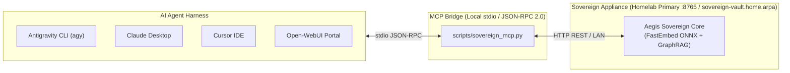

# 🤖 Manual 04: Model Context Protocol (MCP) Harness & Agent Configuration

> **Parent Suite**: [Sovereign Appliance Manual Index](README.md)  
> **Previous Step**: [Manual 03: Connector Matrix](03_connector_matrix_and_external_integrations.md)  
> **Standard**: Model Context Protocol (MCP) JSON-RPC 2.0  
> **Supported Harnesses**: Antigravity (`agy`), Claude Desktop, Open-WebUI, Cursor  

---

## 1. Overview of the Sovereign MCP Server

The Sovereign Appliance exposes its retrieval and context optimization engine to autonomous coding agents and LLM orchestrators via the open **Model Context Protocol (MCP)** standard:



---

## 2. Harness Configuration Walkthroughs

### A. Antigravity CLI (`agy`)
Edit or create `~/.gemini/config/mcp_config.json`:
```json
{
  "mcpServers": {
    "sovereign-vault": {
      "command": "python3",
      "args": [
        "-m",
        "core.mcp.server"
      ],
      "env": {
        "SOVEREIGN_APPLIANCE_URL": "http://127.0.0.1:8765"
      }
    }
  }
}
```

### B. Claude Desktop
Edit `~/.config/Claude/claude_desktop_config.json` (Linux) or `%APPDATA%\Claude\claude_desktop_config.json` (Windows):
```json
{
  "mcpServers": {
    "aegis-sovereign-vault": {
      "command": "python3",
      "args": ["-m", "core.mcp.server"],
      "env": {
        "SOVEREIGN_APPLIANCE_URL": "http://127.0.0.1:8765"
      }
    }
  }
}
```

### C. Cursor IDE
Add to `.cursor/mcp.json` at the root of your workspace:
```json
{
  "mcpServers": {
    "sovereign-vault": {
      "command": "python3",
      "args": ["-m", "core.mcp.server"],
      "env": {
        "SOVEREIGN_APPLIANCE_URL": "http://127.0.0.1:8765"
      }
    }
  }
}
```

### D. Open-WebUI (Function Calling Tool)
In Open-WebUI:
1. Navigate to **Workspace > Tools > Add Tool**.
2. Name: `query_vault`.
3. Toolkit Definition: Configure HTTP POST calling `http://127.0.0.1:8765/optimize` (or internal appliance IP).
4. When users ask questions requiring private document knowledge, Open-WebUI triggers the tool automatically.

---

## 3. Tool Reference & Input Schema

The `sovereign-vault` MCP server registers four typed tools:

### 1. `sovereign_optimize_context`
Pre-filters the client archive into concise, cited evidence chunks.
* **Arguments**:
  - `query` (string, required): Question or inquiry topic.
  - `corpus` (enum: `"all"`, `"wiki"`, `"paperless"`, default `"all"`).
  - `max_chunks` (integer, 1..10, default 3): Number of chunks to return.
  - `retrieval_mode` (enum: `"high_precision"`, `"legal_discovery"`, `"exact_entity"`).
  - `confidence_floor` (float, default 0.0): Discards chunks below this RRF score.
  - `include_graph_dossier` (boolean, default false): Attaches relational graph links.

### 2. `sovereign_search_vault`
Direct hybrid dense (ONNX) + sparse (BM25) RRF search.
* **Arguments**: `query` (string), `corpus` (string), `limit` (integer).

### 3. `sovereign_get_entity_dossier`
Traverses the SQLite WAL GraphRAG store to extract corporate links, tax IDs, and monetary flows.
* **Arguments**: `entity` (string, required): Name or CNPJ/CPF of entity.

### 4. `sovereign_node_status`
Returns real-time health and telemetry from the remote appliance.
* **Arguments**: None.

---

## 4. Verifying MCP Integration via CLI

Verify the MCP bridge from the terminal in one line:
```bash
python3 -c "
import subprocess, json
req = json.dumps({'jsonrpc': '2.0', 'id': 1, 'method': 'tools/list'}) + '\n'
p = subprocess.Popen(['python3', 'scripts/sovereign_mcp.py'], stdin=subprocess.PIPE, stdout=subprocess.PIPE, text=True)
stdout, _ = p.communicate(input=req)
print('Discovered Tools:', [t['name'] for t in json.loads(stdout)['result']['tools']])
"
# Expected Output:
# Discovered Tools: ['sovereign_optimize_context', 'sovereign_search_vault', 'sovereign_get_entity_dossier', 'sovereign_node_status']
```

---

## Next Steps
* Proceed to **[Manual 05: Ingestion & Tagging Runbook](05_ingestion_and_tagging_runbook.md)** to configure drop folders and automated tagging.
