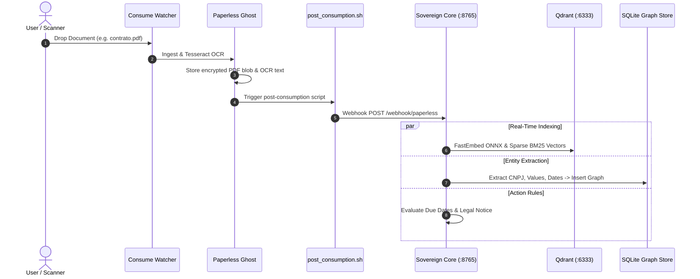

# 📥 Manual 05: Document Ingestion, Drop Folders & Automated Tagging

> **Parent Suite**: [Sovereign Appliance Manual Index](README.md)  
> **Previous Step**: [Manual 04: MCP Harness Configuration](04_mcp_harness_and_agent_configuration.md)  
> **Target Capabilities**: Automated Scanning, OCR Pipelines, Heuristic Classification & Proactive Alerts  

---

## 1. Where to Throw Files: The Ingestion Channels

The appliance provides three seamless entrypoints for ingesting documents into the sovereign archive:

```text
Ingestion Channels:
  ├── 1. Network Drop Folder  -> /opt/sovereign-vault/data/appliance/paperless/consume/
  ├── 2. Direct REST Ingest   -> POST http://<APPLIANCE_IP>:8000/api/documents/post_document/
  └── 3. Mobile Dispatcher    -> Secure Telegram Bot (@Copa726n8nbot) photo / PDF upload
```

### A. Network Drop Folder (`/consume`)
The `/consume` directory is monitored by an inotify filesystem watcher. When a file finishes copying, it is immediately queued for OCR:
- Supported formats: `.pdf`, `.png`, `.jpg`, `.jpeg`, `.tiff`, `.docx`.
- File is ingested, moved to archive, and automatically deleted from `/consume` to prevent duplicates.
- **Tip**: Share this folder over SMB/Samba to map as a network scan target for office multi-function printers (MFPs).

### B. Command-Line Batch Ingestion
To batch-ingest an existing folder of client archives:
```bash
cp /path/to/client_documents/*.pdf /opt/sovereign-vault/data/appliance/paperless/consume/
```

---

## 2. Under the Hood: The Ingestion Lifecycle



---

## 3. Heuristic Auto-Tagging & Entity Extraction

When documents arrive, the deterministic classifier ([`scripts/rag_classifier.py`](../../scripts/rag_classifier.py)) extracts key legal and financial entities without needing external cloud calls:

| Entity Pattern | Regex / Extraction Strategy | Inferred Metadata |
| :--- | :--- | :--- |
| **CNPJ** | `\b\d{2}\.\d{3}\.\d{3}/\d{4}-\d{2}\b` | Correspondent identification & corporate linking |
| **CPF** | `\b\d{3}\.\d{3}\.\d{3}-\d{2}\b` | Beneficiary / Signatory individual node |
| **Monetary Values** | `(?:R\$|BRL)\s*(\d{1,3}(?:\.\d{3})*,\d{2})` | High-value transaction thresholding ($> \text{R\$ } 50.000$) |
| **Due Dates** | `Vencimento:?\s*(\d{2}/\d{2}/\d{4})` | Automated deadline scheduling & reminder alerts |
| **Court Filings** | `\b\d{7}-\d{2}\.\d{4}\.\d\.\d{2}\.\d{4}\b` | Document Type `Intimação Judicial` |

---

## 4. Proactive Action Alerts

High-priority actionable events trigger automated push alerts via the Action Dispatcher ([`scripts/rag_action_dispatcher.py`](../../scripts/rag_action_dispatcher.py)):

1. **Urgent Legal Notice (Intimação)**: Detected judicial subpoena with strict statutory deadline ($\le 5$ days) triggers emergency Telegram alert.
2. **Upcoming Tax / Bill Expiration**: Invoices due within 3 days trigger proactive heads-up notifications.
3. **High-Value Liquidation**: Transfers over R$ 50,000 generate transaction confirmation cards.

---

## Next Steps
* Proceed to **[Manual 06: Executive Tuning & Client Knobs](06_executive_tuning_and_client_knobs.md)** to configure retrieval sensitivity and discovery depth.
