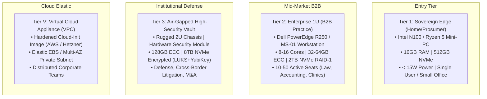
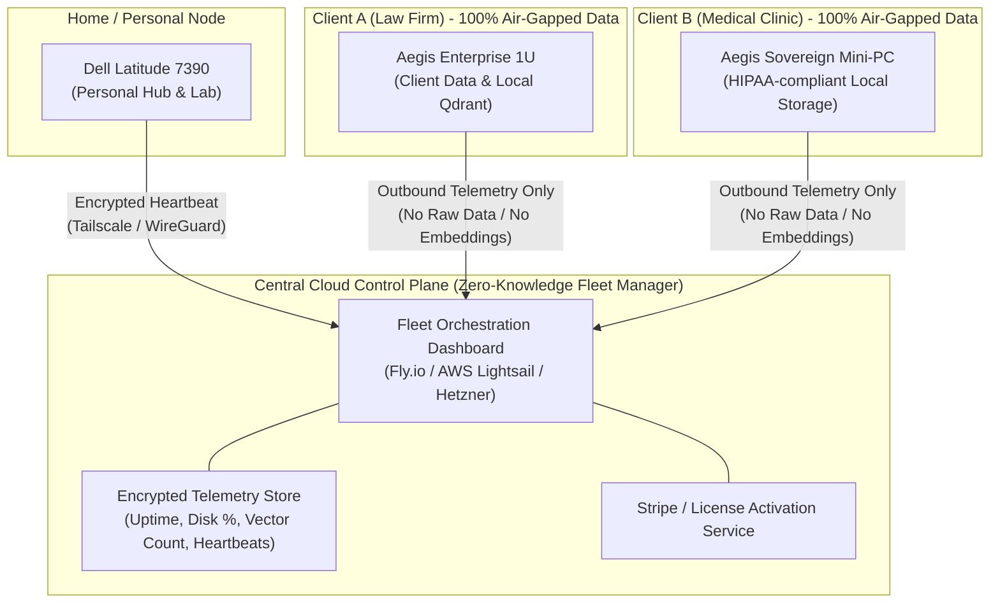

# 🚀 Manual 07: Scaling Topologies, Bottlenecks & Commercial Playbook

> **Parent Suite**: [Sovereign Appliance Manual Index](README.md)  
> **Related Architecture**: [Chapter 23: Sovereign Knowledge Appliance](../23_sovereign_knowledge_appliance_and_commercial_stack.md) | [ADR-36: Scaling Fleet & Business Topology](../adrs/ADR-36-Sovereign-Appliance-Scaling-Fleet-and-Business-Topology.md)

This playbook addresses the engineering, operational scaling, and commercial packaging strategy for turning the Sovereign Knowledge Appliance into a sustainable product line that spans home power-users, professional practices, and institutional B2B deployments.

---

## 1. Hardware Packaging Topologies: Sizing from Home to Enterprise

The appliance is architected as an appliance firmware image deployable across 4 standardized form factors:



### Bill of Materials (BOM) & Unit Economics
- **Tier 1 (Sovereign Edge)**: Hardware cost ~$250–$320. Retail price: $990 one-off or $89/mo subscription (includes remote automated updates and basic telemetry).
- **Tier 2 (Enterprise 1U)**: Hardware cost ~$1,200–$1,800. Retail price: $4,500 setup + $350/mo retainer (includes 24/7 SLA, cold-backup management, and multi-user RBAC).
- **Tier 3 (Institutional Vault)**: Hardware cost ~$4,500. Retail price: $25,000–$50,000 per appliance with air-gapped physical maintenance contracts.

---

## 2. Bottleneck Isolation & Production Workarounds

When scaling from a single user testing a few hundred documents to an institutional archive processing 500,000+ pages, four primary bottlenecks emerge:

| Bottleneck | Root Cause | Impact | Engineering Workaround |
| :--- | :--- | :--- | :--- |
| **1. Bulk OCR Throughput** | Heavy Tesseract CPU processing on high-DPI scans | CPU saturation, thermal throttling, backlogged ingest queues | 1. Set `PAPERLESS_OCR_MODE: skip` for digital PDFs (90% of legal docs have native text).<br>2. Run Celery task workers with `nice -n 19`.<br>3. Decouple drop-folder priority: files dropped into `/consume/urgent` bypass bulk queues. |
| **2. Vector Embedding Latency** | Full-weight PyTorch models require heavy RAM and CPU cycles | Memory spikes and slow ingestion rates (> 500ms/chunk) | 1. Enforce **FastEmbed ONNX Runtime** with int8 quantization (`BAAI/bge-small-en-v1.5`), cutting RAM to ~130MB and compute to ~20ms/chunk on AVX2.<br>2. Batch upserts into Qdrant in chunks of 64 points. |
| **3. SQLite Concurrency Locking** | High concurrent agent queries colliding with CDC graph writes | `database is locked` errors under multi-seat concurrency | 1. Enforce Write-Ahead Logging: `PRAGMA journal_mode=WAL;`.<br>2. Set `PRAGMA busy_timeout = 5000;`.<br>3. For Tier 2+ deployments, delegate the entity graph to the bundled PostgreSQL instance. |
| **4. Memory Footprint on 8–16GB Nodes** | Running Qdrant, Postgres, Redis, Paperless, and Python simultaneously | Out-of-memory (OOM) killer terminating ingestion workers | 1. Enforce Docker memory quotas (`mem_limit: 1.5g` on Paperless, `1.0g` on Qdrant).<br>2. Enable `on_disk_payload: true` in Qdrant collections to keep vectors and payloads out of RAM. |

---

## 3. Hybrid Cloud Fleet Architecture: Home Setup + B2B Management

A critical challenge for operators is managing their personal homelab instance while simultaneously deploying and maintaining client appliances without cross-contaminating private data:



### Strict Architectural Invariant: Control Plane vs Data Plane Separation
- **Data Plane (Strictly Local / Air-Gapped)**:
  - Raw document files, OCR transcripts, vector embeddings, and entity graphs **never leave the client appliance**.
  - All hybrid semantic searches and context optimizations execute locally inside the client's network.
- **Control Plane (Zero-Knowledge Fleet Telemetry)**:
  - An outbound-only, TLS-encrypted agent sends periodic heartbeats to the central fleet dashboard:
    `{ "node_id": "client_alpha_01", "firmware_version": "v1.4.2", "disk_used_pct": 34, "indexed_docs": 12450, "status": "healthy" }`
  - The central manager can trigger remote container updates, license upgrades, or backup verifications via encrypted private Tailscale tunnels, without ever possessing the ability to view or decrypt document content.

---

## 4. Cross-Pollination of Homelab Stack Services into Commercial Offerings

The production-hardened services from this homelab stack can be packaged into high-margin commercial expansion modules:

| Homelab Service | Commercial Expansion Module | Value Proposition to Clients |
| :--- | :--- | :--- |
| **Pi-hole v6 FTL** | **Aegis DNS Shield** | Network-wide corporate cybersecurity: blocks phishing, telemetry spyware, cryptominers, and ad tracking across all office laptops and mobile devices without installing client software. |
| **Traefik v3** | **Aegis Zero-Trust Ingress Gateway** | Turn-key internal application gateway with automated Let's Encrypt certificates, Tailscale Funnel / Serve, and OAuth authentication for private office intranets. |
| **Netdata Agent** | **Aegis Pulse Real-Time Telemetry** | Microsecond visual dashboards displaying container health, CPU thermals, network bandwidth, and storage health for office IT managers. |
| **Maintainerr** | **Aegis Compliance & Lifecycle Daemon** | Automated data retention governance: automatically archives invoices after 5 years, purges temporary client uploads after 30 days, and prevents corporate storage bloat. |
| **ws-scrcpy / ADB** | **Aegis Mobile Fleet Bridge** | Remote management, kiosk control, and telemetry dispatching for corporate Android tablets and point-of-sale terminals. |
| **Zstandard + rclone** | **Aegis Cold Vault Backup Engine** | Automated, deduplicated application snapshots compressed with Zstandard and backed up with client-side zero-knowledge encryption to Wasabi, Backblaze B2, or Google Cloud. |

---

## 5. The Local LLM Dilemma: Should We Bundle an LLM?

### The "Cerebellum vs Brain" Architectural Paradigm
Should the appliance ship with an integrated generative LLM (e.g., Llama-3.2-3B or Qwen2.5-7B/14B), or remain strictly a high-efficiency retrieval engine?

```
┌──────────────────────────────────────────────────────────┐
│             THE CEREBELLUM-FIRST STRATEGY                │
├────────────────────────────┬─────────────────────────────┤
│  The Appliance (Cerebellum)│  The Frontier LLM (Brain)   │
├────────────────────────────┼─────────────────────────────┤
│ • FastEmbed ONNX hybrid RAG│ • Claude 3.5 Sonnet         │
│ • Qdrant Vector Engine     │ • Gemini 1.5 Pro / Flash    │
│ • SQLite Entity Graph      │ • OpenAI GPT-4o             │
│ • Headless Paperless Ingest│ • (Or on-prem GPU Ollama)   │
│ • Runs on $250 Mini-PC     │ • High reasoning capacity   │
│ • 99% Token Reduction Proxy│ • Pay-per-use external API  │
└────────────────────────────┴─────────────────────────────┘
```

### Recommendation: Tiered Hybrid Strategy
1. **Standard Commercial Base (The Cerebellum)**:
   - Does **NOT** bundle a heavy generative LLM.
   - Operates strictly as a **Context Optimization Proxy & Grounding Engine** via MCP.
   - *Why*: Eliminates the need for expensive, power-hungry GPUs ($1,000+), prevents thermal degradation, and allows clients to connect whatever frontier LLM is state-of-the-art that month (Claude, Gemini, ChatGPT) while reducing API bills by 90%+.
2. **Pro Sovereign Tier (The Complete Air-Gapped Brain)**:
   - For defense, intelligence, or medical clinics forbidden from using any external API:
   - Bundle a quantized **Qwen2.5-7B Q4_K_M** or **Llama-3.2-3B-Instruct** running via CPU AVX-512 or paired with an on-demand GPU node (like the RTX 5070 node managed via `homelab-gpu` MCP).
   - Generates responses at 15–25 tok/s on CPU or 80+ tok/s on GPU with 100% zero cloud connectivity.

---

## 6. Pro-Feature Monetization Ladder

To maximize recurring commercial revenue, features are segmented into 3 clear tiers:

```
┌─────────────────────────────────────────────────────────────────┐
│                    ENTERPRISE TIER ($350+/mo)                   │
│  • Multi-Tenant Departmental RBAC (Legal vs Finance Fences)    │
│  • Cryptographic Audit Ledger & Compliance Signatures           │
│  • Multi-Node High Availability & Zero-Knowledge Cloud DR       │
├─────────────────────────────────────────────────────────────────┤
│                    PRO SUITE TIER ($89–$150/mo)                 │
│  • Executive Tuning Drawer (Legal Discovery, Exact Entity Modes)│
│  • Automated PII Redaction Pipeline (Presidio Regex Scrubbing)  │
│  • Interactive Visual Knowledge Graph Explorer                 │
│  • Aegis DNS Shield (Pi-hole Threat Protection Integration)     │
├─────────────────────────────────────────────────────────────────┤
│                    CORE APPLIANCE BASE (Included)               │
│  • Headless Ghost Engine (Paperless OCR & Drop Folders)         │
│  • FastEmbed ONNX Hybrid Search & Qdrant Engine                 │
│  • Standard MCP Tools for agy / Claude / Cursor                 │
└─────────────────────────────────────────────────────────────────┘
```

This monetization ladder allows selling an affordable hardware box upfront while creating high-margin, sticky annual software and support retainers.
