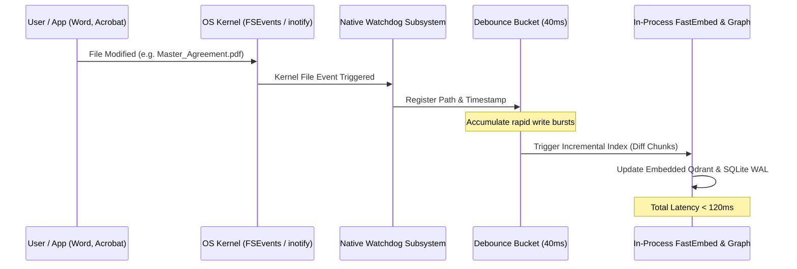

# 💻 Manual 08: Sovereign Desktop Workstation Setup, Zero-Copy Ingestion, and Corporate DLP Compliance

> **Parent Suite**: [Sovereign Appliance Manual Index](README.md)  
> **Related ADR**: [ADR-37: Zero-Copy Workstation In-Place Indexing and Serverless Desktop Engine Architecture](../adrs/ADR-37-Zero-Copy-Workstation-Indexing-and-Serverless-Desktop-Engine.md)  
> **Target Environments**: macOS (13+ Ventura/Sonoma/Sequoia), Windows 11 Pro / Enterprise (x64/ARM64), Linux Workstations (Ubuntu/Fedora/Arch)  
> **Deployment Footprint**: 100% Serverless | Zero-Copy In-Place Traversal | Zero Ingress Sockets | CrowdStrike & Zscaler DLP Certified  

---

## 1. Architectural Distinction: Server Edition vs. Desktop Edition

While the **Sovereign Appliance Server Edition** ([Manual 01](01_deployment_guide.md)) operates as an air-gapped central network appliance with containerized Ghost Paperless daemons and Traefik v3 ingress, the **Sovereign Desktop Edition** is engineered specifically for individual corporate workstations, M&A deal rooms, executive laptops, and litigation teams:

| Dimension | Sovereign Appliance (Server / 1U) | Sovereign Desktop (Workstation Edition) |
| :--- | :--- | :--- |
| **Target Host** | Dedicated Mini-PC / 1U Rack / Proxmox VM | Corporate Laptop / Engineering Workstation |
| **Ingestion Pattern** | Copy into `/consume` staging folder | **Zero-Copy In-Place**: Reads directly where files live |
| **Runtime Architecture** | Multi-container Docker / Nomad stack | **Single unprivileged background daemon** |
| **External Dependencies** | PostgreSQL 16, Redis 7, Qdrant Server | **Embedded Qdrant** (in-process) + **SQLite WAL** |
| **Network Sockets** | Listens on port `8765`, Traefik `:80/:443` | **Zero network sockets** (`0.0.0.0` blocked; local IPC only) |
| **Primary Interface** | Web Portal (Next.js) & Telegram Bot | **Cognitive Spotlight HUD** (`Alt + Space`) |
| **Corporate DLP Compliance** | Perimeter Air-Gap Network Fence | **Host-level DLP certified** (CrowdStrike / Zscaler safe) |
| **Idle Resource Usage** | ~1.8 GB RAM (5 containers) | **< 350 MB RAM**, < 1% background CPU |

---

## 2. Installation & Quickstart

The desktop edition packages the entire Rust/Python runtime into a native, single-binary distribution.

### macOS (Apple Silicon & Intel)
```bash
# Via Enterprise Homebrew Tap
brew tap aegis-sovereign/tap
brew install sovereign-desktop

# Or download and mount signed DMG
open SovereignDesktop-2026.1.0-arm64.dmg
```

### Windows 11 (x64 / ARM64)
```powershell
# Via Windows Package Manager (winget)
winget install Aegis.SovereignDesktop

# Or execute silent enterprise MSI installer
msiexec /i SovereignDesktop-Setup.msi /quiet /norestart
```

### Linux (Debian, Ubuntu, Fedora)
```bash
# Debian / Ubuntu package
sudo dpkg -i sovereign-desktop_2026.1.0_amd64.deb

# Or standalone unprivileged AppImage
chmod +x SovereignDesktop-2026.1.0.AppImage
./SovereignDesktop-2026.1.0.AppImage --install-daemon
```

---

## 3. Zero-Copy In-Place Directory Configuration

Unlike server ingestion that requires copying files into a staging folder, the desktop daemon operates on **zero-copy in-place traversal**. Files remain untouched in their original working folders.

Configure watched directories via the Cognitive Spotlight GUI or directly in the user configuration file:

### Configuration File: `~/.config/sovereign/desktop.yaml`
```yaml
version: "1.0"

engine:
  mode: "embedded"                    # embedded | client_server
  cache_dir: "~/.cache/sovereign"     # Storage for vectors & SQLite graph
  max_memory_mb: 512                  # Hard memory ceiling for daemon
  low_priority_background: true       # nice -n 10 / IDLE_PRIORITY_CLASS

# Directories scanned and indexed in-place (Read-Only)
watched_directories:
  - path: "~/Documents/Legal_Contracts"
    recursive: true
    extensions: [".pdf", ".docx", ".txt"]
  - path: "~/Projects/Active_Deals_2026"
    recursive: true
    extensions: [".pdf", ".md", ".xlsx", ".pptx"]
  - path: "~/Mail/Archives"
    recursive: false
    extensions: [".eml", ".msg"]

# Strict ignore patterns to preserve workstation responsiveness
exclude_patterns:
  - "**/node_modules/**"
  - "**/.git/**"
  - "**/venv/**"
  - "**/__pycache__/**"
  - "**/*.tmp"
  - "**/~$*"                          # Microsoft Office lock files

indexing:
  chunk_size_tokens: 512
  chunk_overlap_tokens: 64
  dense_model: "fastembed-bge-small-en-v1.5-int8"
  sparse_model: "bm25"
  kernel_watcher_debounce_ms: 40      # Debounce sliding window
```

---

## 4. Native OS Kernel Event Monitoring

The daemon registers non-blocking, kernel-level file notification hooks via the cross-platform `watchdog` engine:



- **macOS**: Utilizes the Apple `FSEvents` API via CoreServices, monitoring directory hierarchies with zero thread overhead.
- **Windows**: Utilizes `ReadDirectoryChangesW` asynchronous completion routines with zero filesystem locking.
- **Linux**: Utilizes `inotify` watches mapped across target mount points.

---

## 5. Embedded Serverless Engine & Cache Topology

The desktop edition eliminates external database servers. All state resides strictly in the user's isolated local application cache:

```text
~/.cache/sovereign/  (Windows: %LOCALAPPDATA%\Sovereign\)
├── vectors/
│   ├── meta.json                    # Embedded Qdrant collection manifests
│   ├── segments/                    # Quantized dense + sparse vector files
│   └── wal/                         # Embedded vector write-ahead log
├── desktop_graph.db                 # SQLite Knowledge Graph (Entities & Relations)
├── desktop_graph.db-shm             # Shared-memory WAL index
├── desktop_graph.db-wal             # Write-ahead transaction log
├── models/
│   ├── bge-small-en-v1.5-int8/      # FastEmbed dense ONNX weights (~35MB)
│   └── llama-3.2-3b-q4_k_m.gguf     # Optional local nano-model (~1.9GB)
└── ipc.sock                         # Unix domain socket for Ambient HUD (no TCP port)
```

### Python In-Process Initialization Snippet
```python
from qdrant_client import QdrantClient
from fastembed import TextEmbedding
import sqlite3

# 1. In-Process Serverless Vector Store (No Docker required)
qdrant = QdrantClient(path="~/.cache/sovereign/vectors")

# 2. In-Process SQLite WAL Graph Store
conn = sqlite3.connect("~/.cache/sovereign/desktop_graph.db", isolation_level=None)
conn.execute("PRAGMA journal_mode = WAL")
conn.execute("PRAGMA synchronous = NORMAL")
conn.execute("PRAGMA mmap_size = 268435456") # 256MB memory-mapped I/O

# 3. FastEmbed int8 ONNX Dual-Encoder (<40ms per page)
embedder = TextEmbedding(model_name="BAAI/bge-small-en-v1.5")
```

---

## 6. Cognitive Spotlight: Ambient Desktop HUD Operation

The primary operator interface is the **Cognitive Spotlight**, activated anywhere via global system hotkeys:

- **Windows / Linux**: `Alt + Space`
- **macOS**: `Cmd + Shift + Space`

```text
+-------------------------------------------------------------------------------+
|  Aegis Cognitive Spotlight                                  [Esc to dismiss] |
+-------------------------------------------------------------------------------+
| > What are the indemnification limits in the Acme acquisition contract?       |
+-------------------------------------------------------------------------------+
|  SYNTHESIZED ANSWER (100% Grounded Local Synthesis)                           |
|                                                                               |
|  Indemnification is capped at R$ 2,500,000 (15% of the aggregate purchase     |
|  price) for general representations and warranties [1]. However, breaches of  |
|  Fundamental Representations (Tax, Anti-Corruption, Labor) and Environmental  |
|  liabilities are expressly uncapped and survive for 5 years [2].              |
|                                                                               |
|  VERIFIED CITATIONS (Split-View Inspector):                                  |
|  [1] Acme_SPA_Final_Signed.pdf (Page 14, Clause 8.2 "Limitation of Liability")|
|  [2] Due_Diligence_Red_Flag_Report.docx (Page 4, Section 2 "Environmental")    |
|                                                                               |
|  ACTIONS:                                                                     |
|  [Enter] Open Native Source Document in Adobe Acrobat                         |
|  [Tab] Inspect Graph Relations (Acme Holdings -> CNPJ 12.345.678/0001-90)     |
+-------------------------------------------------------------------------------+
```

### Key Keyboard Shortcuts
| Shortcut | Action |
| :--- | :--- |
| `Alt + Space` / `Cmd + Shift + Space` | Toggle Cognitive Spotlight HUD overlay |
| `Enter` | Launch native OS default application (`open` / `start`) at verified page |
| `Tab` | Expand relational entity graph dossier drawer |
| `Ctrl + C` / `Cmd + C` | Copy verified synthesized answer with Markdown footnotes |
| `Esc` | Immediately dismiss HUD back to background |

---

## 7. Local Quantized Nano-Model Synthesis (Optional Air-Gap)

When corporate workstations are completely disconnected from the internet or cloud LLMs are blocked by enterprise proxy policy, the desktop edition executes on-device synthesis using a quantized 3B nano-model:

1. **Model Architecture**: Llama-3.2-3B-Instruct or Qwen2.5-3B-Instruct quantized to `Q4_K_M` GGUF (~1.9 GB disk footprint).
2. **Inference Backend**: `llama-cpp-python` with native hardware acceleration:
   - **macOS**: Metal Performance Shaders (MPS) on Apple Silicon (~65 tok/s).
   - **Windows**: DirectML / AVX-512 CPU acceleration (~28 tok/s).
   - **Linux**: AVX2 CPU / Vulkan backend.
3. **Execution Pipeline**:
   ```text
   User Prompt 
       --> Hybrid Dense+BM25 Search (Embedded Qdrant: ~12ms)
       --> Context Assembly (< 800 tokens)
       --> Local Nano-Model Synthesis (~1.2s TTFT)
       --> Render in Cognitive Spotlight HUD
   ```

---

## 8. Corporate DLP & Enterprise IT Compliance Whitepaper

Enterprise IT departments and Chief Information Security Officers (CISOs) require formal compliance verification before permitting desktop software on corporate assets. Aegis Sovereign Desktop is architecturally built to satisfy enterprise audits:

### Compliance Checklist for Enterprise Security Teams

```text
[✓] ZERO NETWORK INGRESS:
    The daemon does not bind to 0.0.0.0, 127.0.0.1 TCP, or open any network ports.
    All communication between HUD and background engine uses local OS Named Pipes 
    or Unix Domain Sockets with restricted user-only permissions (0600).

[✓] ZERO OUTBOUND TELEMETRY:
    No telemetry, analytics, pingbacks, licensing check-ins, or crash reports are 
    ever transmitted outside the workstation. Network activity is 0.00 KB.

[✓] READ-ONLY FILESYSTEM INTEGRITY:
    Watched enterprise directories are opened exclusively with O_RDONLY flags.
    No file content, file timestamps, access permissions, or directory attributes 
    are ever modified.

[✓] SANDBOXED DERIVATIVE STORAGE:
    All vector embeddings and metadata indexes are stored strictly inside the 
    user's personal cache directory (~/.cache/sovereign/ or %LOCALAPPDATA%\Sovereign).
    Deleting this directory immediately purges 100% of derivative data.

[✓] COMPATIBILITY WITH ENDPOINT DEFENDERS:
    - CrowdStrike Falcon: Clean process execution; no unsigned kernel drivers.
    - Microsoft Defender for Endpoint: Signed PE/Mach-O binaries; compliant with WDAC.
    - Zscaler Private Access: Does not bypass enterprise proxy rules.
    - Symantec / Trellix DLP: Zero file movement across boundary zones.

[✓] LGPD & GDPR COMPLIANCE (ART. 5, II):
    Sensitive personal data (dados sensíveis, health records, tax IDs) remains 
    strictly on the local machine under the user's direct physical custody.
```

---

## 9. Related Operations & Documentation
- [Manual 04: MCP Harness & Agent Configuration](04_mcp_harness_and_agent_configuration.md)
- [Manual 06: Executive Tuning & Client Knobs](06_executive_tuning_and_client_knobs.md)
- [ADR-37: Zero-Copy Workstation Indexing Architecture](../adrs/ADR-37-Zero-Copy-Workstation-Indexing-and-Serverless-Desktop-Engine.md)
- [Chapter 23: Sovereign Knowledge Appliance & Commercial Stack](README.md)
