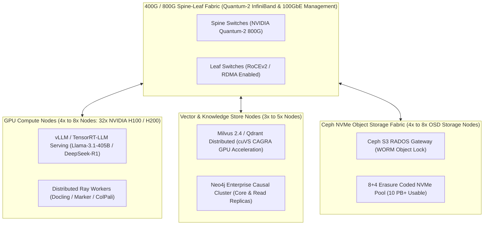

# 🏛️ Manual 09: Enterprise Datacenter Supercomputing Deployment, Ceph S3 WORM Storage, and InfiniBand RoCEv2 Infrastructure

> **Parent Suite**: [Sovereign Appliance Manual Index](README.md)  
> **Related ADR**: [ADR-38: Enterprise Sovereign Datacenter Architecture](../adrs/ADR-38-Enterprise-Sovereign-Datacenter-Architecture-and-Distributed-Fabric.md)  
> **Target Environments**: Tier-3 / Tier-4 Datacenter Facilities, Government Private Clouds, Central Bank Data Rooms, High-Security Hospital Networks  
> **Scale**: Multi-Rack Cluster | 10M to 500M+ Documents | Distributed GPU Ingestion (2,500+ p/s) | 400G InfiniBand Fabric | SEC Rule 17a-4 / BACEN WORM Certified  

---

## 1. Multi-Rack Enterprise Cluster Topology

The datacenter architecture separates compute, storage, and networking into dedicated hardware tiers interconnected by low-latency InfiniBand and RoCEv2 fabrics:



### Reference Bill of Materials (BOM) — 2-Rack Sovereign Cloud
- **Compute Tier**: 4x 8-GPU servers (32x NVIDIA H100 SXM5 80GB, Dual Intel Xeon Platinum 8480+, 2TB DDR5 RAM per node).
- **Storage Tier**: 4x 2U Storage servers (24x 15.36TB U.2 Enterprise NVMe per node, Ceph OSDs, 1.4PB raw NVMe pool).
- **Network Tier**: 2x NVIDIA Quantum-2 QM9700 64-port 400Gb/s InfiniBand switches + 2x 100GbE Arista Leaf switches for management and S3 traffic.
- **Cooling & Power**: Direct-to-Chip Liquid Cooling (DLC) or rear-door heat exchangers (RDHx) supporting 35kW per rack.

---

## 2. Distributed Ray Ingestion Cluster (Docling & ColPali)

At scale, traditional CPU OCR (Tesseract) becomes an insurmountable bottleneck. The datacenter stack uses **Ray** to distribute document parsing across dozens of GPU workers:

```python
# ray_distributed_ingest.py
import ray
from docling.document_converter import DocumentConverter, PdfFormatOption
from docling.datamodel.pipeline_options import PdfPipelineOptions, AcceleratorOptions

ray.init(address="auto")

@ray.remote(num_gpus=1)
def process_document_batch(s3_keys: list[str]):
    pipeline_options = PdfPipelineOptions()
    pipeline_options.accelerator_options = AcceleratorOptions(num_threads=8, device="cuda")
    pipeline_options.do_table_structure = True
    pipeline_options.do_ocr = False # ColPali visual embeddings bypass classical OCR
    
    converter = DocumentConverter(
        format_options={PdfFormatOption: pipeline_options}
    )
    
    results = []
    for key in s3_keys:
        doc = converter.convert(key)
        results.append(doc.render_visual_tokens()) # Extract visual spatial bounding boxes
    return results
```

- **Throughput Benchmark**: 2,500+ pages/second across a 32-GPU cluster.
- **Handling Complex Layouts**: Complex balance sheets, multi-column fiscal reports, and organizational charts are rendered into structured JSON matrix tables with spatial coordinates rather than flattened text dumps.

---

## 3. Ceph S3 Storage with WORM Immutability

For law firms, central banks (BACEN), and public libraries, documents must adhere to statutory non-rewritable, non-erasable standards:

### Enabling S3 Object Lock (Compliance Mode)
```bash
# 1. Create a dedicated WORM-enabled bucket on Ceph RGW
radosgw-admin bucket create --bucket=sovereign-institutional-archive --object-lock-enabled

# 2. Configure mandatory 10-year retention rule via S3 API
aws --endpoint-url=http://s3.sovereign.local s3api put-object-lock-configuration \
    --bucket sovereign-institutional-archive \
    --object-lock-configuration '{
        "ObjectLockEnabled": "Enabled",
        "Rule": {
            "DefaultRetention": {
                "Mode": "COMPLIANCE",
                "Years": 10
            }
        }
    }'
```

### Compliance Guarantees:
- **Zero Administrative Bypass**: In `COMPLIANCE` mode, even the Ceph cluster administrator, root SSH user, or compromised system service cannot delete an object or shorten the retention period before expiration.
- **8+4 Erasure Coding**: With 8 data chunks and 4 parity chunks, the system tolerates the simultaneous loss of 4 whole NVMe storage nodes with zero downtime and automatic background re-striping.

---

## 4. Multi-GPU Tensor Parallelism over InfiniBand (vLLM Serving)

Large models (Llama-3.1-70B, Llama-3.1-405B, and DeepSeek-R1) cannot fit in a single GPU's VRAM. They are sharded across multiple GPUs using **Tensor Parallelism (TP)**:

```bash
# Launching vLLM on an 8x H100 Node with Tensor Parallelism = 8
python3 -m vllm.entrypoints.openai.api_server \
    --model /models/Meta-Llama-3.1-405B-Instruct-FP8 \
    --tensor-parallel-size 8 \
    --pipeline-parallel-size 1 \
    --max-model-len 32768 \
    --gpu-memory-utilization 0.95 \
    --swap-space 32 \
    --disable-log-requests \
    --host 0.0.0.0 \
    --port 8000
```

### Network Requirements for Inter-Node Parallelism:
- Multi-node pipeline parallelism (splitting 405B across multiple chassis) demands **400Gbps InfiniBand with GPUDirect RDMA**.
- Standard 10GbE networking introduces multi-second communication latency during transformer attention sync, causing token generation speed to collapse from 45 tok/s to $< 2\text{ tok/s}$.

---

## 5. Distributed Neo4j Causal Clustering

For government institutions and public archives managing hundreds of millions of entities (citizens, corporations, lawsuits, patents, real estate deeds):

```text
Cluster Architecture:
  • 3x Core Servers: Handle Raft consensus, write transactions, and cluster coordination.
  • 5x Read Replicas: Horizontally scale Cypher queries across distributed memory.
```

### High-Performance Cypher Institutional Traversal Example
```cypher
// Discover indirect offshore holding structures under Lei 14.754
MATCH (origin:Entity {cnpj: $target_cnpj})-[r:HOLDS_SHARES|BENEFICIAL_OWNER*1..5]->(target:OffshoreCompany)
WHERE target.jurisdiction IN ['Panama', 'BVI', 'Cayman Islands', 'Bahamas']
RETURN origin.name, target.name, reduce(weight = 1.0, rel in r | weight * rel.share_pct) AS effective_ownership
ORDER BY effective_ownership DESC;
```

---

## 6. Public Sector & National Library Integration Playbook

Governments and academic libraries face unique indexing challenges:

### Digitization Workflow for Fragile Physical Archives:
1. **High-Resolution Scanning**: Overhead planetary scanners output 600 DPI uncompressed TIFF files to local ingestion queues.
2. **ColPali Visual Vectorization**: Direct visual embedding maps historical calligraphy, stamps, and watermarks into visual vector spaces.
3. **Automated Cross-Reference Linking**: The engine connects historical decree documents with modern administrative codes and judicial precedents.
4. **Public vs. Sealed Access Fencing**: Utilizing Cilium eBPF and RBAC, sealed historical documents (e.g. 50-year state secrets) remain cryptographically isolated while public historical collections are made available to citizens via zero-egress public portals.

---

## 7. Related Operations & Manuals
- [Manual 01: Turn-Key Deployment & Provisioning](01_deployment_guide.md)
- [Manual 06: Executive Tuning & Client Knobs](06_executive_tuning_and_client_knobs.md)
- [Manual 08: Sovereign Desktop Workstation Setup](08_desktop_workstation_and_corporate_dlp.md)
- [ADR-38: Enterprise Sovereign Datacenter Architecture](../adrs/ADR-38-Enterprise-Sovereign-Datacenter-Architecture-and-Distributed-Fabric.md)
