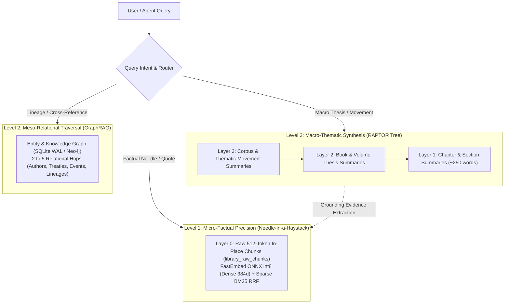
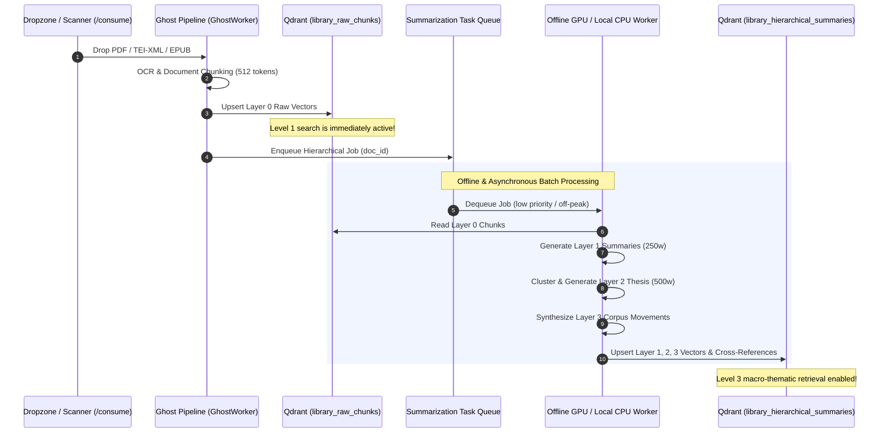

# 📚 Manual 10: Hierarchical Library Retrieval, RAPTOR Summaries & Multi-Strata Archival Search

> **Parent Suite**: [Sovereign Appliance Manual Index](README.md)  
> **Related Architecture**: [ADR-35: Sovereign Knowledge Appliance Packaging](../adrs/ADR-35-Sovereign-Knowledge-Appliance-Packaging-and-Commercial-Architecture.md) | [ADR-38: Enterprise Datacenter Platform](../adrs/ADR-38-Enterprise-Sovereign-Datacenter-Architecture-and-Distributed-Fabric.md) | [Chapter 21: Hybrid RAG Architecture](README.md)  
> **Target Environments**: University Archives, National & Public Libraries, Rare Manuscript Repositories, Research Foundations, Academic Consortia  
> **Retrieval Paradigm**: 3-Strata Cognitive Model (Micro-Factual, Meso-Relational, Macro-Thematic RAPTOR Tree)  

---

## 1. System Overview & The Archival Intelligence Problem

Traditional Retrieval-Augmented Generation (RAG) systems fail catastrophically when deployed over massive literary archives, historical collections, and academic libraries. They suffer from a fundamental tension between two opposing retrieval requirements:

1. **The Risk of Flat Chunking ("Missing the Forest for the Trees")**:  
   Standard RAG segments texts into uniform chunks (typically 512 tokens). When an academic researcher asks about overarching philosophical evolution across a multi-volume treatise, narrative arcs, or comparative literary movements, flat chunking retrieves isolated paragraphs. The model lacks the bird's-eye view required to synthesize macro-thematic conclusions.

2. **The Risk of Naive Summarization ("Losing the Needle in the Haystack")**:  
   Conversely, systems that rely exclusively on pre-generated summaries discard rare terms, exact measurements, obscure proper nouns, footnote citations, and minor historical figures. Summarization acts as a lossy compression filter that eliminates the exact micro-factual evidence scholars and archivists need.

The **Aegis Sovereign Library Intelligence Engine** solves this problem by structuring document cognition across **Three Distinct Cognitive Strata**, unifying micro-factual precision, relational graph traversal, and hierarchical tree summarization (**RAPTOR** paradigm).

---

## 2. The Three Cognitive Strata



### Comparative Matrix of the Cognitive Strata

| Feature | Level 1: Micro-Factual Precision | Level 2: Meso-Relational Traversal | Level 3: Macro-Thematic Synthesis |
| :--- | :--- | :--- | :--- |
| **Primary Query Type** | Exact quotes, specific measurements, minor characters, footnote citations, dates | Cross-referencing authors, historical events, lineages, treaties across editions | Overarching narrative arcs, philosophical evolution, comparative movements |
| **Engine Subsystem** | FastEmbed ONNX int8 (Dense 384d) + Sparse BM25 Reciprocal Rank Fusion (RRF) | GraphRAG (SQLite WAL at Edge/Desktop; Neo4j at Enterprise Datacenter) | Hierarchical Tree Retrieval (RAPTOR Community Summaries in Qdrant) |
| **Retrieval Depth** | Exact sentence, page number, and line offset | 2 to 5 relational edge hops across entities | Recursive summary tree: Layer 3 $\to$ Layer 2 $\to$ Layer 1 $\to$ Layer 0 evidence |
| **Prior Summarization Needed?** | **NO**. Raw in-place chunks preserve rare and archaic terminology. | **NO**. Deterministic regex and entity extractors extract graph triples directly. | **YES (Strictly Offline)**. Local/batch worker pre-generates summaries at ingestion. |
| **Collection Storage** | `library_raw_chunks` (Qdrant collection) | `graph_store.db` (Entities & Relations tables) | `library_hierarchical_summaries` (Qdrant collection) |
| **Latency Profile** | Sub-15ms vector & lexical score calculation | Sub-25ms graph neighbor traversal | Sub-40ms hierarchical tree resolution + synthesis |

---

## 3. Hierarchical RAPTOR Indexing Architecture

The macro-thematic stratum organizes documents into a multi-layer abstraction hierarchy, enabling top-down semantic exploration:

```
[Layer 3: Corpus / Thematic Movements]  <-- Cross-volume trends, historical periods
         │
         ├── [Layer 2: Volume / Thesis Summaries]  <-- Book-level arguments & methodology
         │        │
         │        ├── [Layer 1: Chapter Summaries]  <-- 250-word section condensations
         │        │        │
         │        │        └── [Layer 0: Raw Chunks]  <-- 512-token verbatim text units
```

### Layer Specifications

1. **Layer 0: Raw Chunks (`library_raw_chunks`)**:
   - Chunk Size: 512 tokens with 64-token sliding window overlap.
   - Dense Embeddings: `BAAI/bge-small-en-v1.5` or `multilingual-e5-small` quantized to int8 ONNX (384 dimensions).
   - Sparse Tokenizer: BM25 with language-specific stemmers and stopword filtering.
   - Purpose: Direct retrieval target for Level 1 queries; citation evidence foundation for Level 3 answers.

2. **Layer 1: Chapter & Section Summaries**:
   - Scope: 5 to 15 contiguous Layer 0 chunks (approximately 2,500 to 7,500 tokens).
   - Condensation: Synthesized into structured 250-word summaries capturing key arguments, named entities, and structural shifts.
   - Embeddings: Vectorized into `library_hierarchical_summaries` with metadata pointer `layer: 1` and `parent_volume_id`.

3. **Layer 2: Book & Volume Thesis Summaries**:
   - Scope: Aggregation of all Layer 1 summaries belonging to a distinct volume or monograph.
   - Condensation: 500-word comprehensive thesis abstract detailing thesis statement, methodology, counter-arguments, and historical context.
   - Embeddings: Vectorized with metadata pointer `layer: 2`.

4. **Layer 3: Library & Corpus Thematic Summaries**:
   - Scope: Semantic clustering of related Layer 2 summaries across an author's lifetime, an academic school of thought, or a historical epoch.
   - Condensation: 800-word comparative survey mapping intellectual evolution and thematic trajectories.
   - Embeddings: Vectorized with metadata pointer `layer: 3`.

---

## 4. Asynchronous Offline Summary Workers

To guarantee sub-120ms search latencies and zero user query degradation, all summary generation is decoupled from the ingestion and query paths:



### Key Engineering Invariants
- **Zero Real-Time Blocking**: A new text becomes searchable for Level 1 needle queries within seconds of ingestion. Hierarchical summaries build progressively in the background.
- **Local Model Delegation**: Offline summaries are synthesized locally on CPU (e.g. Llama-3.2-3B / Qwen-2.5-7B via Ollama) or scheduled for off-peak execution on dedicated GPU compute (e.g. RTX 5070 / H100).
- **Immutability of Raw Chunks**: Summaries never replace raw text. Raw chunks remain permanently addressable with original page and line offsets.

---

## 5. Model Context Protocol (MCP) Parameter Tuning Dials

The `sovereign-vault` MCP server provides runtime knobs through the `sovereign_optimize_context` tool to calibrate retrieval depth to the scholar's or attorney's exact requirements:

```json
{
  "query": "Trace the evolution of scholastic nominalism from Peter Abelard to William of Ockham",
  "retrieval_mode": "legal_discovery",
  "max_chunks": 12,
  "confidence_floor": 0.25,
  "include_graph_dossier": true
}
```

### Depth Tuning Guide

| Parameter | Micro-Factual (Level 1) | Meso-Relational (Level 2) | Macro-Thematic RAPTOR (Level 3) |
| :--- | :--- | :--- | :--- |
| `retrieval_mode` | `"high_precision"` | `"high_precision"` or `"legal_discovery"` | `"legal_discovery"` |
| `max_chunks` | `2` to `3` | `4` to `6` | `8` to `15` |
| `confidence_floor` | `0.45` to `0.60` (Strict similarity) | `0.35` to `0.45` | `0.20` to `0.30` (Broad contextual recall) |
| `include_graph_dossier` | `false` (Lowest latency) | `true` (Extracts entity relationship graph) | `true` (Grounds thematic movements in entities) |

### Adaptive Routing Workflow
1. **Level 1 Queries** (e.g., *"What was the exact census figure in the 1782 parish register?"*):
   - Hits `library_raw_chunks` directly with high confidence threshold ($\ge 0.50$).
   - Returns exact chunk with page, line, and file path citations in under 20ms.
2. **Level 3 Queries** (e.g., *"How does the economic thesis of Volume 1 contrast with Volume 3?"*):
   - Hits `library_hierarchical_summaries` matching Layer 2 and Layer 3 vectors.
   - Identifies candidate thematic clusters, then retrieves top-k supporting Layer 0 raw chunks from `library_raw_chunks` to provide grounded textual citations.

---

## 6. Library Cataloging Standards & Metadata Alignment

The appliance aligns standard library cataloging metadata into Qdrant point payloads and SQLite graph tables:

```json
{
  "id": "urn:isbn:978-0-19-924555-0:ch04",
  "payload": {
    "title": "The Problem of Universals in Medieval Thought",
    "creator": "David P. Henry",
    "publication_year": 1984,
    "dewey_decimal": "189.4",
    "call_number": "B738.U5 H46 1984",
    "dublin_core": {
      "subject": ["Scholasticism", "Nominalism", "Medieval Logic"],
      "coverage": "1100-1400",
      "rights": "Public Domain"
    },
    "marc21": {
      "100_author": "Henry, Desmond Paul",
      "245_title": "That which is: an inquiry into logic and ontology",
      "650_subject": "Ontology--History"
    },
    "layer": 1,
    "chunk_type": "chapter_summary",
    "source_file": "henry_medieval_logic_1984.pdf",
    "page_range": "85-112"
  }
}
```

### Access Fencing: Public Domain vs Special Collections
Archives can enforce strict access boundaries using Qdrant payload filters:
- `public_domain`: Freely accessible to external web portals and student queries.
- `sealed_archive` / `special_collections`: Requires cryptographic role-based authorization tokens in the MCP context, preventing leakage of unreleased manuscripts or sensitive donor records.

---

## 7. CLI Runbook & Operational Verification

### Verify Collection Status
Check that both raw chunks and hierarchical summary collections are active:

```bash
# Verify raw chunk collection
curl -s http://127.0.0.1:6333/collections/library_raw_chunks | jq '.result.status, .result.points_count'

# Verify hierarchical summaries collection
curl -s http://127.0.0.1:6333/collections/library_hierarchical_summaries | jq '.result.status, .result.points_count'
```

### Inspect Layer Distribution
Query summary points by hierarchy layer:

```bash
curl -s -X POST http://127.0.0.1:6333/collections/library_hierarchical_summaries/points/scroll \
  -H "Content-Type: application/json" \
  -d '{
    "filter": {
      "must": [
        { "key": "layer", "match": { "value": 2 } }
      ]
    },
    "limit": 5,
    "with_payload": true
  }' | jq '.result.points[].payload | {title, layer, chunk_type}'
```

### Trigger Test Query via Sovereign Python SDK
Run a verification query testing Level 3 retrieval depth:

```python
import urllib.request
import json

payload = {
    "query": "Trace the evolution of scholastic nominalism",
    "retrieval_mode": "legal_discovery",
    "max_chunks": 8,
    "confidence_floor": 0.25,
    "include_graph_dossier": True
}

req = urllib.request.Request(
    "http://127.0.0.1:8765/v1/vault/query",
    data=json.dumps(payload).encode("utf-8"),
    headers={"Content-Type": "application/json"}
)

with urllib.request.urlopen(req) as resp:
    result = json.loads(resp.read().decode("utf-8"))
    print(f"Retrieved {len(result.get('chunks', []))} evidence chunks.")
    print(f"Graph nodes traversed: {len(result.get('graph_dossier', {}).get('nodes', []))}")
```

---

## 8. Related Architecture & Manual Links

* [Sovereign Appliance Master Manual Index](README.md)
* [Manual 02: Database Initialization & Vector Store Architecture](02_database_initialization_and_vector_store.md)
* [Manual 04: MCP Harness & Agent Configuration](04_mcp_harness_and_agent_configuration.md)
* [Manual 06: Executive Tuning & Client Knobs](06_executive_tuning_and_client_knobs.md)
* [Manual 08: Desktop Workstation & Corporate DLP](08_desktop_workstation_and_corporate_dlp.md)
* [Manual 09: Enterprise Datacenter Supercomputing Deployment](09_datacenter_supercomputing_and_distributed_fabric.md)
* [Chapter 21: Hybrid RAG Architecture](README.md)
* [System Overview & Live Cluster Manifest](README.md)
