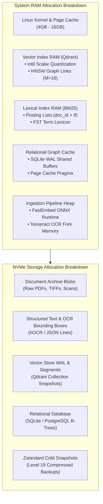
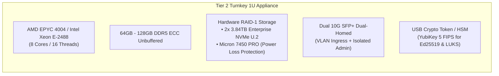
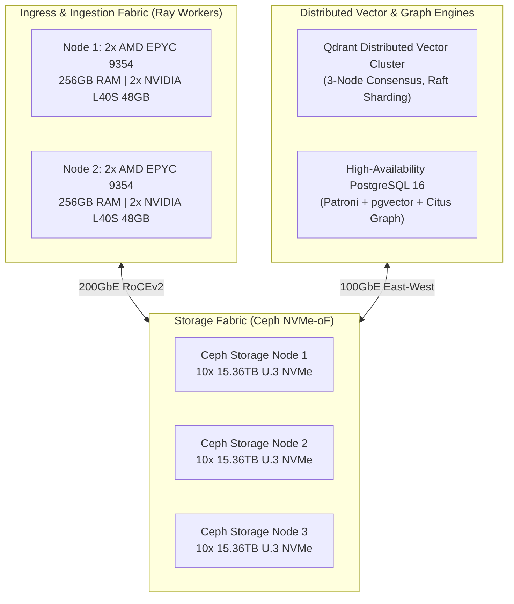

# 📐 Manual 11: Hardware Sizing, Infrastructure Capacity Planning & Sizing Benchmarks

> **Parent Suite**: [Sovereign Appliance Manual Index](README.md)  
> **Related Architecture**: [Manual 07: Scaling Topologies](07_scaling_topologies_bottlenecks_and_commercial_playbook.md) | [Manual 09: Datacenter Supercomputing](09_datacenter_supercomputing_and_distributed_fabric.md) | [ADR-35: Sovereign Packaging](../adrs/ADR-35-Sovereign-Knowledge-Appliance-Packaging-and-Commercial-Architecture.md)

This operational manual establishes the mathematical formulas, memory sizing models, storage footprint multipliers, and empirical throughput benchmarks required to architect, size, and provision bare-metal hardware and virtualized infrastructure for the **Aegis Sovereign Knowledge Appliance**.

---

## 1. Mathematical Sizing Models & Memory Architecture

Deploying an air-gapped sovereign intelligence appliance requires predictable resource bounding. Because the appliance operates without external cloud dependencies, memory exhaustion (OOM) halts real-time query serving and background document ingestion. Engineers must size RAM, storage, and compute according to the multi-tier data structures detailed below:



---

### 1.1 Vector RAM Sizing (Dense Embeddings & HNSW Graph)

The appliance utilizes dense vector embeddings for semantic similarity search. Standard models include **384-dimensional** embeddings (`BAAI/bge-small-en-v1.5`, `sentence-transformers/all-MiniLM-L6-v2`) and **512-dimensional** embeddings (`paraphrase-multilingual-MiniLM-L12-v2`, `clip-ViT-B-32`).

#### Vector Footprint Comparison: FP32 vs. int8 Scalar Quantization
- **Full Precision (FP32)**:
  $$S_{\text{fp32}} = d \times 4\text{ bytes}$$
  For 384 dimensions: $384 \times 4 = 1,536\text{ bytes/vector}$.  
  For 512 dimensions: $512 \times 4 = 2,048\text{ bytes/vector}$.
- **int8 Scalar Quantization (Default Invariant)**:
  Scalar quantization compresses each floating-point dimension to a single signed 8-bit integer, supplemented by an 8-byte metadata header per vector (4-byte minimum scalar offset + 4-byte scale factor):
  $$S_{\text{int8}} = (d \times 1\text{ byte}) + 8\text{ bytes}$$
  For 384 dimensions: $384 \times 1 + 8 = 392\text{ bytes/vector}$ (**74.5% memory reduction**).  
  For 512 dimensions: $512 \times 1 + 8 = 520\text{ bytes/vector}$ (**74.6% memory reduction**).

#### HNSW Graph Index Memory Footprint ($M=16, \text{efConstruction}=100$)
Hierarchical Navigable Small World (HNSW) graphs maintain directional links between vector nodes across hierarchical layers. With connectivity parameter $M = 16$ (and $M_0 = 2M = 32$ at layer 0):
- Average bidirectional links per vector: $\bar{E} \approx 1.25 \times M \approx 20\text{ pointers}$.
- Pointer storage: Each 64-bit internal pointer requires 8 bytes.
- Link memory per vector:
  $$S_{\text{hnsw}} = 20 \times 8\text{ bytes} = 160\text{ bytes/vector}$$
- Payload and metadata indexing cache (clearance level filter, document UUID, section hash): $\approx 120\text{ bytes/vector}$.

#### Total Vector RAM Formula
The aggregate vector RAM requirement is governed by:
$$RAM_{\text{vector}} = N_{\text{chunks}} \times \left( S_{\text{int8}} + S_{\text{hnsw}} + S_{\text{metadata}} \right) \times O_{\text{runtime}}$$
Where $O_{\text{runtime}} \approx 1.15$ accounts for Qdrant segment allocator overhead, memory fragmentation, and bloom filters.

For 384-dimensional vectors with int8 quantization:
$$RAM_{\text{vector}} = N_{\text{chunks}} \times (392 + 160 + 120) \times 1.15 \approx N_{\text{chunks}} \times 773\text{ bytes}$$

| Document Corpus | Estimated Chunks ($15\text{ chunks/doc}$) | Vector RAM (FP32) | Vector RAM (int8 Quantized) |
| :--- | :--- | :--- | :--- |
| **10,000 documents** | 150,000 chunks | 315 MB | **116 MB** |
| **100,000 documents** | 1,500,000 chunks | 3.15 GB | **1.16 GB** |
| **500,000 documents** | 7,500,000 chunks | 15.75 GB | **5.80 GB** |
| **1,000,000 documents** | 15,000,000 chunks | 31.50 GB | **11.60 GB** |
| **10,000,000 documents** | 150,000,000 chunks | 315.00 GB | **116.00 GB** |

---

### 1.2 Lexical RAM Sizing (BM25 Inverted Index)

Hybrid retrieval combines dense vector embeddings with sparse BM25 lexical retrieval via Reciprocal Rank Fusion (RRF). The BM25 engine maintains an inverted index in memory for sub-10ms keyword lookups.

#### Posting List Memory Footprint
- Average tokens per chunk: 250 words.
- Distinct normalized terms per chunk: $\bar{U} \approx 110\text{ terms}$.
- Posting entry structure:
  - Document/Chunk ID (uint32): 4 bytes
  - Term frequency (uint16): 2 bytes
  - Field position bitmask: 2 bytes
  - Total per posting entry: $S_{\text{posting}} = 8\text{ bytes}$.

#### Finite State Transducer (FST) Lexicon Dictionary
The vocabulary lexicon $|V|$ scales logarithmically following Heaps' Law:
$$|V| = K \times T^\beta$$
For enterprise legal and clinical corpora ($T \approx 10^8\text{ tokens}$), the dictionary stabilizes at $\approx 250,000 - 450,000$ unique stems, occupying $\approx 18\text{ MB}$ in an optimized FST structure.

#### Total BM25 Inverted Index RAM Formula
$$RAM_{\text{lexical}} = \left( |V| \times S_{\text{term}} \right) + \left( N_{\text{chunks}} \times \bar{U} \times S_{\text{posting}} \right) \times O_{\text{lexical}}$$
Where $O_{\text{lexical}} \approx 1.20$ accounts for skip-lists and document length arrays.

For typical English legal and technical prose:
$$RAM_{\text{lexical}} \approx 18\text{ MB} + \left( N_{\text{chunks}} \times 110 \times 8 \times 1.20 \right) \approx 18\text{ MB} + \left( N_{\text{chunks}} \times 1,056\text{ bytes} \right)$$

For 1,000,000 documents ($1.5 \times 10^7\text{ chunks}$):
$$RAM_{\text{lexical}} \approx 18\text{ MB} + 15.84\text{ GB} \approx 15.86\text{ GB}$$

---

### 1.3 Relational Knowledge Graph Disk Sizing (SQLite WAL & PostgreSQL)

The relational knowledge graph captures structured entities (Companies, Persons, Contracts, CPFs, Medical Record Numbers) and semantic edges (SIGNATORY_OF, SUBSIDIARY_OF, OWES_OBLIGATION_TO).

#### Entity and Relation Storage Layout
1. **Entity Record**:
   - `entity_id` (UUID): 16 bytes
   - `name` (VARCHAR 128): ~32 bytes average
   - `entity_type` (VARCHAR 32): ~16 bytes
   - `clearance_level` (uint8): 1 byte
   - `mention_count` (uint32): 4 bytes
   - `metadata_json` (JSONB): ~160 bytes
   - Total per entity: $S_{\text{entity}} \approx 229\text{ bytes}$.
2. **Relation Record**:
   - `relation_id` (UUID): 16 bytes
   - `source_id` + `target_id` (2x UUID): 32 bytes
   - `relation_type` (VARCHAR 32): ~16 bytes
   - `confidence` (float32): 4 bytes
   - `provenance_chunk_id` (UUID): 16 bytes
   - Total per relation: $S_{\text{relation}} \approx 84\text{ bytes}$.

#### B-Tree Index and WAL Multipliers
To support multi-hop graph traversal without sequential table scans, the database maintains four composite B-tree indexes:
- `idx_entities_type_clearance (entity_type, clearance_level)`
- `idx_entities_name_trgm (trigram search)`
- `idx_relations_src_type (source_id, relation_type)`
- `idx_relations_tgt_type (target_id, relation_type)`

Accounting for a standard SQLite 4096-byte page fill factor of 70% and Write-Ahead Logging (WAL) headroom:
$$Disk_{\text{graph}} = \left( N_{\text{entities}} \times 229 + N_{\text{relations}} \times 84 \right) \times 1.45\text{ (index overhead)} \times 1.30\text{ (WAL margin)}$$

For an archive with 250,000 documents containing 1.2M entities and 4.8M relations:
$$Disk_{\text{graph}} \approx (274.8\text{ MB} + 403.2\text{ MB}) \times 1.885 \approx 1.28\text{ GB}$$

---

### 1.4 Document Storage Footprint & Compression Multipliers

Document storage encompasses raw ingestion files, derived OCR representations, page image plates, and immutable cold snapshots:

```
+-------------------------------------------------------------------------+
|                  Per-Page Storage Distribution Breakdown                |
+-------------------------------------------------------------------------+
| Raw Scanned PDF (300 DPI Monochrome / Color)       : 120 KB - 450 KB    |
| Extracted UTF-8 Plain Text                        : 3.5 KB - 5.0 KB    |
| Structured OCR Geometry (hOCR / Bounding Box JSON): 14.0 KB - 22.0 KB   |
| Visual Plate Thumbnail (WebP 800x1200)             : 45.0 KB - 75.0 KB   |
+-------------------------------------------------------------------------+
| Net Active Storage per Scanned Page               : 182.5 KB - 552.0 KB |
| Net Active Storage per Born-Digital PDF Page      : 42.5 KB - 95.0 KB   |
+-------------------------------------------------------------------------+
```

#### Zstandard Cold Snapshot Compression
For disaster recovery and air-gapped tape/USB export, the backup subsystem compresses database dumps and document vaults using Zstandard (`zstd -19 -T0`):
- Pure Text and OCR payloads compress at **4.8:1**.
- Mixed PDF and image archives compress at **2.4:1**.
- Blended average compression ratio: **3.1:1**.

$$Storage_{\text{cold\_snapshot}} = \frac{Storage_{\text{active}}}{3.1}$$

---

## 2. Ingestion Throughput Benchmarks Across Hardware Architectures

Document ingestion involves four discrete processing stages: PDF rasterization, Tesseract OCR character recognition, layout analysis, and FastEmbed ONNX vector embedding generation. The following empirical benchmarks detail throughput across validated hardware profiles:

| Hardware Configuration | Compute Profile | Active Threads | OCR Pages / sec | Embedding Chunks / sec | Total Ingestion (Pages/hour) |
| :--- | :--- | :--- | :--- | :--- | :--- |
| **Dell Latitude 7390** | Intel Core i5-8350U (4C/8T) | 6 threads | 4.8 | 42 | **17,280** |
| **Mini-PC (MS-01 / N100)** | Intel Core i9-13900H (14C/20T) | 16 threads | 22.4 | 185 | **80,640** |
| **Pro Workstation + RTX 5070** | Ryzen 9 9900X + RTX 5070 12GB | 24T + CUDA | 68.0 | 850 | **244,800** |
| **Enterprise 1U Server** | Dual AMD EPYC 9354 (64C/128T) | 96 threads | 145.0 | 1,200 | **522,000** |
| **Datacenter Ray GPU Fabric** | 4x NVIDIA L40S 48GB + EPYC | Ray Cluster | 820.0 | 7,400 | **2,952,000** |

---

## 3. Hardware Bill of Materials (BOM) & Topology Sizing

### 3.1 Tier 1: Personal Desktop & Mobile Workstation
Designed for individual litigation attorneys, investigative journalists, compliance officers, and power prosumers running the serverless desktop appliance.

| Component | Minimal Entry Configuration | Optimal Executive Workstation |
| :--- | :--- | :--- |
| **Form Factor** | Ultra-Compact Mini-PC or Laptop | High-Performance SFF Tower Workstation |
| **Processor** | Intel Core i5 (8th Gen+) or AMD Ryzen 5 | AMD Ryzen 9 9900X (12C / 24T, up to 5.6 GHz) |
| **System Memory** | 16 GB DDR4-2666 non-ECC | 64 GB DDR5-6000 (2x32GB) dual-channel |
| **Primary OS Drive** | 512 GB M.2 NVMe PCIe 3.0 (2,000 MB/s) | 1 TB Samsung 990 Pro PCIe 4.0 NVMe |
| **Appliance Data Drive**| Shared with OS (Encrypted LUKS) | Dedicated 2 TB NVMe PCIe 4.0 (Direct I/O) |
| **Hardware Accelerator**| Intel UHD 620 Graphics (CPU-only ONNX) | NVIDIA GeForce RTX 5070 12GB GDDR7 |
| **Network Interfaces** | 1x Gigabit Ethernet (1000BASE-T) | 1x 2.5GbE LAN + 1x 10GbE SFP+ Direct Attach |
| **Power Consumption** | ~15W Idle, 45W Peak Ingestion | ~65W Idle, 320W Peak Ingestion |
| **Document Capacity** | Up to **25,000 documents** (~375k chunks) | Up to **150,000 documents** (~2.25M chunks) |
| **Estimated BOM Cost** | **$350 - $550 USD** | **$1,850 - $2,300 USD** |

---

### 3.2 Tier 2: Edge Turnkey 1U & Micro-Server Appliance
Engineered for mid-sized law firms, regional hospitals, accounting practices, and sovereign municipal departments managing between 50,000 and 500,000 confidential files across 10 to 50 concurrent seats.



| Component | Minimal Turnkey Specification | Optimal High-Reliability Enterprise 1U |
| :--- | :--- | :--- |
| **Chassis** | 1U Short-Depth Rackmount (Supermicro) | 1U Dell PowerEdge R360 / HPE ProLiant DL20 |
| **Processor** | Intel Xeon E-2436 (6C / 12T, 2.9 GHz) | AMD EPYC 4584PX (16C / 32T, 4.2 GHz, 3D V-Cache) |
| **System Memory** | 64 GB (2x32GB) DDR5-4800 ECC UDIMM | 128 GB (4x32GB) DDR5-4800 ECC UDIMM |
| **OS Boot Mirror** | 2x 480 GB SATA SSDs (RAID-1 Hardware) | 2x 480 GB NVMe M.2 BOSS Card (Hardware RAID-1) |
| **Hot Storage Array** | 2x 1.92 TB Micron 7450 PRO U.2 NVMe | 2x 3.84 TB Kioxia CD8-R Enterprise PCIe 4.0 NVMe |
| **Cold Snapshot Drive**| 1x 8 TB Seagate IronWolf Pro 7.2k SATA | 2x 16 TB Enterprise SATA (ZFS Mirror Pool) |
| **Power Supply** | 350W Single 80-Plus Gold | Dual Redundant 600W Hot-Plug Titanium PSUs |
| **Out-of-Band Mgt** | Dedicated IPMI 2.0 / ASPEED AST2600 | Integrated Dell iDRAC9 Enterprise (Dedicated Port)|
| **Network Fabric** | 2x 1GbE RJ45 + 2x 10GbE SFP+ Ports | 2x 10GbE SFP+ (Intel X710) + 2x 1GbE Management |
| **Document Capacity** | Up to **250,000 documents** (~3.75M chunks) | Up to **600,000 documents** (~9.0M chunks) |
| **Target SLA & Seats**| 99.9% Uptime, 25 Concurrent Seats | 99.99% Uptime, 75 Concurrent Seats |
| **Estimated BOM Cost** | **$2,800 - $3,600 USD** | **$5,200 - $6,800 USD** |

---

### 3.3 Tier 3: Enterprise Datacenter Multi-Node GPU Cluster
Architected for defense agencies, state archives, banking regulatory compliance teams, and sovereign cloud environments managing between 1,000,000 and 50,000,000 documents.



| Component | Minimal Datacenter Cluster (Single 2U Node) | Full Scale-Out Institutional Fabric (3 Nodes + Ceph) |
| :--- | :--- | :--- |
| **Compute Nodes** | 1x 2U Dual-Socket Rackmount Server | 3x Compute/Vector Nodes + 3x Storage Nodes |
| **Processors** | 2x AMD EPYC 9354 (64 Cores / 128 Threads) | 2x AMD EPYC 9654 per node (96C / 192T each) |
| **System Memory** | 512 GB (16x32GB) DDR5-4800 Registered ECC | 1.5 TB DDR5 ECC per compute node (4.5 TB Cluster) |
| **Accelerators** | 2x NVIDIA L40S 48GB PCIe (Air-Cooled) | 4x NVIDIA L40S 48GB or 2x H100 NVL per node |
| **Local Scratch Array**| 4x 3.84 TB NVMe Gen5 U.2 (Hardware RAID-10)| 4x 7.68 TB Kioxia CM7-R PCIe 5.0 NVMe per node |
| **Shared Storage** | Direct Attached JBOD via SAS-4 (96 TB Raw)| Ceph NVMe-oF Distributed Fabric (460 TB Raw) |
| **Network Fabric** | Dual-Port 25GbE SFP28 Mellanox ConnectX-6 | Dual-Port 100/200GbE QSFP58 (RoCEv2 RDMA Fabric) |
| **Redundancy** | Dual 1600W Titanium Redundant PSUs | Dual 2400W Titanium PSUs per chassis, A+B Feed |
| **Document Capacity** | Up to **2,500,000 documents** (~37.5M chunks) | Up to **25,000,000 documents** (~375M chunks) |
| **Concurrency Scale** | 250 Concurrent Executive Seats | 1,500+ Concurrent Multi-Tenant Organization Seats|
| **Estimated BOM Cost** | **$24,000 - $32,000 USD** | **$120,000 - $185,000 USD** |

---

## 4. Hardware Verification & Stress-Testing Acceptance Procedure

Before issuing a cryptographic production license or handing over an appliance to client custody, systems engineers must execute the automated hardware acceptance script:

```bash
# 1. Assert CPU instruction set support (AVX2, AVX-512, FMA)
lscpu | grep -E "avx2|avx512|fma|bmi2"

# 2. Benchmark raw NVMe sequential and random 4K IOPS
fio --name=random-write --ioengine=posixaio --rw=randwrite --bs=4k \
    --size=4g --numjobs=4 --runtime=60 --time_based --group_reporting

# 3. Assert memory stability under maximum vector allocation
stress-ng --vm 4 --vm-bytes 80% --vm-method all --verify -t 10m

# 4. Run the automated offline license verification latency audit
python3 -m pytest -s tests/test_license.py -k test_verification_latency_budget
```

The appliance passes hardware acceptance when:
1. Sequential NVMe read bandwidth exceeds **1,500 MB/s** and 4K random write IOPS exceed **45,000 IOPS**.
2. Total memory verification passes 10 minutes of stress-ng testing with zero kernel OOM kills.
3. Asymmetric Ed25519 offline license verification executes in **$< 0.5\text{ ms}$**.

---

## 5. Summary Sizing Quick Reference Matrix

| Metric / Parameter | Tier 1: Personal | Tier 2: Turnkey 1U | Tier 3: Datacenter |
| :--- | :--- | :--- | :--- |
| **Max Documents** | 25,000 | 250,000 | 5,000,000 - 25,000,000 |
| **RAM Sizing** | 16 GB - 64 GB | 64 GB - 128 GB ECC | 512 GB - 4.5 TB ECC |
| **NVMe Storage** | 1 TB - 2 TB | 3.84 TB - 7.68 TB RAID-1 | 30 TB - 460 TB NVMe-oF |
| **GPU Acceleration** | Optional (RTX 5070) | Optional (Tesla T4/L4) | Mandatory (NVIDIA L40S/H100) |
| **Ingest Rate** | 17k - 80k pages/hr | 80k - 240k pages/hr | 500k - 2.9M pages/hr |
| **Query P99 Latency** | $< 120\text{ ms}$ | $< 65\text{ ms}$ | $< 25\text{ ms}$ |
| **Applicable License**| Free / Pro Desktop | Pro / Enterprise 1U | Enterprise Multi-Tenant |

---

## 6. Related Operational Guides
- [Manual 01: Deployment Guide](01_deployment_guide.md)
- [Manual 02: Database Initialization & Vector Store](02_database_initialization_and_vector_store.md)
- [Manual 07: Scaling Topologies & Playbook](07_scaling_topologies_bottlenecks_and_commercial_playbook.md)
- [Manual 08: Desktop Workstation & DLP Compliance](08_desktop_workstation_and_corporate_dlp.md)
- [Manual 09: Datacenter Supercomputing & Distributed Fabric](09_datacenter_supercomputing_and_distributed_fabric.md)
- [Manual 10: Hierarchical Library Retrieval & RAPTOR](10_hierarchical_library_retrieval_and_raptor_summaries.md)
- [ADR-35: Sovereign Packaging Architecture](../adrs/ADR-35-Sovereign-Knowledge-Appliance-Packaging-and-Commercial-Architecture.md)
