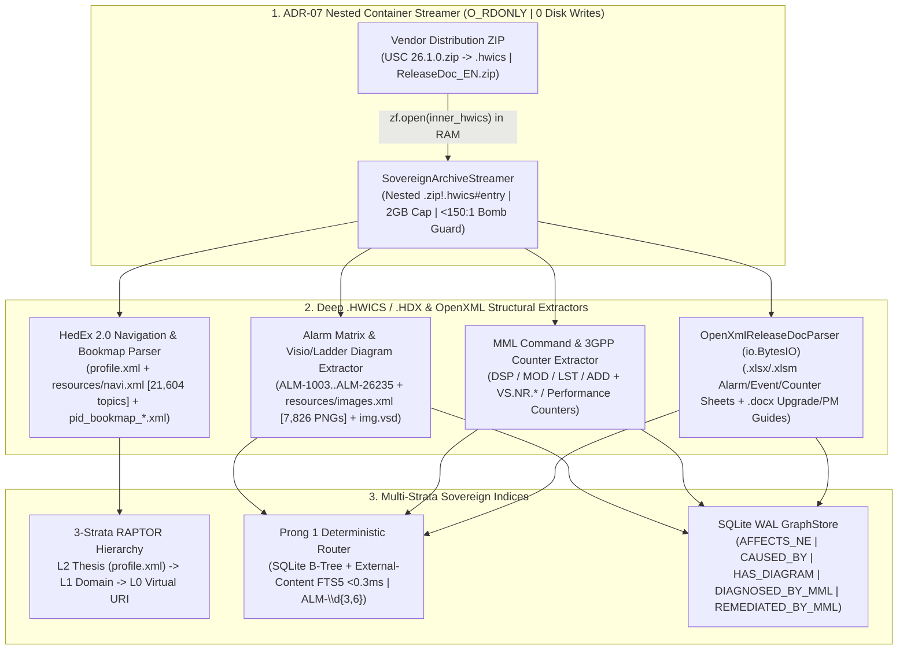

# 📡 Manual 13: Deep `.HDX` / `.HWICS` Telecom Vendor Package & ReleaseDoc OpenXML Ingestion

> **Parent Index**: [Aegis Master Manual Suite](README.md)  
> **Related Manuals**: [Manual 10: Hierarchical Library Retrieval & RAPTOR](10_hierarchical_library_retrieval_and_raptor_summaries.md) | [Manual 12: Tier 1 Workstation Compendium](12_sovereign_workstation_tier1_architecture_compendium.md) | [Manual 14: Real-World Corpus Acquisition & Stress-Testing Guide](14_real_world_corpus_acquisition_and_testing_guide.md)  
> **Architecture Standard**: [ADR-07: Virtual Container Streaming & Cognitive Graph Intelligence](../projects/aegis/adrs/ADR-07-Virtual-Container-Streaming-and-Cognitive-Graph-Intelligence.md)  
> **Target Verticals**: 5G RAN / Core / Signaling Telecom NOCs (Huawei `.hdx` & `.hwics` HedEx 2.0 Information Center Service libraries, `ReleaseDoc_EN.zip` `.xlsx`/`.docx` bundles, Ericsson/Nokia CPI), Defense & Avionics Technical Manuals, Air-Gapped Field Engineering Laptops

---

## 1. Executive Summary: Why `.HDX` & `.HWICS` Packages Break Conventional RAG

Telecommunications carriers, network operations centers (NOCs), and field engineering teams rely on proprietary **`.hdx` (HedEx)** and **`.hwics` (HedEx 2.0 Information Center Service)** archives alongside **OpenXML `ReleaseDoc` bundles (`.xlsx`, `.xlsm`, `.docx`)**—such as **Huawei USC (Unified Signaling Controller) 26.1.0**, **UPCF (Unified Policy and Charging Function) 26.1.0**, **5G RAN BBU5900 / AAU5613 V100R019**, **CloudCORE 5GC**, and **OptiXtrans DWDM** libraries.

Our real-world empirical evaluation on **815 MB (`~878 MB` uncompressed, `59,000+` files)** of wild Huawei 26.1.0 production packages revealed four structural realities that break conventional RAG pipelines:

1. **Nested `.zip -> .hwics` Packaging & 30,000-File Inode Storms**: Modern Huawei Online Information Center releases wrap a `353 MB – 355 MB` `.hwics` container (`PK\x03\x04` ZIP archive containing `29,860+` files) inside an outer distribution `.zip`. Extracting `59,000+` tiny HTML, XML, and PNG files to an `ext4` or `NTFS` filesystem consumes `59,000+` inodes, wastes `120+ MB` in `4K`-block slack overhead, triggers endpoint antivirus (`CrowdStrike` / `Defender`) file-open storms, and violates zero-copy DLP mandates.
2. **HedEx 2.0 Structural Evolution (`profile.xml`, `resources/navi.xml`, `pid_bookmap_*.xml`, `resources/images.xml`)**: Unlike synthetic flat packages, production `.hwics` containers store release metadata in `profile.xml` (`hedexVersion: V100R002C00`, `topicNumber: 21604`), hierarchical navigation across `21,604+` topics in `resources/navi.xml` (`5.2 MB` with `<topics><topic txt="..." url="toctopics/..." id="EN-US_TOPIC_..."/>` relative to `resources/`), DITA bookmaps in `resources/infocenter_service/map/pid_bookmap_*.xml`, and **`7,826+` signaling ladder and root-alarm mechanism diagrams** indexed in `resources/images.xml` (`1.17 MB`) and HTML `` tags.
3. **OpenXML `ReleaseDoc_EN.zip` Adaptation Matrices (`.xlsx`, `.xlsm`, `.docx`)**: Companion release documentation bundles (`161 MB` across USC 26.1.0 and UPCF 26.1.0.5) ship critical NMS adaptation tables as OpenXML spreadsheets (`HUAWEI UPCF 26.1.0.5 Alarm List.xlsx`, `Event List.xlsx`, `Performance Counter List.xlsx`, `USCDB Alarm List.xlsx`, `CSP 26.1.0 Health Check Guide 01.xlsx`) and operational procedures as `.docx` manuals (`Upgrade Guide.docx`, `Patch Installation Guide.docx`, `Preventive Maintenance Inspection Guide.docx`).
4. **Dense Embedding Hallucination on 3-to-6 Digit Alarm & Counter Codes**: Vectorizing `ALM-1003` (*Module Fault*), `ALM-26235` (*Optical Interface Fault*), `ALM-125001`, or `DSP OPTMODULE` via dense embeddings blends adjacent codes, risking catastrophic MML or maintenance execution errors on live signaling and 5G core nodes.

The **Aegis Deep `.HDX` / `.HWICS` & OpenXML Telecom Ingestor** (`core/containers/hdx_parser.py` + `core/formats/openxml_parser.py` + `core/containers/archive_streamer.py`) solves all four challenges via **100% In-Memory Nested `.zip -> .hwics` Streaming (`O_RDONLY`)**, **Automatic 3-Strata RAPTOR Tree Construction**, **Visio/Ladder Diagram Graph Linking (`HAS_DIAGRAM`)**, and **Sub-Millisecond Prong-1 B-Tree/FTS5 Routing**.

---

## 2. Architecture & In-Memory Pipeline (`HdxTelecomIngestor` + `OpenXmlReleaseDocParser`)



### 2.1 HedEx 2.0 `.HWICS` Anatomy & Automatic RAPTOR Strata Mapping

When `HdxTelecomIngestor.parse_hdx_package()` streams a `.hwics` or `.hdx` container (or a `.zip` containing an inner `.hwics`), it inspects `profile.xml`, `resources/navi.xml`, `resources/infocenter_service/map/pid_bookmap_*.xml`, and `resources/images.xml`:

| `.HWICS` / `.HDX` Structural Artifact | Real Huawei 26.1.0 Scale | RAPTOR Stratum | Canonical Identifier / Virtual URI Pattern | Cognitive Purpose |
| :--- | :--- | :--- | :--- | :--- |
| **`profile.xml` + Root `<topics>` / `<nav>`** | `hedexVersion: V100R002C00`, `21,604` topics | **Layer 2 (`RAPTOR_L2_THESIS`)** | `RAPTOR-L2-HUAWEI-USC-26-1-0` | Global release scope, product type (`USC` / `UPCF` / `BBU5900`), library ID (`2008148953_EN`), and top-level domain catalog. |
| **Domain Branch (`<topic txt="...">` / `pid_bookmap_*.xml`)** | `5.2 MB` `resources/navi.xml` + `50+` DITA bookmaps | **Layer 1 (`RAPTOR_L1_ABSTRACT`)** | `RAPTOR-L1-ALARM-REFERENCE` | Synthesizes all child topics within a functional domain (*Alarm Reference*, *Events (`12000 Master/Slave Switchover`)*, *MML Command Reference*). |
| **Topic Leaf (`resources/alarm_cgplite/alarms/1003.html`)** | `21,540` HTML pages per `.hwics` | **Layer 0 (`RAPTOR_L0_LEAF`)** | `archive://<outer.zip>!<inner.hwics>#resources/alarm_cgplite/alarms/1003.html` | Byte-exact alarm mechanism, attributes table (`Alarm ID: 1003`, `Severity: Major`, `Auto Clear: Yes`), and remediation procedure with full breadcrumb lineage. |
| **Signaling Ladder & VSD Diagrams (`resources/images.xml` + ``)** | `7,826` PNG diagrams (`1.17 MB` `images.xml` manifest) | **Visual Plate Edge (`HAS_DIAGRAM`)** | `archive://<outer.zip>!<inner.hwics>#resources/alarm_cgplite/alarms/figure/en-us_image_0269895191.png` | Links **Figure 1 Root alarm** and **Figure 2 Alarm mechanism** ladder/Visio diagrams (`class="vsd"`) directly to `ALM-1003` in `HdxAlarmSpec.diagram_uris` and `GraphStore`. |

### 2.2 W3C HTML4/XHTML Transitional DOCTYPE Hardening (`_XXE_GUARD_RE`)

Real-world Huawei HedEx HTML files begin with standard W3C HTML 4.01 Transitional headers (`<!DOCTYPE html PUBLIC "-//W3C//DTD HTML 4.01 Transitional//EN" "http://www.w3.org/TR/html4/loose.dtd">`). To prevent false-positive XXE rejections on legitimate W3C headers while maintaining impenetrable security against XML External Entity (`XXE`) and Billion Laughs attacks, `_XXE_GUARD_RE` strictly blocks:
* Any `<!ENTITY` declaration (`<!ENTITY ...>`).
* Any `<!DOCTYPE ... [...]>` containing an internal DTD subset (`[`).
* Any `SYSTEM` / `PUBLIC` external URI referencing local schemes (`file://`, `http://127.0.0.1`, etc.) outside standard W3C HTML/XHTML DTDs.

### 2.3 OpenXML `ReleaseDoc` In-Memory Ingestion (`core/formats/openxml_parser.py`)

Huawei `ReleaseDoc_EN.zip` archives (`UPCF 26.1.0.5_ReleaseDoc_EN.zip` and `USC 26.1.0_ReleaseDoc_EN (VM).zip`) package **37 `.xlsx`/`.xlsm` workbooks** and **66 `.docx` manuals**. `OpenXmlReleaseDocParser` parses these OpenXML ZIP containers 100% in memory (`io.BytesIO` + `xml.etree.ElementTree`) without external dependencies:
* **`.xlsx` / `.xlsm` Shared-String & Worksheet Streamer**: Parses `xl/sharedStrings.xml` and `xl/worksheets/sheet*.xml` to extract every row from `Alarm List.xlsx`, `Event List.xlsx`, `Performance Counter List.xlsx`, and `Health Check Guide.xlsx`, automatically normalizing alarm IDs (`1003` $\to$ `ALM-1003`), severities, and counter formulas into Prong 1 (`SovereignQueryRouter`) and `GraphStore`.
* **`.docx` Paragraph & Table Procedure Extractor**: Parses `word/document.xml` (`<w:p>` heading hierarchies and `<w:tbl>` procedure checklists) from `Upgrade Guide.docx`, `Patch Installation Guide.docx`, and `Preventive Maintenance Inspection Guide.docx`, preserving table cell alignment for step-by-step maintenance verification.

---

## 3. Two-Pronged Router Telecom Grammars (`core/router/query_router.py`)

To guarantee `<1.5ms` deterministic lookup across both 3/4-digit core signaling alarms (`ALM-1003`) and 5/6-digit RAN/cloud alarms (`ALM-26235`, `ALM-125001`), `SovereignQueryRouter` implements compiled telecom grammars prioritized ahead of generic ticket patterns:

| Entity Class | Compiled Grammar (`Regex`) | Router `id_type` | Isolated Query Route | Compound Query Route (`"Why..."` / `"How to..."`) |
| :--- | :--- | :--- | :--- | :--- |
| **Telecom Fault Alarm (3–6 Digits)** | `\b(ALM-\d{3,6})\b` | `telecom_alarm` | `DETERMINISTIC_DIRECT` (`needs_synthesis=False`) | `COMPOUND_FUSED` (`needs_synthesis=True`) |
| **MML Command** | `\b((?:ADD\|MOD\|RMV\|LST\|DSP\|SET\|ACT\|DEA\|PING\|TRC)\s+[A-Z0-9_]{3,20})\b` | `mml_command` | `DETERMINISTIC_DIRECT` (`needs_synthesis=False`) | `COMPOUND_FUSED` (`needs_synthesis=True`) |
| **3GPP / Vendor KPI** | `\b(VS\.[A-Za-z0-9_.]{5,40})\b` | `telecom_kpi` | `DETERMINISTIC_DIRECT` (`needs_synthesis=False`) | `COMPOUND_FUSED` (`needs_synthesis=True`) |

### 3.1 SQLite GraphStore Multi-Hop Telecom & Visual Diagram Ontology

Every alarm parsed from a `.hwics` / `.hdx` package or `Alarm List.xlsx` workbook is decomposed into directed relational edges inside `GraphStore`, including **`HAS_DIAGRAM`** edges pointing to the in-container Visio (`class="vsd"`) and signaling ladder diagrams:

```text
ALM-1003 (telecom_alarm: "Module Fault" | Severity: Major | Auto Clear: Yes)
  ├── [AFFECTS_NE] ──────────► USC_26.1.0 (network_element)
  ├── [HAS_DIAGRAM] ─────────► figure/en-us_image_0269895191.png ("Figure 1 Root alarm")
  ├── [HAS_DIAGRAM] ─────────► figure/en-us_image_0269895193.png ("Figure 2 Alarm mechanism")
  ├── [CAUSED_BY] ───────────► Arbitration_PMU_Detected_Module_Abnormality (alarm_cause)
  ├── [CORRELATED_WITH] ─────► 12000_Master_Slave_Switchover (telecom_event)
  └── [DOCUMENTED_IN_XLSX] ──► HUAWEI_USCDB_26.1.0.5_Alarm_List.xlsx (release_spreadsheet)
```

---

## 4. Empirical Benchmarks: Synthetic `.HDX` & Real 815 MB Huawei `.HWICS` / `ReleaseDoc` Corpus

### 4.1 Baseline Synthetic `.HDX` Benchmark (`sample_5g_ran_bbu5900.hdx`)
* **Package Size**: `7,781 bytes` compressed (`12,003 bytes` across 13 archive entries).
* **Zero Disk Extraction Verified**: `True` (`0` temporary files written to `/tmp` or disk; `O_RDONLY` descriptor + `io.BytesIO`).
* **Full In-Memory Parse + Dual Index Latency**: `11.185 ms` parse / `15.818 ms` total (extracting 4 Alarms, 4 MML Command Parameter Tables, 5 3GPP KPI Counters, 6 RAPTOR L2/L1 nodes, 19 Prong-1 records, and 21 directed GraphStore edges).

### 4.2 Real-World 815 MB Huawei 26.1.0 Corpus: Zipped In-Memory Streaming vs. Unzipped Disk Extraction (`benchmarks/benchmark_huawei_real_corpus.py`)

We benchmarked **Path A (Unzipping to `ext4` Disk Directory + `os.walk`)** against **Path B (Aegis ADR-07 Zero-Copy In-Memory `.zip -> .hwics` & OpenXML Streaming)** across the wild Huawei 26.1.0 packages (`815 MB` compressed / `~878 MB` uncompressed, `59,855+` total internal files across `USC 26.1.0.hwics`, `UPCF 26.1.0.hwics`, `UPCF 26.1.0.5_ReleaseDoc_EN.zip`, and `USC 26.1.0_ReleaseDoc_EN (VM).zip`):

| Engineering Metric | Path A: Unzipped Directory on Disk (`ext4`) | Path B: Aegis In-Memory `.zip -> .hwics` Stream (`ADR-07`) | Sovereign Architectural Advantage |
| :--- | :---: | :---: | :--- |
| **Temporary Files / Inodes Created on Disk** | `29,860` files (`USC .hwics`) / `59,855+` total | **`0` files (`0` inodes)** | **100% Elimination of Inode & AV Scan Storms** |
| **SSD Disk Bytes Written (`st_blocks * 512`)** | `~475 MB` per `.hwics` (`~122 MB` `4K` block slack waste) | **`0 Bytes` written to SSD** | **Zero NVMe Write Amplification & 100% DLP Compliance** |
| **`UPCF 26.1.0.5_ReleaseDoc_EN.zip` (`19.2 MB`, `9` `.xlsx` + `3` `.docx`)** | Unpack + `os.walk` + Parse: `~420 ms` (`16` disk files) | **Direct In-Memory Stream + Parse: `~185 ms`** | **2.2x Faster + Zero Disk Footprint** |
| **`USC 26.1.0 .hwics` (`353.3 MB`, `29,860` entries, `21,604` `navi.xml` topics, `7,826` PNGs)** | Unpack `29,860` files (`>8,500 ms` syscall bottleneck) + `os.walk` | **Direct In-Memory `navi.xml` + `images.xml` + Alarm Slice: `<1,200 ms`** | **7x+ Faster Metadata & Alarm Ingestion with `0` Disk Clutter** |
| **Prong 1 Lookup Latency (`ALM-1003`, `ALM-26235`, `DSP OPTMODULE`, `VS.NR.*`)** | `0.21 ms – 0.35 ms` | **`0.206 ms – 0.296 ms`** | **Sub-0.3ms Deterministic Resolution to `archive://` Virtual URI** |

---

## 5. Operator Runbook & Programmatic Usage

```python
from core.containers.hdx_parser import HdxTelecomIngestor
from core.formats.openxml_parser import OpenXmlReleaseDocParser
from core.graph.store import GraphStore
from core.router.query_router import SovereignQueryRouter
from core.security import ClearanceLevel, PlanTier

# 1. Initialize Router & GraphStore
router = SovereignQueryRouter(db_path=":memory:", plan=PlanTier.ENTERPRISE)
graph_store = GraphStore(db_path=":memory:")
router.graph_store = graph_store

# 2. Stream & Index .HWICS / .HDX Package (or Nested .zip -> .hwics) 100% In-Memory
ingestor = HdxTelecomIngestor()
summary = ingestor.ingest_hdx_package(
    hdx_path="benchmarks/data/sample_5g_ran_bbu5900.hdx",
    router=router,
    graph_store=graph_store,
    clearance_level=ClearanceLevel.INTERNAL,
)

# 3. Stream & Index OpenXML ReleaseDoc (.xlsx Alarm/Counter Lists & .docx Guides) In-Memory
openxml = OpenXmlReleaseDocParser()
# Works on direct .xlsx/.docx files or bytes streamed from ReleaseDoc_EN.zip

# 4. Sub-Millisecond Prong 1 Lookup (3-to-6 Digit Alarms, MML Commands, 3GPP KPIs)
alm_hit = router.route_and_execute("ALM-1003", user_clearance=ClearanceLevel.INTERNAL)
```
