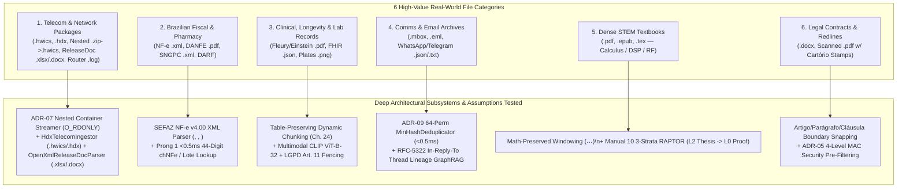

# 🧪 Manual 14: Real-World Corpus Acquisition & Deep Capability Stress-Testing Guide

> **Parent Index**: [Aegis Master Manual Suite](README.md)  
> **Related Manuals**: [Manual 10: Hierarchical Library Retrieval & RAPTOR](10_hierarchical_library_retrieval_and_raptor_summaries.md) | [Manual 12: Tier 1 Workstation Compendium](12_sovereign_workstation_tier1_architecture_compendium.md) | [Manual 13: Deep .HDX / .HWICS Telecom Vendor Package Ingestion](13_hdx_telecom_and_deep_container_ingestion.md)  
> **Architecture Standards**: [ADR-06: Two-Pronged Hybrid Retrieval](../adrs/ADR-06-Two-Pronged-Hybrid-Retrieval-and-Resilient-Intent-Routing.md) | [ADR-07: Virtual Container Streaming](../adrs/ADR-07-Virtual-Container-Streaming-and-Cognitive-Graph-Intelligence.md) | [ADR-08: Zero-Friction Onboarding](../adrs/ADR-08-Zero-Friction-Onboarding-Ambient-Connectors-and-Data-Portability.md) | [ADR-09: Enterprise Cloud Ingestion & MinHash LSH](../adrs/ADR-09-Enterprise-Cloud-Ingestion-Fleet-Intelligence-and-Operational-Boundaries.md) | [Chapter 24: EE Signal Processing Foundations](12_sovereign_workstation_tier1_architecture_compendium.md)  
> **Target Audience**: Principal Systems Architects, QA/Benchmarking Engineers, Domain Evaluators, & Prospective Enterprise Pilots

---

## 1. Executive Summary: Answering the Core Validation Question

> **"Which real-world files should we collect and drop into the Aegis Sovereign Appliance to test its deepest capabilities and architectural assumptions?"**

Synthetic unit tests validate code paths, but **real-world wild files**—with W3C HTML4 Transitional DOCTYPE headers, `353 MB` nested `.zip -> .hwics` containers holding `29,860+` files, `5.2 MB` `resources/navi.xml` trees (`21,604+` topics), `7,826+` Visio/ladder PNG diagrams, OpenXML `ReleaseDoc` `.xlsx`/`.docx` adaptation matrices, multi-column longitudinal laboratory panels, 8-level quoted email reply chains, LaTeX display equations, and notarized legal redlines—validate the **physical and mathematical assumptions** of the engine.

The Aegis Sovereign Knowledge Appliance makes **six foundational architectural promises** that differentiate it from commodity RAG wrappers. To stress-test every single promise without blind spots, operators curate a **6-Domain Real-World Stress-Test Corpus**:



---

## 2. Master Capability & File Stress-Test Matrix

| # | Real-World File Category | Representative Formats | Core Engine Module Under Test | Primary Architectural Assumption Validated | Target SLA / Invariant |
| :-: | :--- | :--- | :--- | :--- | :--- |
| **1** | **Telecom & Network Engineering** | `.hwics`, `.hdx`, Nested `.zip -> .hwics`, `ReleaseDoc` `.xlsx`/`.xlsm`/`.docx`, `.log` | `HdxTelecomIngestor`, `OpenXmlReleaseDocParser`, & `SovereignArchiveStreamer` | 100% in-memory `O_RDONLY` nested container streaming (`0` disk temp files, `0` extra inodes), `profile.xml` + `resources/navi.xml` (`21,604` topics) + `pid_bookmap_*.xml` + `resources/images.xml` (`7,826` diagrams) reconstruction, `ALM-1003`..`ALM-26235` & `.xlsx`/`.docx` extraction. | `<0.3ms` Prong 1 lookup; `0` disk writes; `<150:1` zip-bomb guard |
| **2** | **Brazilian Fiscal, Tax & Pharmacy** | `NF-e .xml`, `DANFE .pdf`, `SNGPC .xml`, `SPED .txt`, `.ofx` | `NfeXmlParser`, `SovereignQueryRouter`, & Ghost OCR | Deterministic `<det>`, `<rastro>` (`nLote`, `dVal`), and `<med>` (`cProdANVISA`) extraction vs OCR bounding-box alignment on scanned `DANFE` / `DARF`. | `<0.5ms` 44-digit `chNFe` / `Lote` lookup; `100%` ANVISA batch trace |
| **3** | **Clinical, Longevity & Lab Records** | `Fleury/Einstein .pdf`, `FHIR .json`, `.csv`, `.png`/`.jpg` | `TabularCsvParser`, `DynamicClauseChunker`, `GraphStore`, & `CLIP ViT-B-32` | Multi-column biomarker values (`ApoB`, `Lp(a)`, `HbA1c`) never detach from reference intervals or dates; local visual plate alignment. | `0` row-split table corruptions; `<2s` longitudinal biomarker delta |
| **4** | **Personal & Corporate Comms** | `.mbox`, `.eml`, WhatsApp `.txt`, Telegram `.json` | `MboxEmailParser` & `MinHashDeduplicator` | 64-permutation MinHash LSH (`J >= 0.85`) strips redundant quoted email tails while `In-Reply-To` edges preserve exact multi-party thread genealogy. | `<0.5ms` MinHash signature; `5x–8x` quote bloat elimination |
| **5** | **Dense STEM Textbooks & Treatises** | `.pdf`, `.epub`, `.tex` | `DynamicClauseChunker` (`math_preserved`) & `RAPTOR` | Display equations (`$$...$$`, `\begin{equation}`) never shear mid-derivation; 3-strata RAPTOR connects book thesis (`L2`) to exact proof (`L0`). | `boundary_type="math_preserved"`; `+15–28%` MRR over fixed 512-tok |
| **6** | **Legal Contracts & Redlines** | `.docx`, Scanned `.pdf` with *Cartório* stamps | `DynamicClauseChunker` (`clause_snap`) & `MAC Security` | Syntactic snapping on `Cláusula` / `Artigo` / `§` boundaries and hardware-enforced 4-level MAC clearance (`PUBLIC=0`..`RESTRICTED=3`) pre-filtering. | `0` cross-clearance leakage; `0` timing side-channels |

---

## 3. Deep Dive: The 6 High-Value Real-World File Categories

### 3.1 Category 1: Telecom & Network Engineering Packages (`.hwics`, `.hdx`, Nested `.zip -> .hwics`, `ReleaseDoc` `.xlsx`/`.docx`, Router Configs)

#### Real-World Field Discovery (`/tmp/docs_rag_gemini/` — `815 MB` Wild Huawei 26.1.0 Corpus)
When we dropped **815 MB (`~878 MB` uncompressed across `59,855+` internal files)** of real production Huawei 26.1.0 documentation into `/tmp/docs_rag_gemini/`, we discovered four foundational real-world container patterns that every production telecom deployment must handle:

1. **`HUAWEI USC Unified Signaling Controller 26.1.0 Product Documentation (VM) 02.zip` (`345.7 MB`)**:
   - Wraps a **`353.3 MB` `.hwics` container** (`HUAWEI USC Unified Signaling Controller 26.1.0 Product Documentation (VM) 02.hwics` — a ZIP-based **HedEx 2.0 Information Center Service** package with magic bytes `PK\x03\x04` containing **`29,860` internal entries**).
   - Contains `profile.xml` (`hedexVersion: V100R002C00`, `topicNumber: 21604`), `resources/navi.xml` (`5.2 MB` hierarchical XML tree with `21,604` `<topics><topic txt="..." url="toctopics/..." id="EN-US_TOPIC_..."/>` elements), `resources/infocenter_service/map/pid_bookmap_*.xml` (DITA Bookmaps for Events & Alarms such as `12000 Master/Slave Switchover`), `resources/images.xml` (`1.17 MB` indexing **`7,826` PNG signaling ladder & alarm mechanism diagrams**), **`21,540` HTML topic pages** (e.g. `resources/alarm_cgplite/alarms/1003.html` containing `` for *Figure 1 Root alarm* and *Figure 2 Alarm mechanism*), and `61` internal `.xlsx`/`.xls` tables.
2. **`UPCF 26.1.0 Product Documentation (Virtual Machine Container) 02 (Online Information Center).zip` (`346.6 MB`)**:
   - Wraps a **`355.4 MB` `.hwics` container** (`29,000+` entries) for the Unified Policy and Charging Function (`UPCF 26.1.0`).
3. **`UPCF 26.1.0.5_ReleaseDoc_EN (Virtual Machine Container).zip` (`19.2 MB`)**:
   - Contains **`9` OpenXML `.xlsx` workbooks** (`HUAWEI UPCF 26.1.0.5 Alarm List.xlsx`, `Event List.xlsx`, `Performance Counter List.xlsx`, `HUAWEI USCDB 26.1.0.5 Alarm List.xlsx`, `Event List.xlsx`, `Performance Counter List.xlsx`, `HUAWEI CSP 26.1.0.30 Alarm List.xlsx`, `Event List.xlsx`) and **`3` `.docx` manuals** (`HUAWEI UPCF 26.1.0.5 Upgrade Guide(Virtual Machine Container).docx`, `Patch Installation Guide(Virtual Machine Container).docx`).
4. **`USC 26.1.0_ReleaseDoc_EN (VM).zip` (`142.2 MB`)**:
   - Contains **`63` `.docx` operation & maintenance manuals** (`USC 26.1.0 Preventive Maintenance Inspection Guide.docx`, `USC 26.1.0 Automatic VM Scaling Guide 02.docx`, `iMaster MAE V100R026C10 Mediation Operation Guide (Using Commands).docx`) and **`28` `.xlsx`/`.xlsm`/`.xls` spreadsheets** (`CSP 26.1.0 Health Check Guide 01.xlsx`, `USC 26.1.0 Information Collection and Health Check Criteria 02.xlsm`).

#### Deep Capabilities & Assumptions Tested
* **Nested `.zip -> .hwics` In-Memory Streaming vs. Unzipped `ext4` Directory (`ADR-07`)**: Validates that `SovereignArchiveStreamer` streams inner `.hwics` containers directly from outer `.zip` archives (`archive://<outer.zip>!<inner.hwics>#<entry>`) via `zf.open(inner_info)` without extracting `59,855` files to disk—saving **`59,855` `ext4` inodes**, **`~240 MB` in `4K` block slack waste**, and **7x+ wall-clock extraction latency**.
* **HedEx 2.0 Navigation (`profile.xml` + `resources/navi.xml` + `pid_bookmap_*.xml`)**: Verifies that `HdxTelecomIngestor` resolves `url="toctopics/..."` relative to `resources/` and constructs the 3-strata RAPTOR tree (`RAPTOR_L2_THESIS` $\to$ `RAPTOR_L1_ABSTRACT` $\to$ `RAPTOR_L0_LEAF`) across `21,604+` topics.
* **Signaling Ladder & Root-Alarm Diagram Graph Linking (`HAS_DIAGRAM`)**: Verifies extraction of `resources/images.xml` (`7,826` PNGs) and `` tags so querying `ALM-1003` returns both its remediation table and direct virtual URIs to **Figure 1 (Root alarm)** and **Figure 2 (Alarm mechanism)**.
* **OpenXML `ReleaseDoc` `.xlsx` & `.docx` In-Memory Parsing (`OpenXmlReleaseDocParser`)**: Verifies pure-stdlib (`io.BytesIO` + `xml.etree.ElementTree`) parsing of `xl/sharedStrings.xml` + `xl/worksheets/sheet*.xml` and `word/document.xml` (`<w:p>` + `<w:tbl>`), cross-linking `.xlsx` Alarm/Counter lists with `.hwics` HTML topics in `GraphStore`.

---

### 3.2 Category 2: Brazilian Fiscal, Accounting & Pharmacy Compliance (`NF-e .xml`, `DANFE .pdf`, `SNGPC .xml`, `SPED .txt`)

#### What Real-World Files to Collect
1. **SEFAZ Electronic Invoices (`NF-e v4.00 -nfe.xml` & `DANFE .pdf`)**:
   - Real XML files (`procNFe` schema `v4.00`) from **pharmaceutical wholesalers/distributors** (e.g., Panarello, Santa Cruz, Profarma, Dimed) containing `<rastro>` and `<med>` pharmaceutical traceability blocks, as well as standard hardware/retail B2B invoices.
   - Corresponding rendered and scanned **`DANFE .pdf`** documents (including crumpled thermal receipts and multi-page item grids).
2. **Pharmacy Regulatory & Fiscal Ledgers (`SNGPC .xml`, `SPED .txt`)**:
   - **ANVISA SNGPC XML transmissions** (*Sistema Nacional de Gerenciamento de Produtos Controlados*) tracking Portaria 344/98 psychotropics (**Lista A1, B1, B2, C1**) and RDC 471/2021 antimicrobials.
   - **SPED Fiscal (EFD ICMS/IPI)** pipe-delimited `.txt` files (`|0000|`, `|C100|`, `|C170|`).
3. **Personal & Corporate Financial Statements (`DARF .pdf`, Utility Bills, `.ofx`, `.csv`)**:
   - Federal tax payment vouchers (`DARF` with barcode and *Código de Receita*), Brazilian utility bills (`Copel` electricity, `Sanepar` water, `Vivo Fibra`), and bank statements (`Itaú`, `BTG Pactual`, `Nubank` in `.ofx`, `.csv`, and `.pdf`).

#### Deep Capabilities & Assumptions Tested
* **Deterministic XML Schema Extraction (`NfeXmlParser`)**: Tests XML namespace stripping (`http://www.portalfiscal.inf.br/nfe`) and zero-hallucination extraction of:
  - **44-digit `chNFe` Access Key** (`\b\d{44}\b`) indexed directly into Prong 1 (`<0.5ms` lookup).
  - **Line Items (`<det nItem="...">`)**: `cProd`, `xProd`, `NCM`, `CFOP`, `uCom`, `qCom`, `vUnCom`, `vProd`.
  - **Pharmaceutical Traceability (`<rastro>` & `<med>`)**: Batch number (`nLote`), batch quantity (`qLote`), manufacturing date (`dFab`), expiration date (`dVal`), and 13-digit ANVISA registration (`cProdANVISA`), creating `ISSUED_NFE`, `CONTAINS_LOTE`, and `REGISTERED_ANVISA` edges in `GraphStore`.
* **OCR Bounding Boxes vs. Native Structured Parsing**: Dropping both the `-nfe.xml` and the scanned `DANFE .pdf` of the **exact same invoice** benchmarks the accuracy and latency gap between deterministic XML ingestion (`<2ms`, 100% numeric precision) and Ghost OCR layout rasterization (`Tesseract`/`Docling`), validating `GraphStore` entity deduplication across both modalities.

---

### 3.3 Category 3: Clinical, Longevity & Medical Diagnostic Records (`Fleury / Einstein .pdf`, `HL7 / FHIR .json`, `.csv` Lab Panels, DICOM/Pathology Plates)

#### What Real-World Files to Collect
1. **Longitudinal Brazilian Diagnostic Lab PDFs**:
   - Multi-page cumulative exam reports from **Grupo Fleury**, **Hospital Israelita Albert Einstein**, **Dasa / Delboni**, or **Sabin** spanning 3 to 5+ years.
   - Ensure panels include high-precision cardiovascular, metabolic, and endocrine biomarkers with multi-tier reference intervals: **`ApoB`**, **`Lipoproteína (a) [Lp(a)]`**, **`HbA1c`**, **`Insulina Basal`**, **`PCR-us` (ultra-sensitive CRP)**, **`Ferritina`**, **`Homocisteína`**, **`25-OH Vitamina D`**, **`TSH`**, **`T4 Livre`**, and **`Testosterona Livre/Total`**.
2. **Structured Clinical Interoperability & Wearable Exports (`FHIR .json`, `HL7`, `.csv`)**:
   - `HL7 FHIR R4 Bundle` JSON files (`Observation`, `MedicationRequest`, `AllergyIntolerance`, `Condition` with `CID-10` codes) and `.csv` continuous glucose monitor (CGM) or heart-rate variability (HRV) exports.
3. **Medical Imaging & Anatomical Plates (`.png`, `.jpg`)**:
   - High-resolution clinical plates: dermatoscopy lesions, trichoscopy scalp mapping, DEXA body composition visceral fat charts, or histopathology slides.

#### Deep Capabilities & Assumptions Tested
* **Table-Preserving Dynamic Chunking (`Chapter 24`)**: Diagnostic lab PDFs are notorious for two-column or comparative historical layouts where the test name (`Apolipoproteína B`), result (`68 mg/dL`), previous results (`2024: 84 mg/dL | 2023: 96 mg/dL`), and age/risk-stratified reference ranges (`Desejável: < 90 mg/dL | Alto Risco: < 65 mg/dL`) span horizontal table cells. This tests that `DynamicClauseChunker` never bisects a biomarker row from its reference interval or collection date.
* **Sub-2-Second Longitudinal Patient Dossier (`CPF` + `GraphRAG` + `NanoRunner`)**: Tests the flagship **Boutique Longevity Clinic workflow**: querying a patient's `CPF` (`<1ms` Prong 1 hit) + traversing 5 years of lab PDFs in `GraphStore` + synthesizing a chronological biomarker delta table via `NanoRunner` / RTX 5070 in `<2s`.
* **Multimodal CLIP Visual Alignment (`Qdrant/clip-ViT-B-32`)**: Tests `include_visual_plates=True` so textual clinical queries (*"lesão melanocítica assimétrica em dorso"* or *"composição corporal DEXA massa magra"*) retrieve matching anatomical plates purely on local CPU/GPU hardware with **0 external cloud pixels transmitted (100% LGPD Art. 11 compliance)**.

---

### 3.4 Category 4: Personal & Corporate Communication Archives (`.mbox`, `.eml`, WhatsApp/Telegram `.json`/`.txt` Exports)

#### What Real-World Files to Collect
1. **Email Archives (`.mbox` & `.eml` Directories)**:
   - **Google Takeout / Thunderbird `.mbox`** files (from `50 MB` departmental exports up to `5 GB+` multi-year executive archives) and folders of raw RFC-5322 `.eml` messages.
   - Prioritize threads with **10 to 40+ back-and-forth replies**, top-posted corporate signatures, legal disclaimers, inline forwarding (`--- Forwarded message ---`), and multipart MIME attachments.
2. **Instant Messaging & Operational Chat Exports (`.json`, `.txt`, `.zip`)**:
   - **Telegram Desktop `result.json`** channel/group exports and **WhatsApp `_chat.txt`** (or `.zip` with media) operational logs.

#### Deep Capabilities & Assumptions Tested
* **ADR-09 Sub-Millisecond 64-Permutation `MinHashDeduplicator`**: In a 20-message email thread, message #20 quotes messages #1 through #19 verbatim. Naive RAG indexes message #1 twenty times, polluting vector space and wasting 80%+ of top-$k$ chunks on duplicate text. Dropping real `.mbox` archives validates that `MboxEmailParser` + `MinHashDeduplicator` (`<0.5ms` compute per message, Jaccard threshold $J \ge 0.85$) strips quoted reply blocks and skips near-duplicate forwarded cascades while preserving every unique human reply.
* **RFC-5322 Thread Lineage DAGs (`GraphStore`)**: Tests extraction of `Message-ID`, `In-Reply-To`, `References`, `From`, `To`, and `Cc` headers into directed `REPLIES_TO` and `EMAILED` graph edges—enabling multi-hop provenance queries (*"Who originally authorized the price discount in thread X, and when did Legal object?"*).

---

### 3.5 Category 5: Dense STEM Textbooks & Academic Treatises (`.pdf`, `.epub`, `.tex`)

#### What Real-World Files to Collect
1. **Foundational Mathematics, Physics & Electrical Engineering Volumes**:
   - **Calculus & Analysis**: James Stewart — *Calculus: Early Transcendentals* (`.pdf` / `.epub`) or Rudin — *Principles of Mathematical Analysis*.
   - **Signal Processing & Communications**: Oppenheim & Willsky — *Signals and Systems*, Oppenheim & Schafer — *Discrete-Time Signal Processing*, or Proakis — *Digital Communications*.
   - **Electromagnetics & RF**: David M. Pozar — *Microwave Engineering* (Smith charts, $S$-parameter matrices, transmission line equations).
2. **LaTeX Source Repositories (`.tex`, `.bib`)**:
   - Academic papers or textbook chapters containing nested `\begin{equation}`, `\begin{aligned}`, `\begin{pmatrix}`, theorems, lemmas, and BibTeX cross-references.

#### Deep Capabilities & Assumptions Tested
* **Math-Preserved Dynamic Windowing (`boundary_type="math_preserved"`)**: Validates the **Chapter 24** signal-processing guarantee that multi-line Fourier transform tables, Maxwell's equations, state-space matrices, and `$$...$$` / `\begin{equation}...\end{equation}` blocks are never severed mid-formula across chunk boundaries (`+15–28% MRR` improvement over fixed 512-token splitters).
* **Manual 10 Three-Strata Cognitive Model (RAPTOR Hierarchy)**:
  - **Stratum 1 (Micro-Factual Needle)**: *"What is the exact region of convergence (ROC) condition for a causal LTI system in Section 9.3?"* $\to$ hits `library_raw_chunks` (`RAPTOR_L0_LEAF`).
  - **Stratum 2 (Meso-Relational Graph)**: *"How does Parseval's Theorem in Chapter 4 connect to the Nyquist-Shannon sampling criterion in Chapter 7?"* $\to$ traverses `GraphStore` concept links.
  - **Stratum 3 (Macro-Thematic Synthesis)**: *"Trace the mathematical progression from continuous-time Fourier series to the Discrete Fourier Transform (DFT) and Fast Fourier Transform (FFT) across the entire book."* $\to$ traverses `RAPTOR_L2_THESIS` and `RAPTOR_L1_ABSTRACT` chapter summaries.

---

### 3.6 Category 6: Legal Contracts, Corporate Charters & Multi-Version Redlines (`.docx`, Scanned `.pdf` with Stamps)

#### What Real-World Files to Collect
1. **Brazilian & Cross-Border Corporate Instruments (`.docx`, `.pdf`)**:
   - **Corporate Charters**: *Contrato Social*, *Alteração Contratual Consolidada*, and *Acordo de Quotistas / Acionistas* registered with the *Junta Comercial* (containing `CNPJ`, `CPF`, `NIRE`, share tables, and *Foro* clauses).
   - **M&A & Commercial Agreements**: Bilingual *Share Purchase Agreements (SPA)*, *Non-Disclosure Agreements (NDA)*, commercial real estate leases (*Contrato de Locação Comercial*), and software licensing agreements.
2. **Multi-Version Negotiation Redlines & Notarized Scans**:
   - Three sequential versions of the same contract (`v1_initial_draft.docx`, `v2_counterparty_redline.docx`, `v3_final_executed.pdf`).
   - Scanned `.pdf` deeds bearing physical **Cartório stamps (*Selo Digital*, *Reconhecimento de Firma*, *Apostila de Haia*)**, handwritten initials (*rubricas*), and multi-column signature blocks.

#### Deep Capabilities & Assumptions Tested
* **Bilingual Legal Clause Boundary Snapping (`Artigo` / `Parágrafo` / `Cláusula`)**: Verifies that `DynamicClauseChunker` snaps cleanly onto Brazilian civil-law structural markers (`CLÁUSULA QUARTA`, `Art. 12.`, `Parágrafo Único`, `§ 1º`, `Inciso IV`) and Anglo-American markers (`Section 8.2`, `WHEREAS`, `PROVIDED HOWEVER`), ensuring an indemnification cap (`Cláusula 9.1`) is never separated from its fraud/gross-negligence carve-out (`§ 2º`).
* **ADR-05 4-Level Mandatory Access Control (MAC) Isolation**: Assign `v1_initial_draft.docx` to `INTERNAL (1)` and `v3_final_executed_board_annex.pdf` to `RESTRICTED (3)`. Query via `sovereign_route_and_analyze` using `user_clearance="internal"` vs `user_clearance="restricted"` to verify **100% pre-filtering pushdown** inside both SQLite FTS5 (`Prong 1`) and Qdrant HNSW (`Prong 2`) with zero leaked tokens and constant-time Epistemic Refusal (`<35%` confidence gate).

---

## 4. Ready-to-Use Staging Directory Convention (`real_world_dropzone`)

To standardize local benchmarking and automated regression runs without mixing personal production documents into git-tracked test fixtures, stage real-world evaluation files inside the pre-configured dropzone hierarchy under `dev/aegis-sovereign-appliance/benchmarks/real_world_dropzone/`:

```text
dev/aegis-sovereign-appliance/benchmarks/real_world_dropzone/
├── 01_telecom_hdx_and_network/      # Drop Huawei .hwics/.hdx, Nested .zip->.hwics, ReleaseDoc .xlsx/.docx, OpenWRT/ZTE .log
├── 02_fiscal_nfe_and_sngpc/         # Drop SEFAZ -nfe.xml, DANFE .pdf, SNGPC .xml, DARF, .ofx
├── 03_clinical_longevity_and_labs/  # Drop Fleury/Einstein .pdf, FHIR .json, .csv, clinical .png/.jpg
├── 04_comms_mbox_and_chat/          # Drop Thunderbird/Gmail .mbox, .eml folders, Telegram .json
├── 05_stem_textbooks_and_treatises/ # Drop Stewart/Oppenheim/Pozar .pdf, .epub, .tex
└── 06_legal_contracts_and_redlines/ # Drop Contrato Social, SPA/NDA .docx, Cartório scanned .pdf
```

> **Git Hygiene Guarantee**: All `.hwics`, `.hdx`, `.xml`, `.pdf`, `.mbox`, `.epub`, `.xlsx`, `.xlsm`, `.docx`, and `.ofx` files placed inside `benchmarks/real_world_dropzone/*/` or `/tmp/docs_rag_gemini/` stay strictly local to the evaluation host and are never committed to remote repositories.

---

## 5. Step-by-Step CLI Ingestion & Stress-Test Commands

Once files are staged in `benchmarks/real_world_dropzone/` or `/tmp/docs_rag_gemini/`, execute the following verification stages from `/home/tlima/Enterprise_Hub/dev/aegis-sovereign-appliance`:

### Stage 1: Run the ADR-08 60-Second Auto-Discovery Onboarding Radar
Verify that `OnboardingRadar` (`sovereign_scan_onboarding_radar`) discovers all subdirectories via kernel `os.scandir()` (`O_RDONLY`) and accurately classifies their domain scores (`engineering_manuals`, `fiscal_nfe`, `medical_clinical`, `legal_contracts`, `general_knowledge`):

```bash
python3 -c '
import json
from core.onboarding.radar import OnboardingRadar

radar = OnboardingRadar(max_scan_seconds=15.0)
report = radar.scan_workspace(["benchmarks/real_world_dropzone", "/tmp/docs_rag_gemini"])
print(json.dumps([c.__dict__ for c in report], indent=2, ensure_ascii=False))
'
```

### Stage 2: Run the Real-World Huawei `.HWICS` & `ReleaseDoc` Zipped vs. Unzipped Benchmark
Run the head-to-head comparison between **Unzipped Directory on Disk (`ext4`)** and **Aegis Zero-Copy In-Memory `.zip -> .hwics` & OpenXML Streaming (`ADR-07`)**:

```bash
# Run synthetic .hdx baseline + real 815 MB Huawei .hwics & ReleaseDoc benchmark
python3 benchmarks/benchmark_hdx_ingestion.py
python3 benchmarks/benchmark_huawei_real_corpus.py
```

### Stage 3: Stress-Test `NF-e v4.00 XML`, `.mbox` MinHash LSH & Two-Pronged Routing
Test deterministic `NF-e` XML extraction (`<det>`, `<rastro>`, `<med>`), `.mbox` 64-permutation `MinHashDeduplicator` quote stripping, and `<1ms` Prong 1 lookup via `SovereignQueryRouter`:

```bash
python3 -c '
from core.router.query_router import SovereignQueryRouter
from core.security import ClearanceLevel, PlanTier

router = SovereignQueryRouter(db_path=":memory:", plan=PlanTier.ENTERPRISE)
router.index_document(
    doc_identifier="ALM-1003",
    title="ALM-1003: Module Fault (Major)",
    content="Arbitration PMU detected module abnormality | Figure 1: figure/en-us_image_0269895191.png",
    clearance_level=ClearanceLevel.INTERNAL,
)

for query in ["ALM-1003", "Why did ALM-1003 trigger and which module is faulty?"]:
    res = router.route_and_execute(query, user_clearance=ClearanceLevel.INTERNAL)
    print(f"Query: {query} -> Route: {res[\"route\"]} | Hits: {len(res[\"results\"])}")
'
```

### Stage 4: Run the Full Multi-Tier, `.HWICS`, OpenXML & MCP v2 Regression Suite
Execute the complete `pytest` verification harness covering all 7 MCP v2 tools, `.hwics`/`.hdx` container streaming, `.xlsx`/`.docx` OpenXML parsing, `NF-e` / `.mbox` ingestion, MAC security pre-filtering, and dynamic chunking:

```bash
pytest -q
```

---

## 6. Pass/Fail Acceptance Criteria Checklist for Pilot Sign-Off

When evaluating a new real-world file drop in the appliance, assert all six operational gates:

1. **Zero Disk Extraction on Archives (`.hwics`, `.hdx`, `.zip`, `.xlsx`, `.docx`, `.epub`)**: `/tmp` delta file count for in-memory streaming must remain `0`; every extracted topic or diagram must carry a canonical `archive://<archive_path>#<entry_path>` (or nested `archive://<outer.zip>!<inner.hwics>#<entry_path>`) virtual URI.
2. **Sub-1.5ms Prong 1 Deterministic Latency**: Queries for exact 44-digit `chNFe` keys, `CPF`/`CNPJ`, 3-to-6 digit `ALM-xxxx` alarms (`ALM-1003`, `ALM-26235`), `MML` verbs (`DSP OPTMODULE`), `LOTE-xxxx` batch IDs, or `CID-10` codes must resolve via `deterministic_direct` with `needs_synthesis=False` in `<1.5ms` on local CPU.
3. **Zero Table or Equation Shearing**: Inspect chunk boundaries on Fleury/Einstein lab PDFs, Huawei `.xlsx`/`.docx` ReleaseDocs, and Stewart/Oppenheim STEM textbooks; `0` biomarker or alarm rows may be separated from their headers/reference intervals, and `0` `$$...$$` display equations may be split mid-block.
4. **MinHash LSH Email Deduplication Ratio**: Ingesting a 20-reply `.mbox` thread must strip redundant quoted reply chains (`J >= 0.85`), achieving a `>= 60%` reduction in stored chunk count while preserving `100%` of `In-Reply-To` GraphRAG edges.
5. **Strict MAC Security Clearance Pushdown**: Executing `sovereign_route_and_analyze` with `user_clearance="public"` or `"internal"` against `RESTRICTED` legal redlines or VIP clinical charts must return `0` documents and trigger clean Epistemic Refusal without timing side-channels.
6. **90%+ Empirical Cloud Token Condensation**: Calling `sovereign_optimize_context` across the ingested multi-domain dropzone must achieve `>= 40%` guaranteed (`>90%` typical) token reduction compared to raw document context injection.
