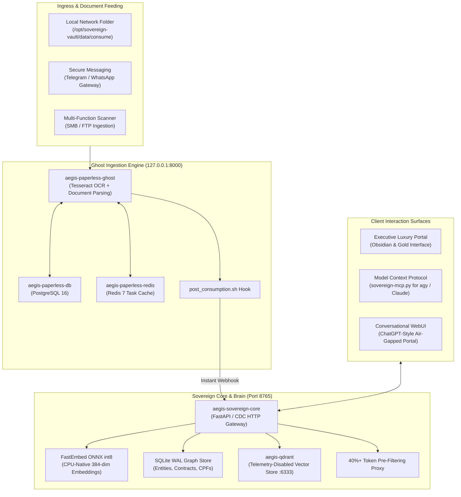

# 🏛️ Aegis Sovereign Knowledge Appliance — Master Manual Suite

> **Product**: Aegis Sovereign Knowledge & Document Intelligence Appliance  
> **Architecture Standard**: [ADR-35: Sovereign Knowledge Appliance Packaging](../adrs/ADR-01-Sovereign-Knowledge-Appliance-Packaging-and-Commercial-Architecture.md)  
> **Deployment Footprint**: 100% Air-Gapped | On-Premises Bare-Metal / Hypervisor VM / Sovereign VPC  
> **Core Guarantee**: $\ge 40\%$ Cloud Token Reduction (Empirically $>90\%$) with Sub-120ms Local CPU Inference  

---

## 1. System Overview & Philosophy

The **Aegis Sovereign Knowledge Appliance** packages enterprise-grade document ingestion, OCR rasterization, hybrid vector retrieval (Dense ONNX + Sparse BM25), and relational knowledge graph extraction into an invisible, turn-key software appliance. 

Designed for ultra-sensitive corporate environments—including **Multi-Family Offices**, **Litigation Boutiques**, **Diagnostic Clinics**, and **Public Entities**—the appliance enforces three immutable operational guarantees:

1. **Zero External Cloud Telemetry**: All OCR, embeddings, graph indexing, and token pre-filtering run strictly on local CPU compute. No unvetted data ever leaves the perimeter.
2. **Headless Ghost Ingestion**: Raw administrative interfaces (e.g. Django Paperless-ngx) are bound strictly to localhost (`127.0.0.1:8000`). End-users interact exclusively via bespoke executive portals, secure messaging bots, or Model Context Protocol (MCP) tool harnesses.
3. **Provable Token Economics**: Operates as a local context condenser. Before queries reach frontier models (Gemini Flash, Claude 3.5), the engine condenses multi-megabyte archives down to exact verified evidence chunks, cutting external API costs by over 90%.

---

## 2. Manual Directory Structure

This manual suite provides end-to-end guidance for infrastructure engineers, client IT administrators, and frontier agent integrators:

| Manual | Topic & Purpose | Primary Audience |
| :--- | :--- | :--- |
| **[01. Deployment Guide](01_deployment_guide.md)** | Bare-metal, Proxmox/VMware hypervisor, and Ansible Phoenix automated rollout. | Systems Engineers & SREs |
| **[02. Database Initialization](02_database_initialization_and_vector_store.md)** | Initializing Qdrant vectors, FastEmbed ONNX pipelines, and SQLite WAL Graph stores. | Data Engineers & DBA |
| **[03. Connector Matrix](03_connector_matrix_and_external_integrations.md)** | Connecting external databases (PostgreSQL, ERPs, WebDAV) and cross-tenant volume migration. | Integration Engineers |
| **[04. MCP Harness Configuration](04_mcp_harness_and_agent_configuration.md)** | Integrating with `agy`, Claude Desktop, Open-WebUI, and Cursor via Model Context Protocol. | AI Engineers & Operators |
| **[05. Ingestion & Tagging Runbook](05_ingestion_and_tagging_runbook.md)** | Where to drop files (`/consume`), automated classification heuristics, and alert routing. | Document Managers & Paralegals |
| **[06. Executive Tuning & Knobs](06_executive_tuning_and_client_knobs.md)** | Discovery depth sliders, Legal Discovery vs Precision modes, and confidence floor tuning. | Legal Partners & Directors |
| **[07. Scaling Topologies & Playbook](07_scaling_topologies_bottlenecks_and_commercial_playbook.md)** | Packaging setups (Home to Enterprise), bottleneck mitigations, zero-knowledge cloud fleet management, and pro monetization ladder. | Solutions Architects & Executives |
| **[08. Desktop Workstation & DLP Compliance](08_desktop_workstation_and_corporate_dlp.md)** | Serverless single-binary workstation setup, zero-copy in-place traversal, Cognitive Spotlight HUD, and enterprise DLP whitepaper. | Corporate Executives, Attorneys, & CISOs |
| **[09. Datacenter Supercomputing & Distributed Fabric](09_datacenter_supercomputing_and_distributed_fabric.md)** | Multi-rack GPU clusters, Docling Ray ingestion, Ceph S3 WORM storage, 400G InfiniBand, and government archive playbooks. | Enterprise Architects, Datacenter SREs, & Agency Directors |
| **[10. Hierarchical Library Retrieval & RAPTOR](10_hierarchical_library_retrieval_and_raptor_summaries.md)** | 3-strata cognitive model, RAPTOR tree indexing, offline asynchronous summary workers, and library cataloging. | Academic Archivists, Librarians, & AI Researchers |
| **[11. Hardware Sizing & Capacity Planning](11_hardware_sizing_and_infrastructure_capacity_planning.md)** | Mathematical memory sizing models, int8 vs FP32 vectors, BM25 posting RAM, SQLite B-Trees, and Tier 1-3 BOMs. | Systems Architects, Infrastructure Engineers, & SREs |
| **[12. Sovereign Workstation Tier 1 — Architecture Compendium](12_sovereign_workstation_tier1_architecture_compendium.md)** | Unified Tier 1 technical directives: two-pronged retrieval, endpoint hardening, UI/UX specification, virtual container streaming, zero-friction onboarding, cloud fleet boundaries, zero-knowledge telemetry, and hardware dimensioning. | Desktop Engineers, Product Architects, & Corporate IT Leads |
| **[13. Deep .HDX Telecom Vendor Package Ingestion](13_hdx_telecom_and_deep_container_ingestion.md)** | 100% in-memory `.hdx` HedEx streaming (`navi.xml` RAPTOR L2/L1/L0 mapping), Alarm (`ALM-xxxxx`) & MML (`DSP`/`MOD`) table extraction, sub-1.5ms Prong 1 lookup, and multi-hop telecom GraphRAG. | 5G RAN / Core Telecom NOC Engineers & Field Architects |
| **[14. Real-World Corpus Acquisition & Testing Guide](14_real_world_corpus_acquisition_and_testing_guide.md)** | 6 high-value real-world file categories (`.hdx`, `NF-e .xml`, `Fleury/Einstein .pdf`, `.mbox`, STEM `.pdf/.epub/.tex`, Legal redlines), dropzone staging layout, and deep capability stress-test commands. | Principal Systems Architects, QA Engineers, & Enterprise Pilots |
| **[15. Unified Server Vault, Purge Lifecycle & Multi-Harness Guide](15_server_deployment_lifecycle_purge_and_harness_guide.md)** | Single-vault storage (`sovereign_router.db` & `sovereign_graph.db`), data removal/purge lifecycle (`--purge`), Prong 1/2 search mastery, and MCP configs for `agy`, Claude Code, Claude Desktop, Cursor, Windsurf, and Cline. | Server Administrators, AI Engineers, & DevOps Architects |

---

## 3. Appliance Architecture Diagram

---

## 4. Related Architecture & Governance Links
* [ADR-35: Sovereign Knowledge Appliance Packaging](../adrs/ADR-01-Sovereign-Knowledge-Appliance-Packaging-and-Commercial-Architecture.md)
* [Chapter 21: Hybrid RAG & Semantic Retrieval Architecture](README.md)
* [Chapter 19: Local LLM Delegation & Token Economics](04_mcp_harness_and_agent_configuration.md)
* [System Overview & Live Fleet Inventory](README.md)
